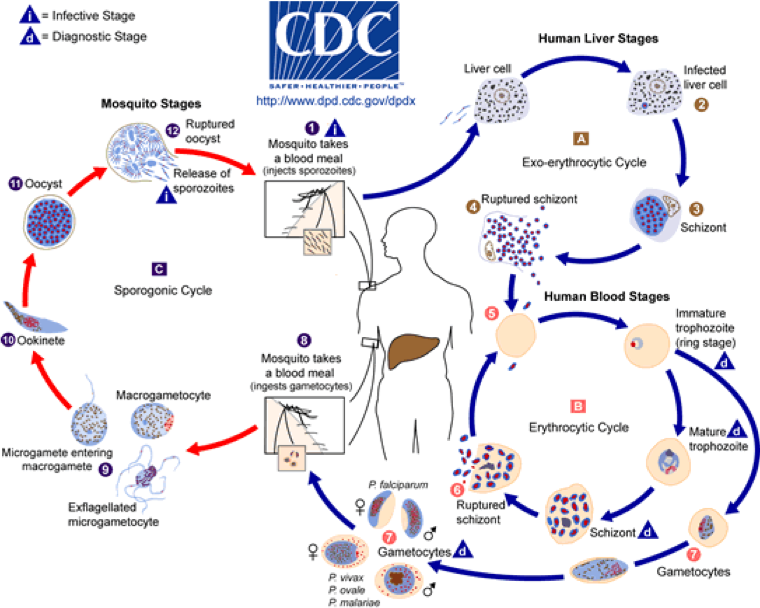

# Task 1 - Sexual development of malaria parasites

## Table of contents
1. [Introduction & Aims](#introduction)
2. [Exercise - How does knockout of the transcription factor *ap2-g* affect gene expression in *Plasmodium*?](#exercise1)

## Introduction 

*Plasmodium berghei* is used as a rodent model of malaria. It is known that in the lab it can evolve to stop producing sexual stages (Figure 1). We want to try and use this observation to our advantage. If we can understand how the parasite switches to the sexual, transmissible stage, then we might better understand how to prevent this from happening and prevent the spread of malaria. 

Our colleagues grew several cultures of a transmissible strain in the lab continuously for several months (See Figure 1a in ([Sinha et al., 2014](https://www.nature.com/articles/nature12970)). These all become gametocyte non-producers (GNPs). They then sequenced the genomes of each strain and identified the mutations in each one. They hypothesised that, while each GNP strain would have many mutations compared to the parental strain, only one gene would be mutated in every strain and this gene would be a key regulator of gametocytogenesis. This worked and they identified the ap2-g gene, which is a transcription factor and is now thought to regulate early steps of gametocytogenesis ([Sinha et al., 2014](https://www.ncbi.nlm.nih.gov/pubmed/24572359)). 

Our colleagues have proposed that we explore the function of this transcription factor by looking at changes in gene expression after it has been knocked-out. One of their team managed to knock it out, grow the mutant up, extract and sequence its RNA. This means we are able to examine the role of the gene and how it affects the transcriptional landscape of the parasite. Which transcripts are affected by the knockout of this gene? Does this make sense in terms of what we expect to happen? What could this gene list be useful for in future?

Sequencing reads as well as the reference sequence are available in the data directory Task_1_SexualDevelopment (please use this rather than download one). There are also files of genome annotation, product descriptions, GO terms and an R script for performing GO term enrichment. A full explanation is found in a README file in the directory.

**Figure 1. Malaria life cycle.** The parasites must produce sexual forms called gametocytes in order to be transmitted from the intermediate mammalian host to the definitive mosquito host.

 [↥ **Back to top**](#top)
 
 
  ******
## Exercise - How does knockout of the transcription factor *ap2-g* affect gene expression in *Plasmodium*? 
 
For this exercise, we will not tell you exactly which commands to use, but you will only need to use variations on those used in previous exercises. The exception to this rule is running the Gene Ontology enrichment.

To complete the exercise you should:

1. Map the RNA-seq data to the reference
2. Confirm the knockout in the mutant samples
3. Call differentially expressed genes
4. Perform a Gene Ontology enrichment analysis (we have provided an R script to help with this)

 [↥ **Back to top**](#top)

******
## License
 This work is licensed under a <a rel="license" href="http://creativecommons.org/licenses/by/4.0/">Creative Commons Attribution 4.0 International License</a>.
