# Task 2 - Georeferencing genomic data

## Table of contents
1. [Introduction](#introduction)
2. [Phylogenetic analysis](#phylogenetic-analysis)
3. [Antimicrobial resistance Screening](#antimicrobial-resistance-screening)
4. [Georeferenceing](#georeferenceing)
5. [Reporting](#reporting)
6. [Group discusssions](#group-discussion)
7. [Additional information](#additional-information)

## Introduction <a name="introduction"></a>

Phylogenetic trees based on whole genome data tell us the about the relationships of bacterial isolates to each other on a very fine scale. When we combine that high resolution information about the evolutionary relationships of isolates with geographical data it can inform our understanding of the current distribution of the pathogen and allow us to infer the epidemiological processes that have acted on the pathogen over time. The simplest example of this would be if a phylogeny showed that a pathogen was geographically constrained (e.g. isolates from the same region always cluster together). This might indicate that the pathogen is not highly mobile, whereas a pathogen with a phylogeny that shows isolates from distant regions are equally likely to be related to each other as isolates from nearby is likely to be highly mobile across regional borders. Geographical referencing of genomic data can also be combined with temporal information to study the movement of pathogens in space and time in real time for use in outbreak detection and monitoring. 
 
For this task, you will be split into teams. Using the skills you learned in the structured modules, your team will use the all the mapped sequences (.fa) produced in Module 7 and  to identify single nucleotide polymorphism (SNP) sites based on the reference sequence strain SL1344 and subsequently construct a phylogenetic tree. You will use the software [FigTree](http://tree.bio.ed.ac.uk/software/figtree/) to view and interpret your phylogeny and geo-reference your data using [Microreact](https://microreact.org/showcase) to develop your own hypotheses about the pathogen distribution. In addition, you will use the software [ARIBA](https://www.ncbi.nlm.nih.gov/pmc/articles/PMC5695208/) (Antibiotic Resistance Identification By Assembly) to investigate resistance genes in these strains and a free visualisation tool, Phandango to compare with the pathogen distribution observed in your tree.

## The aims of this exercise are:
1. Introduce the biology & workflow
2. Gain experience in building and interpreting phylogenetic trees 
3. Introduce concepts and tools for geo-referencing metadata
4. Show how Whole Genome Sequence data (WGS) can be used to describe the evolution and distribution of a pathogen across a geographical area 
5. Combine phylogenetic analysis and comparative genomic techniques 
6. Demonstrate the value of shared data resources 
7. Gain experience in presenting the results of WGS Data analysis

## Background
### Biology
To learn about phylogenetic reconstruction and geo-referencing for epidemiological inference, we will work with some software that has already been introduced as well as some new software introduced in this module. We will work with real data from _Salmonella enetrica_ serovar Typhimurium sampled from regional labs in England and Wales, United Kingdom in 2015. 

### _Salmonella enetrica_ serovar Typhimurium
_Salmonella enterica_ is a diverse bacterial species that can cause disease in both human and animals. Human infections caused by _Salmonella_ can be divided into two, typhoidal _Salmonella_ or non-typhoidal _Salmonella_ (NTS). The former include Typhi and Paratyphi serovars that cause typhoid. NTS comprises of multiple serov   ars that cause self-limiting gastroenteritis in humans and is normally associated with zoonotic _Salmonella_ reservoirs, typically domesticated animals, with little or no sustained human-to-human transmission. 

_Salmonella enterica_ serovar Typhimurium (_S._ Typhimurium), unlike the classical views of NTS, can cause an invasive form of NTS (iNTS), with distinct clinical representations to typhoid and gastroenteritis and normally characterized by a nonspecific fever that can be indistinguishable from malaria and in rare cases is accompanied by diarrhoea ([Okoro et al. Nature Genetics, 2012](https://www.ncbi.nlm.nih.gov/pmc/articles/PMC3491877/)).

Whole genome sequence analysis of this organism of provides some insight into the short-term microevolution of S. Typhimurium. Understanding the level of diversity in this time-period is crucial in attempting to identify if this is an outbreak or sporadic infection.

## Your task
The Global Health Authority (GHA) has asked you to provide an overview of Salmonella enterica serovar Typhimurium in England and Wales, using retrospective samples. You will need to generate a whole-genome sequencing based tree from all 24 sequences and correlate this to the geography of the city. You will also look into the distribution of antimicrobial resistance and investigate the genetic basis for the resistance phenotype you identified in the laboratory. At the end of the task we will split into groups to discuss your findings. Each group will be provided a question to present to the other learners regarding what you can conclude from the data. 

The teams are the will be assigned on the day. Each team will have an instructor working with them to answer any questions.

* You will need to compete the following steps to answer the research questions posed to you.  
* Phylogenetic analysis– SNP-calling and phylogenetic inference (1hr)
* Antimicrobial Resistance Screening  – ARIBA and Phandango (1hr)
* Geo-referenceing – geo-referencing with Microreact (1hr)
* Reporting– mini group discussions and preparation for presentation (45 mins)
* Presentation and discussion with larger group – (45 mins)

---
## Data provided 
You will create a phylogenetic tree of the _S._ Typhimurium isolates from England and Wales. You will geo-reference this information, as well as antimicrobial resistance data, against the address of the isolates to form ideas about the distribution and epidemiology of the pathogen. Additionally, the genetic basis for the antimicrobial resistance will be explored. 

To achieve this, you will be provided with the following files in the Task folder: 
* A metadata table (metadata.xls) which contains information on the isolates including the date and address of collection.
* Sequence data. You will only have fastq files for 3 isolates so you can practice mapping to a reference to extract SNP data. These are in the ‘sequence data’ folder. 
* An ariba_reports folder that contains a summary the resistance reports from ARIBA to save time. You are encouraged to run the ARIBA analysis on the samples allocated to your group.
* _S._ Typhimurium fasta and embl files, which you will use as a reverence.

* A pseudogenomes folder that contains an .fa file. 

* And a PDF of the literature reference cited on page 2.

----
## Other infromation

### Your isolate names

The isolate names you can see in the subfolders of your group folder. There are two files for every isolate  `_1.fastq.gz` and `_2.fastq.gz.` These represent the forward and reverse reads of paired end sequencing for that isolate.   


When you work with your own sequencing data after the course, other naming conventions will be used. As in the example above, it is likely this formats will include helpful pieces of information, so find out what your own sequencing data names mean when the time comes!  

### How to use this module 
As in some previous modules, you will be provided with many of the commands you will need to perform the analysis. 

We have provided you with a guide time for each task so that you will have plenty of time to ds your findings with the group. We strongly suggest you keep to these times.

### Mini group discussion
Once you have completed all the tasks you will need to compile your findings. We suggest you make summarise these in PowerPoint or Word with one slide per task. You can then reflect on your findings and draw conclusions about the data using all that you have learnt during the week. Examples of some of the exciting key images you might produce are below, but don’t be limited by these ideas - please be as creative as you like!

<p align="center">
 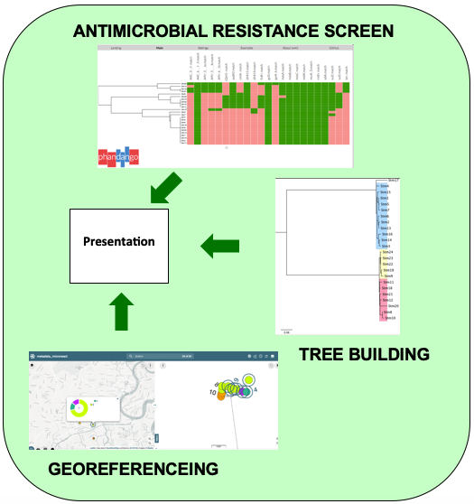
</p>

---
[↥ **Back to top**](#top)


## Phylogenetic analysis <a name="phylogenetic-analysis"></a>

### General Information 

In this task you will construction of a tree from WGS data. You will map the sequence data to the _Salmonella enterica_ Typhimurium reference genome SL1344. To save on time, you will only be mapping the fastq files to 2.5 million base pairs of the genome. Although this will take a long time, keep in mind that this step would ordinarily take many more hours of computation time. 

Bioinformatic processing of data into biologically-meaningful outputs involves the conversion of data into many different forms. Just like working in the laboratory, it’s  useful to to break this process down into individual steps and have a plan. 

A rough guide of the steps for this task is below and in the following schematic. Check that you understand the principles of each one and then get started: 

* **Step 1**. Map and call SNPs for each isolate using commands introduced earlier in the course
* **Step 2**. Create a whole genome sequence alignment
* **Step 3**. Build a phylogenetic tree from the SNP data in your alignment
* **Step 4**. Interpret your phylogeny and report the lineages to the geo-referencer

### Step 1: Map and call SNPs for each isolate

Your reference sequence for this is Salmonella enterica serovar Typhimurium strain SL1344, called `Salmonella_enterica_serovar_Typhimurium_SL1344_2.5MB.fasta` in the task folder. You may want to create a local copy in the directory you are working in by using the cp command. 

Map the sequencing data for each isolate to the reference genome and obtain a pseudogenome (incorporating the isolate SNPs into the reference sequence). The required commands were covered in the mapping and phylogeny modules. If you struggle with the commands, ask the instructors for help. 

**NOTE: Before you continue onto the next step, you must do some housekeeping. Refer to the mapping and phylogeny module, for which files you should remove.**

<p align="center">
 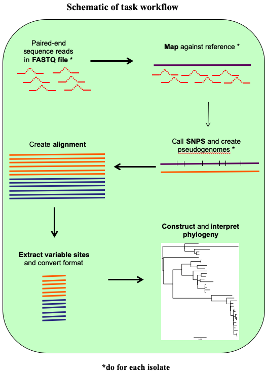
</p>

### Step 2: Create a whole genome sequence alignment for your data 

Now you have created pseudogenomes (.fasta NOT .fastq) for each of your samples, you can use this data to create a sequence alignment to build a phylogenetic tree. Using this mapping based approach we are able to avoid the computational power required to align millions of base pairs of DNA that would be needed with e.g. CLUSTAL or MUSCLE. Here, because all of the isolates were mapped to the same reference genome, they are already the same length, so they can just be pasted together to form an alignment. 

Due to time constrains we have mapped all the samples to the same reference. The file can be found in the pseudogenome folder. The pseudogenomes of all 24 strains were combined together using the cat command as below.  

```
cat *_pseudogenome.fasta > All_pseudogenomes.fa
```

This produces a mutlifasta file ‘All_pseudogenomes.fa’ that contains all 24 sequences. You can check all 24 sequences are present by opening it in seaview.

Here, the * acts as a wildcard symbol and a single file containing all of the pseudogenome sequences pasted one after the other is created. Both `.fa` and `.fasta` files are sequence files, but the extension is useful for distinguishing files with single (`.fasta`) and multiple (`.fa`) sequences.

Align the sequences in seaview as you were shown in the [Phylogenetics module](manuals/module_phylogenetics/module_phylogenetics.m) and save the file as `All.aln`.

You should now have a file containing 24 taxa each 2.5MB long. Most of the sites in this alignment will be conserved and not provide useful information for phylogenetic inference, so we will shorten the alignment by extracting the variable sites using the program `snp-sites` by typing:

```
# Type the below in the command line: 
snp-sites -o All_snps.aln All.aln
```

### Step 3: Build a phylogenetic tree from the SNP data in your genome alignment

Now you will build a phylogenetic tree from the SNP alignment that you created in the last step. There are a lot of programs for building phylogenetic trees, and here we are going to use one called RAxML which evaluates trees based on maximum likelihood. 

The reference is: 

[A. Stamatakis: "RAxML-VI-HPC: maximum likelihood-based phylogenetic analyses with thousands of taxa and mixed models". In Bioinformatics, 2006.](https://academic.oup.com/bioinformatics/article/22/21/2688/251208)

Like all programs, RAxML has requirements for the format of input files. Your `All_snps.aln` file is multifasta format and RAxML requires [**phylip**](https://en.wikipedia.org/wiki/PHYLIP) format, so open the file in seaview and save it as phylip format under the name `All_snps.phy` by typing:

```shell
seaview All_snps.aln
```

Save the file by going to _File > Save As > Format > Phylip(*.phy)_ as pictured below.

<p align="center">
 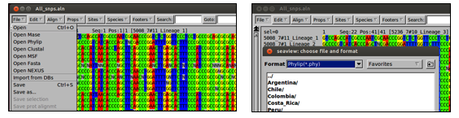
</p>

Then, back at the command line, run RAxML by typing the following: 

```shell
raxmlHPC -m GTRGAMMA -p 12345 –n STm -s All_snps.phy
```
Recall that with a single iteration of a maximum likelihood method you risk recovering a tree from a local maximum, which means it might not be the best one. This can be avoided by running multiple iterations with different starting points (we can’t do that now because of time). The addition of multiple runs is done by adding the following flag to the command. 

```shell
-N 20	# would run the program with 20 different starting trees (which is typically enough to find a problem if one exists).
```

Additionaly, running your RAxML with a bootstrap value denoted bythe '-b' option. Bootstrap values that denote the confidence or accuracy in each inferred node of the tree i.e. If choosing a value of `-b 100`, the resulting bootstrap value indicates how many times a particular node (topology), out of a hundred, is recovered when resampling, essentially estimating the confidence in the generated tree. More details on bootstraps can be found [here](http://europepmc.org/article/MED/12801728).


### Step 4: Interpret your phylogenetic tree
Open you final tree file (`RAxML_result.STm`) in FigTree and midpoint root it by selecting _Tree > Midpoint Root_. 

You will need to this file that you have saved in FigTree in the subsequent georeferencing task, but you will need to save it in a specific format to be compatible with [Microreact](https://microreact.org/showcase). Go to _File > Export trees > select Newick file format_. Remember to save your file with a _.nwk_ suffix so that you know what type of file it is.


Interpret your phylogenetic tree by first taking some time to make some general observations: 
* Are there distinct clades resent in the isolates?
* Are there isolates that do not cluster with other isolates?

Then, using the relationships with the known lineages, define each of your isolates as belonging to clades 1 and any additional lineages you would like to highlight. A picture of your tree as well as your general observations about it should go into your team presentation. Take some time to make figure(s) you are happy with and create a PDF picture file by selecting _File > export PDF._ 


<p align="center">
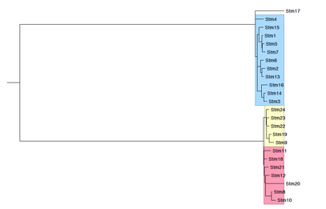
</p>

---
[↥ **Back to top**](#top)

## Antimicrobial resistance Screening <a name="antimicrobial-resistance-screening"></a>

### General Information 

In this task you will screen your isolates for antimicrobial resistance (AMR) genes. You will correlate the phenotypic metadata with the genetic information contained in the isolates using a local assembly approach with [ARIBA](https://github.com/sanger-pathogens/ariba). ARIBA, Antimicrobial Resistance Identifier by Assembly, is a freely available tool that can be installed from the ARIBA github repository. This tool requires a FASTA input of reference sequences, which can be a mutli-fasta file or database of antibiotic resistance genes or non-coding sequences. This database will serve as one of your inputs and the other is paired sequence reads. ARIBA reports which of the reference sequences were found, plus detailed information on the quality of the assemblies and any variants between the sequencing reads and the reference sequences. 

We have installed ARIBA in the virtual machine. You will download the [CARD database](https://card.mcmaster.ca/home) for resistance detection for your samples, however other databases can be installed. 
Further information and installation instructions are detailed in the [ARIBA github wiki page](https://github.com/sanger-pathogens/ariba/wiki). The data can then be visualised using [Phandango](http://jameshadfield.github.io/phandango/), an interactive also freely available tool to visualise your outputs.

* Step 1. Run ARIBA
* Step 2. Visualise outputs (phandango.csv and .phandango.tre) in Phandango
* Step 3. Compare resistance gene present with metadata
* Step 4. Summarise your findings in text and screen shots to report your findings

### Step 1: Run ARIBA

Navigate to the `sequence_data` folder. To run ARIBA you will need to download and format the database. On the command line prompt, type:

```
ariba getref card out.card
```

Next you will need to format the reference database for ARIBA. Type:

```

ariba prepareref –f out.card.fa –m out.card.tsv out.card.prepareref
```

Next you will need to run local assemblies and call variants, type:

```
ariba run out.card.prepareref reads_1.fastq.gz reads_2.fastq.gz out.run
```

The command should take about 5 minutes per sample. Be patient and wait for the command prompt (denoted by a `$` sign).

Next you will need to summarise the data from several runs. These are included in newly generated folders. You will combine the data in `report.tsv` files.

```
ariba summary out.summary out.run1/report1.tsv out.run2/report2.tsv out.run3/report3.tsv
```

Three files will be generated, a `.csv` file with the summary of all the runs and two .phandango files. You will need to drag and drop the `out.summary.phandango.tre` and `out.summary.phandango.csv` into the [Phandago website](http://jameshadfield.github.io/phandango/).

To understand the whole picture you will need to run ARIBA for ALL 24 samples. To save time, we have already done this for all 24 samples. Please use the files in the ariba_reports folder for subsequent steps. We suggest you run the analysis for a few samples to get an idea of the results. 

### Step 2. Visualise in Phandango

<p align="center">
 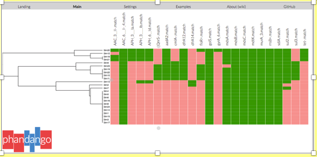
</p>

On the left hand side is a dendogram of the phylogenetic relationship of the resistance data and the strains. On the top panel are the matching resistance genes found. The green colour indicates positive match and salmon pink is a negative match.

Consult the [CARD database](https://card.mcmaster.ca/home) for the resistance phenotype of the genes detected. Note that underscores (_) in the output data denotes prime (‘) or bracket, therefore AAC_3_-II is AAC(3)-II. The codes for these in a file names ‘01.filter.check_metadata.tsv’ produced when you prepared your database (p.11). Consult the `report.tsv` of the particular sample of interest for the gene names. You can open both .tsv files in excel.

<p align="center">
 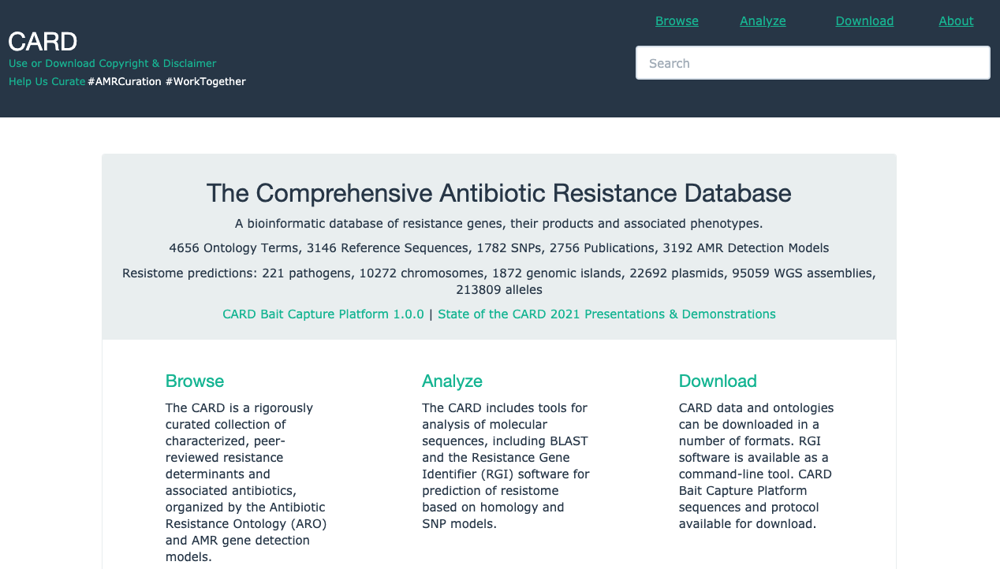
</p>

### Step 4: Summarise your findings for the presentation 

Some general points to consider when summarizing your finding for antimicrobial resistance (AMR) screen.
* Does the presence of the gene correlate well with the phenotypic results? 
* Is it the same in multiple isolates that share the resistance?
* Do you think it is vertically or horizontally transmitted?

Discuss  with your group members your answers to the above questions. Consolidate your findings into some slides to help you consolidate your final findings.

To help you in your discussions, summarized in the table below are the most frequently observed antimicrobial resistance patterns of _S._ Typhimurium strains between 1996 and 2016 taken from [Wang et al., 2019 (PMID: 311340204)](https://pubmed.ncbi.nlm.nih.gov/31134024/).

Below are genes found in your* isolates that confer resistance to some of the antibiotics below. Can you match isolates to any of the patterns listed? 
Ampicillin (A): _aac_, _aph_. Chlorampheniol/Florfenicol (C): _cmlA_, _floR_. Streptmycin (S): _aadA2_. Sulfonamide (Su): _sul2_ and _sul3_. Tetracycline (T): _tet_.

 _*Multiple genes can confer resistance to the same class of antimicrobials._

Although not highlighted as a AMR pattern for _Salmonella_ strains, oral quinolones are used as a first line drug for _Salmonella_ diarrhoeal illness. Resistance to quinolones are conferred by: _gyrA_ (located on the chromosome), and _qnrS_ (located on the plasmid). Remember that chromosomal mutations are verticaly transmited (inherted). In contrast to plasmids that can be trasnmitted both vertically or horizontally (genetic transfer between cells) by a process known as [Horizontal Gene Transfer](https://en.wikipedia.org/wiki/Horizontal_gene_transfer#:~:text=Horizontal%20gene%20transfer%20(HGT)%20or,parent%20to%20offspring%20(reproduction)).

Other drugs used in the treatment of diarrhoeal illness caused by _Salmonella_ are azithromycin (_mph_) and ceftriaxone (_bla_<sub>CTX-M</sub> and _bla_<sub>CMY-2</sub>). **Please note**, none of these strains confer resistance to either of these drugs.

<p align="center">
 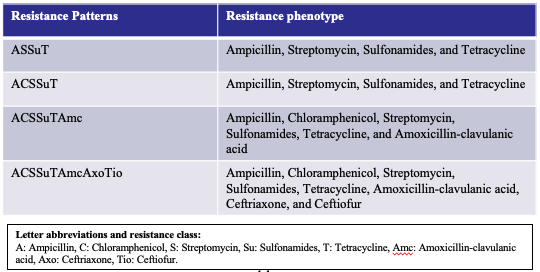
</p>

---
[↥ **Back to top**](#top)

## Georeferenceing <a name="georeferenceing"></a>

### General Information 

Geo-referencing information from pathogens can provide insight into the processes that drive their epidemiology. This can be used to infer whether single introductions of a pathogen have occurred followed by local evolution or whether it transmits frequently across borders. It can also indicate regions affected by antimicrobial resistance (AMR). 

In this task, you are going to use the metadata provided and the tools [Data.flo](https://data-flo.io/ and [Microreact](https://microreact.org/showcase). 
 
You will need to complete the following steps: 
* Step 1. Identify the global positioning coordinates (longitude and latitude) of the addresses where the isolates were collected. 
* Step 2. Create a map of the metadata of the isolates for your country.

To start, open the metadata file for the strains is in the inbuilt spread sheet program on the virtual machine and note the address column, as well as the two empty global positioning columns.

In _Step 1_ you will be locating isolates based on their Address and filling out the information in the Latitude and Longitude columns. 

Eventually you will use the phylogenetic tree you generated along with the metadata file with GP locations to infer relationships between the samples. These will be the input files for Microreact.

### Step 1: Batch geocoding to obtain the longitude and latitude of the isolates

There are plenty of ways to get coordinates (e.g. using a simple search on google), however with multiple samples, it is easier to submit this in batches. You can use [Data-flo](https://data-flo.io/), which allows you to paste the name your locations, hit _Run_ and it returns a list of geographic coordinates. 

Open a browser (preferably Chrome or Firefox) and navigate to Data-flo or click the link above. Click the _Get Started_ purple tab at the centre of the page. Click on the _Geocoder_ option  (circled). This _info_ page gives you more information how to use Data-Flo.

<p align="center">
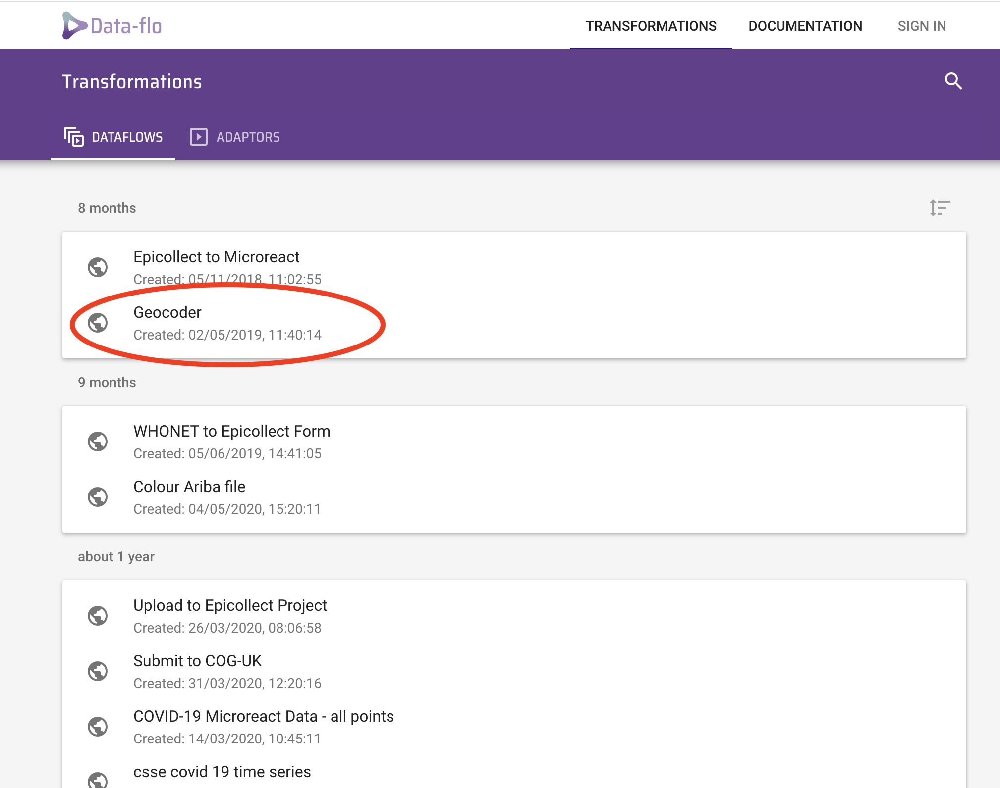
</p>

Click the _RUN_ tab and you should see an option to input your location.

Open the `metadata.xls` file. You will notice, it only contains some very basic information including, ID, year, Month and address. Sometimes this is the only information provided. Before we can use it in microreact, we have to add a few things to display useful information and make it compatible with the software. 

Copy the data in the column titled _Address_. Navigate to the Data-flo _RUN_ page you just opened and paste the list in the _inputs_ locations box and click RUN.

<p align="center">
 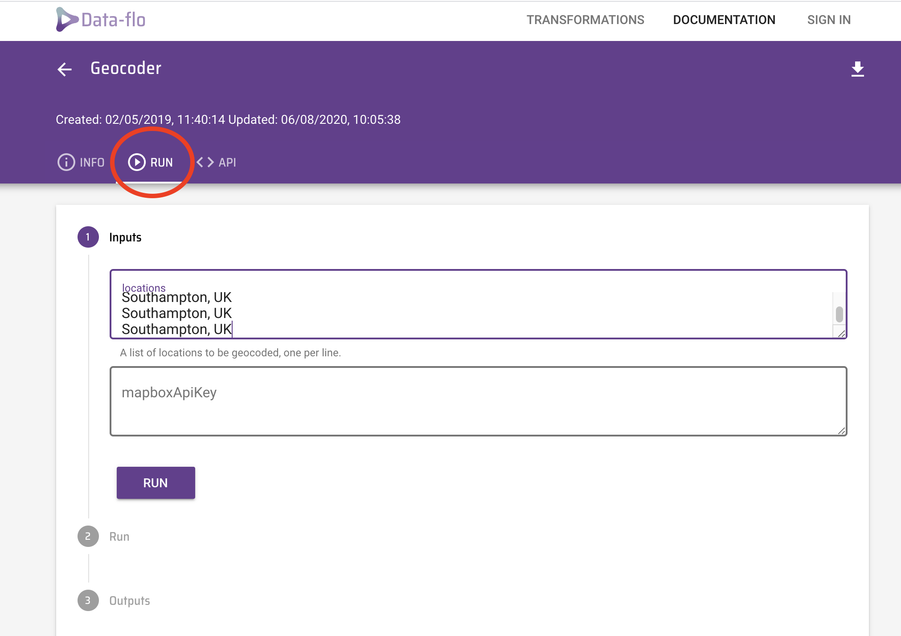
</p>

After only a few seconds, the software returns the results, which can be downloaded as a CSV file by clicking the link provided (circled in red). You can open this file in Excel using the _File > Import_ function.

Update the latitude and longitude columns in your metadata file.

When you are happy with your metadata sheet, we will now save this file as a CSV file, go to _File > Save as > Select ‘CSV UTF-8 (comma delimited) (.csv)_ from the drop down menu in _file format_ then _Save_. A dialogue box will appear asking if you are sure you want to save it as csv and some formatting may be lost, don’t worry about this, click _yes_. We are now ready to view our data in microreact.

### Step 2: Create a map of the metadata of the isolates for your country
We will use [Microreact](http://microreact.org) to visualize and explore your trees and metadata.Microreact enables you to visualize phylogenetic relationships of isolates linked to geographic locations. One of the advantages of microreact is being able to display geographical locations along with the phylogenetic information, collectively known as phylogeography. You can also display other information you find useful and to do so, you need only format your metadata table. 

<p align="center">
 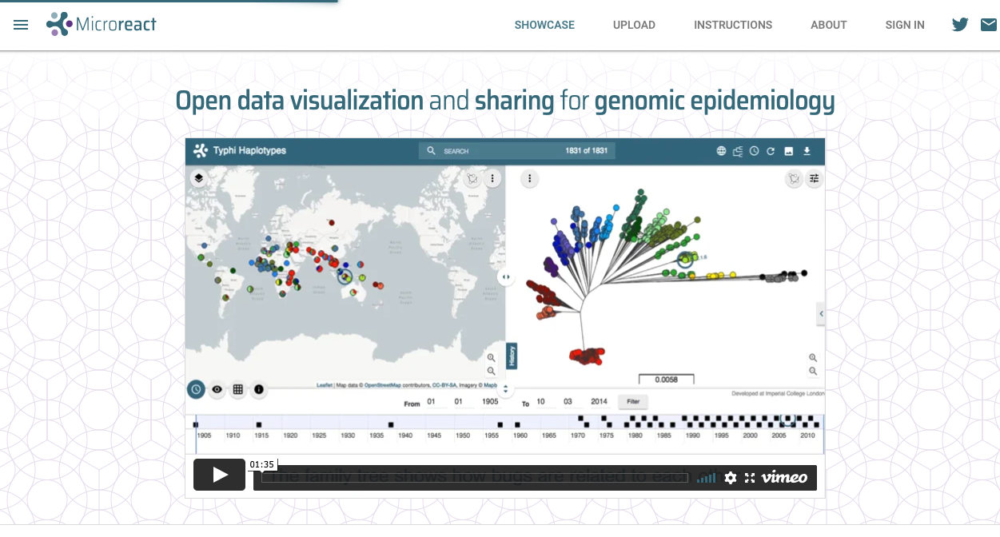
</p>

Using either **Google Chrome** or **Firefox** internet browsers, go to the [microreact upload](https://microreact.org/upload) page.

Make sure you have saved your updated metadata as a .csv file with GPS locations. The suffix should be `.csv` and denoted `metadata.csv`.

Read the instructions on how to set format your metadata file to visualise in microreact. This is vital for the next steps. 

_Note: You can obtain more [HTML colour codes.](http://htmlcolorcodes.com/)_

You will need the NEWICK (.nwk) file from your phylogenetic analysis and the .csv metadata file you have just saved for the next step. 

Drag the relevant `.csv` file and `.nwk` in the _UPLOAD_ section on the website.

<p align="center">
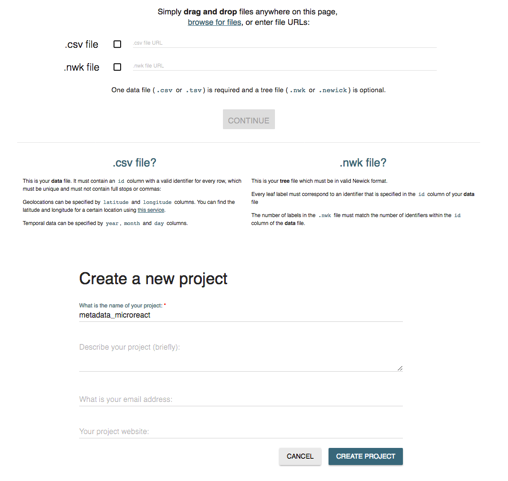
</p>

You can include a different name for your projects and a brief description if you would like.   

Leave _project website_ section blank and your email is optional. Then _create project_. 

The resulting map and tree enables you to query your data. Notice we have assigned colour to the samples resistant or sensitive to aminoglycosides encoded by aadA2, but you can choose to group the samples however you want.   

<p align="center">
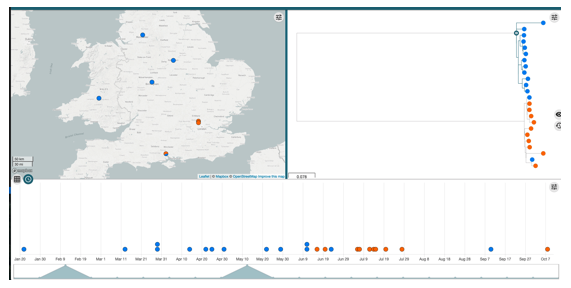
</p>

#### Customising your metadata

You can choose to customise you data further to include the antimicrobial resistance information. All you will have to do is add the resistance gene data from `out.summary.phandango.csv`. If you do so, make sure to follow the instructions as you did previously, making sure you denote the colour (presence or absence AMR data) correctly as detailed in the guidelines.

**This step is not necessary for today due to time contraints, but you may want to give a try in your own time as this step may help you interpret your data better and obtain a great figure for a paper!**

---
[↥ **Back to top**](#top)

## Reporting <a name="reporting"></a>
To assist you in reporting. We suggests you have a go at answering these questions and then discuss your answers with your mini group. 

Look at the distribution of your isolates across the country when coloured by: 
* **Clade**

  1. How many clades are there?
  2. How are the isolates distributed? 
  3. Are there any patterns you can see to the distribution? 
  4. What factors might be driving the distribution?

* **Antimicrobial resistances**
  1. Are there patterns to any of the resistances? 
  2. And is this related to clades? 
  3. Are there any genes that confer resistance to antimicrobials used to treat _Salmonella_ cases?

Take screen shots of the images and compile a short report with your findings to help you answer the above questions.

---
[↥ **Back to top**](#top))

## Group discussion <a name="group-discussion"></a>

For each assigned group, you will have to discuss the questioned assigned to your group and this will form part of your presentation to the bigger group. You will need to choose a someone to lead the presentation. Please include slides containing images as part of your presentation to demonstrate your point.

ALL the questions will require you to scrutinise you at least one of your data sets and in some cases ALL of  them. These include, phylogenetic analysis, AMR and geo-tagging data.

Group questions:
* **Group 1**: Looking at the phylogenetic relationship of the strains and associated metadata, which strain do you think are part of an outbreak? What measurements can you use to support your hypothesis. Hint: Look at the month of collection.
* **Group 2**: What resistance genes confer resistance to clinically relevant antibiotics for treating Salmonella infections? Hint: read the last page of instructions of the AMR screen.
* **Group 3**: How do you think genes encoded on the plasmids can affect the interpretation of the data? Hint: are any isolates genetically similar to others sensitive to antibiotics whose gene may be encoded on a plasmid.
* **Group 4**: What other data might be useful to have, to improve your hypothesis of which strains may be part of an outbreak? To give you some ideas, we suggest downloading the [microreact metadata](https://microreact.org/project/GPS_tetSM) file from the [Lo et al., 2019](https://www.thelancet.com/journals/laninf/article/PIIS1473-3099(19)30297-X/fulltext) study.

---
[↥ **Back to top**](#top)

## Additional information <a name="additional-information"></a>

### Why geo-tag your data  

Pathogens do not respect borders and global travel is increasingly frequent. For this reason the effective tracking and tracing of pathogens internationally is more important then ever. The analysis of your _S._ Typhimurium isolates tells us about how the pathogen behaves on a city-wide scale. To see if the epidemiology and resistance patterns you observed in your data translate to the global scale, we need effective collaboration. To do so effectively, good scientific citizenship encourages data sharing to be able to make meaningful interpretations and generate hypotheses form genomic data. 

You can view open data (phylogenetic and metadata) for multiple bacterial species at [Pathogen Watch](https://pathogen.watch/).

---

**DISCLAIMER: All the locations and dates of the Salmonella isolates are fictitious and solely for educational purposes.  No data was collected from Public Health England.**

---

End of module

[↥ **Back to top**](#top)
