# Genome assembly


## Table of contents
1. [Introduction and aims](#intro)
2. [Step 1: Raw read QC](#step1)
3. [Step 2: Estimating genome size from raw data](#step2)
4. [Step 3: Genome assembly ](#step3)
5. [Step 4: Comparing assemblies against a reference](#step4)
6. [Step 5: Further exploration and improvement of your assembly](#step5)
7. [Summary](#summary)
8. [References](#references)

---


## Introduction and Aims <a name="intro"></a>
The aim of this practical class is to introduce you to some of the concepts involved in the assembly of a eukaryotic genome. The workflow that you will be using is not extensive, nor comprehensive, and like many bioinformatic tasks, there are many tools that do a similar job. However, this workflow should give you an overview of how to perform a genome assembly, and identify some of the ways to assess (and maybe improve) the quality of your genome assembly.

The data you will be working with in this tutorial comes from a species of parasitic blood fluke named *Schistosoma mansoni*. This parasite causes a disease called schistosomiasis that affects approximately 200 million people who reside in Africa, the Middle East, the Caribbean, Brazil, Venezuela and Suriname. The lifecycle of the parasite is shown in Figure 1, which illustrates two main life history stages: (1) the maturation into adulthood and sexual reproduction in the mammalian host (here a human), and (2) clonal reproduction and transmissible stage in an intermediate host (typically a snail), and in the lakes and streams in which the snail resides. The DNA for sequencing was derived from a maintained laboratory line of *S. mansoni* at the Wellcome Sanger Institute, in which the mammalian host is a mouse in the maintenance of the life cycle.

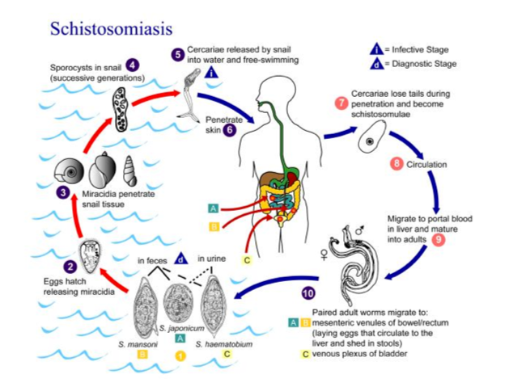

**Figure 1** *Schistosoma mansoni* lifecycle

The data you will be using were generated by the Parasite Genomics group at the Wellcome Sanger Institute; a draft genome sequence was initially published in 2009 ([Berriman et al. 2009](https://doi:10.1038/nature08160)), followed by an improved version in 2013 ([Protasio et al.](https://doi.org/10.1371/journal.pntd.0001455)); however, it has subsequently been the focus of further improvement, particularly using long read Pacbio data and genetic mapping, and now is largely complete in chromosome-scale scaffolds (7 autosomes + Z/W sex chromosomes) that total approximately 380 Mb in length.

Genome assembly of a 380 Mb genome is a relatively big task and is suited to a computer cluster environment, and not personal computers. To make things manageable in terms of computer power and run time, we have selected data that corresponds to a single *S. mansoni* autosome, designated chromosome IV, which is approximately 47 Mb in length. While only a fraction of the *S. mansoni* genome, a single chromosome is comparatively huge relatively to many prokaryotic genomes, and still comes with the complexity of an eukaryotic genome that is not often present in a prokaryote.

To assemble the 47 Mb chromosome IV, we will use the following workflow and demonstrate following concepts:

- Step 1: Checking raw sequencing data before assembly
	- Tools used: FastQC, MultiQC, Kraken

- Step 2: Estimating your genome size from raw sequence data
	- Tools used: Jellyfish, GenomeScope

- Step 3: Performing a genome assembly using either Illumina short read or Pacbio long read 	data
	- Tools used: Canu, Spades, Miniasm

- Step 4: Comparison of your assemblies against a known reference sequence
	- Tools used: Nucmer, Assemblytics

- Step 5: Further exploration of your genome assemblies
	- Tools used: Bandage, Nucmer, Genome Ribbon

```bash
# your first command – move to the working directory to get started!

cd /home/manager/Module_5_helminth_denovo_assembly/
```
---
[↥ **Back to top**](#top)


## Step 1: Checking raw sequencing data before assembly <a name="step1"></a>

The first exercise of any genomics project is to turn your sample of interest into sequencing data. There are many steps involved, including sample collection (and storage), DNA extraction (and storage), sequencing library preparation, and then finally submitting and having your DNA library sequenced on one or more of a number of different sequencing platforms. Not surprisingly then is that the success of each step will influence how well your sample will be sequenced and will impact on the quality of the data generated.  Exploring and understanding the characteristics of the raw data before any assembly is performed should give you some confidence in whether your data is sufficient to undertake a genome assembly, and may provide some insight into how an assembly will proceed.

We will use two tools to assess different aspects of the raw data. The first tool is called **FastQC** (https://www.bioinformatics.babraham.ac.uk/projects/fastqc/). FastQC takes raw fastq reads and provides simple graphs and tables to quickly assess the quality of the data. It also highlights where they may be problems in different aspects of your data (NOTE: it is parameterised on human data, i.e., GC content, and so may report as “failing” based on assessing your data [if not human] because it does not look like human – be aware that not all “fails” are bad). The features of the raw data that are being assessed is presented in the left-hand panel of Figure 2.

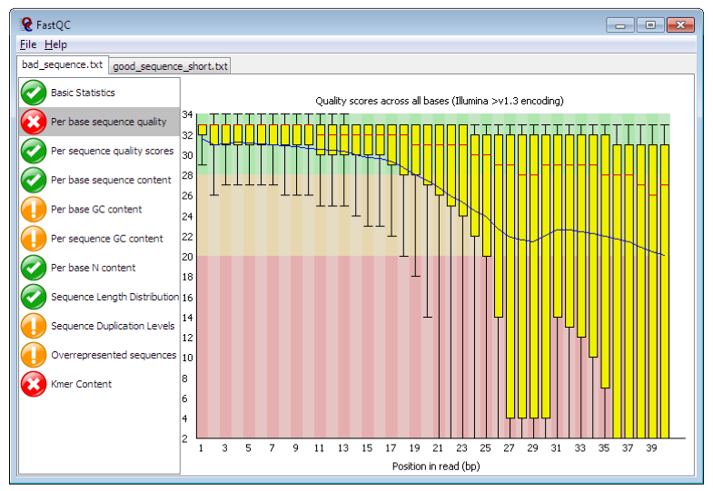

**Figure 2** . Example FastQC output. 	https://www.bioinformatics.babraham.ac.uk/projects/fastqc/


The main panel of this figure shows an example of the comparison of the distribution of per base quality (Phred score, on the y-axis) per base position in the read (x-axis). Phred scores above 30 are typically considered to be good quality for an Illumina read. In this case, it shows higher quality bases toward the start of the read (in the green section), followed by a decrease in quality along the read, in which the quality drops into the yellow (Phred < 30) and then into the red (Phred < 20). Some examples of “good” and “bad” quality data is found in the “Example Reports” section of the FastQC website.

The main features of the data to look out for will be:
- Per base sequence quality
     - Good overall indicator of data quality. Should remain mostly in the green, however, will drop in quality over the length of the read. Longer reads will show great drop, and R2 will show greater drop compared to R1.
- Per base sequence content
     - The base frequency of each nucleotide should reflect the GC content, with f(A)=f(T) and f(C)=f(G). The expectation is that these lines should remain horizontal and even throughout the read. Are they even?
- Per base sequence GC
     - Abnormal GC distribution is a good indicator of contamination. Does the GC profile fit the expected GC content for your species of interest? Is it a smooth distribution, or are their spikes?
- Per base N content
     - Is there an excess of positions in the reads for which a “N” base was called? Excess Ns can often indicate an issue with the sequencing.
- Sequence duplication levels
     - Is there excessive duplication? Duplication may suggests artefacts generated during library preparation / PCR amplification
- Adapter content
     - What is the proportion of known Illumina adapters that are present in the data?

FastQC reports would typically be generated for each read set. However, if you have a lot of datasets, it can be tedious to look at each one individually. We are going to use a visualisation tool called MultiQC (http://multiqc.info/), which can automatically detect the FastQC data once generated and arrange the data into single plots for all read sets. MultiQC is not only good for visualising FastQC output; it supports the QC of over 60 bioinformatic tools, including mapping, SNP calling, transcriptomic analyses etc. It it a great way of summarising lots of datasets in one place.

The second tool to assess the quality of your raw data is **Kraken** (https://ccb.jhu.edu/software/kraken/). Kraken is a fast way of assigning and approximating the abundance of known species based on short DNA sequences called kmers. A kmer is simply a short length of nucleotide sequence of a given length. For example, in a DNA sequence:
- DNA sequence: ATGCGTCATGC
- Kmer = 4 :  ATGC, TGCG, GCGT, CGTC, GTCA, TCAT, CATG, ATGC
- Kmer = 4 (n):  ATGC (2), TGCG (1), GCGT (1), CGTC (1), GTCA (1), TCAT (1), CATG (1)
     - I.e. ATGC was seen twice, while the rest were seen only once.

Kraken works by aligning kmers from your DNA sequence against known kmer frequency data for different species in a kraken database. It will therefore only assign species that it knows, else, it calls the sequence “unclassified”. Most kraken databases contain comprehensive bacterial and viral species lists, however, it may also contain human and mouse profiles. Kraken databases can be customised to include any species with DNA sequence available. Therefore, if you are investigating one of the species in the kraken database, running kraken will given you a good estimate of the amount of reads specifically from that species. If your species is not in the database, then you would expect most if not all reads to fall into the “unclassified” category. Either way, this approach can serve as an effective screen for contaminants in your sequencing reads.

### Tasks
1. run fastqc
2. visualise output of FastQC using MultiQC and check sequence quality
3. view the Kraken report to determine if there are any contaminants

```bash
# go to the working directory

cd /home/manager/Module_5_helminth_denovo_assembly/step_1  

# unzip your fastq read files

gunzip *.gz

#--- this will take a few moments, so just wait. As a hint, the "*" is a wildcard. Used here, it allows the unzip of any files in this directory that end with the ".gz". Wildcards save you some time, as you dont have to run the command twice for both files.

# run FastQC for read 1 and read 2

fastqc SM_V7_chr4_illumina_R1.fq

fastqc SM_V7_chr4_illumina_R2.fq


# Once FastQC has finished running for both rad files, run MultiQC and visualise output in web browser

multiqc .

firefox multiqc_report.html


# Once you have finished exploring FastQC/MultiQC, open the kraken report to determine the proportion of the read data that is “unclassified”.

head -n 25 kraken.report

#--- "head" is used to look at the top of the file, and "-n 25" selects the top 25 lines. You want to look at the very top of this output.
```

### The kraken report
The output of kraken-report is tab-delimited, with one line per taxon. The fields of the output, from left-to-right, are as follows:
- percentage of reads covered by the clade rooted at this taxon
- Number of reads covered by the clade rooted at this taxon
- Number of reads assigned directly to this taxon
- A rank code, indicating (U)nclassified, (D)omain, (K)ingdom, (P)hylum, (C)lass, (O)rder, (F)amily, (G)enus, or (S)pecies. All other ranks are simply '-'.
- NCBI taxonomy ID
- indented scientific name


### Questions
1. FastQC / MultiQC output
	- What are the similarities / differences between read 1 and read 2?
	- Are the base quality and nucleotide frequency distributions relatively level, or 	are they uneven?
2. Kraken
	- What proportion of the reads are “unclassified”, and therefore potentially *S. mansoni* reads?
	- What looks to be the main contaminant? Why might this be so?

---
[↥ **Back to top**](#top)


## Step 2: Estimating your genome size from raw sequence data <a name="step2"></a>

In this tutorial, we are in the unique position to already know what the length of the chromosome sequence were are trying to assemble. However, if sequencing a new species for the first time, we may not know what the genome size is. Knowledge of the genome size can be an important piece of information in its own right, however, it can also be useful to help parameterise some stages of the genome assembly.

We can estimate the genome size based a calculation of the kmer coverage of our reads. We introduced kmers in the last section – they are simply a string of nucleotides of a given length. The relationship between kmer coverage and genome size is described by:


Where Ckmer is the average kmer coverage, Nreads is the number of reads, L is the average read length, k is the length of the kmer, and G is the genome size (Vurture et al 2017; https://doi.org/10.1093/bioinformatics/btx153; supplementary data). It is not important to know this equation, however, we illustrate it to demonstrate that kmer coverage can be informative about genome size.

There are a number of different tools available to count kmers (https://omictools.com/k-mer-counters-category) and to calculate the genome size. Today, we are going to count kmers using Jellyfish (http://www.genome.umd.edu/jellyfish.html ), and use the output to calculate the genome size using a online web tool called GenomeScope (http://qb.cshl.edu/genomescope/info.php).  

You can explore some examples of kmer spectra and genome size estimates on the GenomeScope website. Figure 2 presents an example of a Drosophila dataset (quick access here: http://genomescope.org/analysis.php?code=example5); the difference between the two plots is the scale on the axes, with the first plot zoomed in, and the second plot zoomed further out. In both plots, the blue data represents the actual kmer frequency data generated by Jellyfish. The dark black line represents a model of the kmer spectra, used to characterise the number of peaks, which are indicated by the black dashed line. The orange line represents very rare kmers (low coverage), which are likely associated with sequencing errors and are ignored. This data is used to estimate the genome size, taking into account the heterozygosity and error of the sequencing reads.

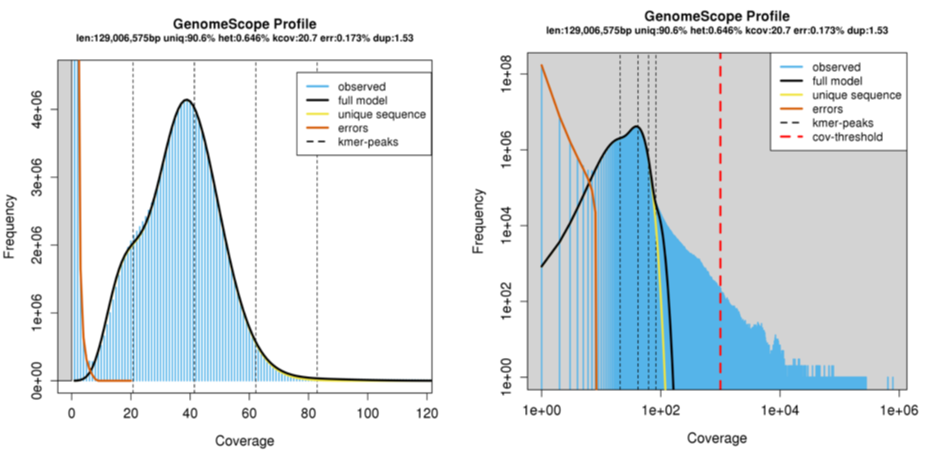

**Figure 3**. Example GenomeScope output. Kmer coverage is presented on the x-	axis, and kmer frequency on the y-axis.


### Tasks

1. Run jellyfish on your raw sequencing data
2. Upload your kmer count data to GenomeScope and estimate the genome size

```bash
# go to the working directory

cd /home/manager/Module_5_helminth_denovo_assembly/step_2  


# run Jellyfish commands. The first step will take a few minutes

jellyfish count -C -m 21 -s 1000000000 -t 4 ../step_1/*.fq -o reads.jf      

jellyfish histo -t 4 reads.jf > reads.histo


# Once Jellyfish commands have been run and you have the “reads.histo” file, open the webpage: http://qb.cshl.edu/genomescope/

# Upload reads.histo to GenomeScope

```

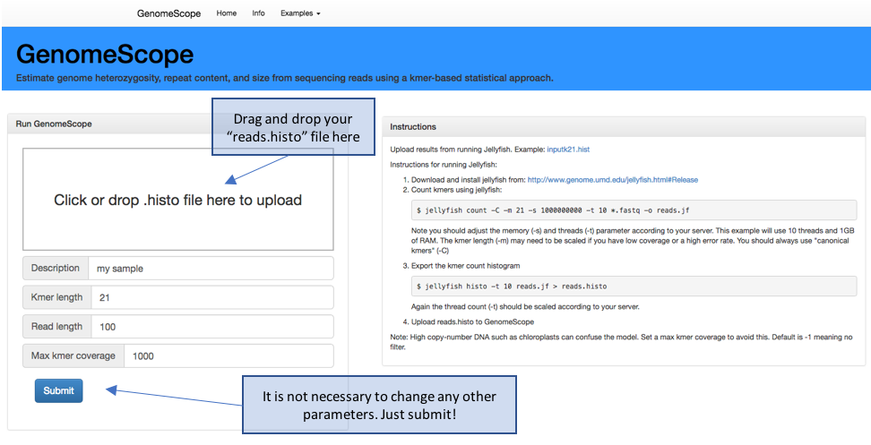

**Figure 4**. GenomeScope webpage. http://qb.cshl.edu/genomescope/


### Questions
1. what is my predicted genome / chromosome size?
2. how does it compare to the expected size?
3. what does changing the kmer length do?

---
[↥ **Back to top**](#top)


## Step 3: Performing a genome assembly using either Illumina short read or Pacbio long read data <a name="step3"></a>

Now that you have performed some QC on your raw data and estimated your genome size, it is now time to perform a genome assembly. There are a huge number of tools dedicated to genome assembly; OMICS tools describes 163 dedicated for *de novo* genome assembly (https://omictools.com/genome-assembly-category), however, there are likely others. Furthermore, there are likely to be at least as many tools that value-add to a genome assembly, including but not limited to scaffolders, circularisers, gap closers etc. The choice of assembler and subsequent add-ons is dependent on the type of data available, type of organism, i.e., haploid, diploid etc, genome size, and complexity of the task among other variables.  

The aim of this practical is not to assess these tools or promote any particular tool(s) in any meaningful way, but to compare and contrast two technologies commonly used in genome assembly: Illumina short-read and Pacbio long read.

Illumina short read sequencing has been the workhorse of genome assembly and resequencing studies for the last few years, and continues to be the main technology for high throughput genome sequencing. This is because it is possible to sequence millions to billions of short reads at the same time. A genome assembly using Illumina short reads begins by fragmenting DNA into ~300-500 bp lengths (less than 1000 bp), after which universal sequencing adapters are ligated to each end to generate a sequencing library. These adapters enable a site for a sequencing primer to bind, the attachment of the library read to the sequencer, and may contain barcoding indices to allow sample multiplexing. Sequencing is typically performed using a paired-end chemistry, which means that two reads are generated per library fragment, one from the beginning of the fragment, ie. read 1, and one from the end, ie. read 2. Depending on the chemistry and sequencer used, these paired-reads will each be ~100-250 bp in length; therefore, some read 1 and read 2 pairs will overlap, whereas others will be separated by a gap, dependent on the library fragment and sequencing read lengths. After sequencing, paired-end reads (which maintain their relationship and orientation via information coded in their name in the fastq output files) are assembled, resulting in contigs – contiguous stretches of assembled sequence that do not contain gaps - and scaffolds – which are assembled sequence that do have gaps, typically generated by the spanning of two contigs by read pairs that do not overlap and lack nucleotide coverage in the gap. The contiguity is therefore dependent on the ability to find unique overlaps between read pairs; features of the genome, including by not limited to repetitive and/or low complexity regions, or even inherent genetic diversity in the sequences, cause uncertainty in the assembly and often prevents further extension of a contig or scaffold. To overcome some of these difficulties, library preparation approaches to produce mate-pair or jumping libraries may be performed, which increase the gap distance between the paired-end reads, ie., 3-kb, 8-kb, 20-kb, and in turn, may span the difficult to assembly region; this results in an increase in the scaffold- but not contig length overall.

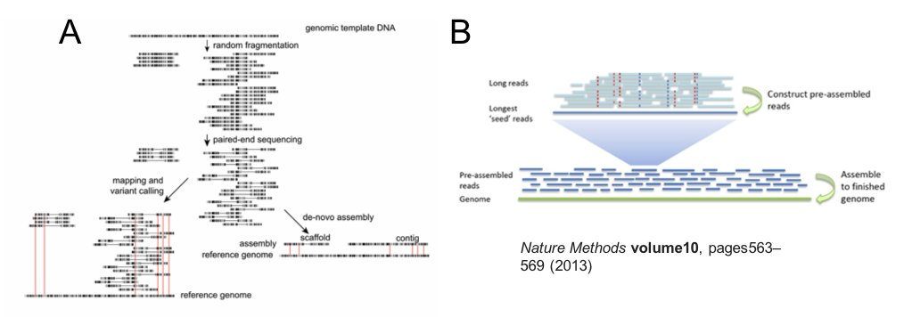

**Figure 5**. Overview of Illumina short read (A) and Pacbio long read assembly approaches (B).


While Illumina library preparation aims to sequence from fragments of DNA that are only a few hundred base pairs long, Pacbio sequencing aims to sequence DNA fragments that are tens of kilobases in length, ie. 10s-100s of times longer than Illumina reads. The key advantage of this approach is that many short, complicated genome regions that would have broken an Illumina assembly are spanned by Pacbio long reads, and therefore can be assembled accurately. Moreover, the longer read lengths increase the probability of identifying unique overlaps between reads. Both features enable significantly longer contig lengths from an Pacbio assembly when compared to an Illumina assembly alone.

One feature of all sequencing technologies is that sequence quality declines over the read length - you should have observed this in your FastQC analysis of raw Illumina reads (Step 1: Checking raw sequencing data before assembly). Pacbio reads are not only much longer than Illumina reads, but that when sequenced, the raw reads produced are derived from a single molecule of DNA. This differs from Illumina reads, in which a “raw” (but really, a consensus sequence) is generated from a cluster of reads representing the original library fragment. For these two reasons, Pacbio reads are more error-prone than Illumina reads. To overcome this, two initial informatic “correction” steps are undertaken prior to assembly (Figure 5B). Raw DNA is fragmented and size selected to achieve fragment lengths in the 10s of kilobases, before the addition of barbell adaptors, which provide sequencing primer binding sites. Sequencing is performed by the polymerase attaching to the barbell adaptor, and processing around the circle to produce a raw read, which contains the library insert sequence flanked by the adapter sequences in an array. In the first correction step, the raw read is trimmed to remove adapters, and the library inserts are aligned to produce a consensus sequence.  In the second correction step, the longest of the first round consensus sequences (~30-40% of the total reads) are used as a template to map the remaining shorter, more accurate reads; taking the consensus of the mapped reads, in turn, corrects the longer reads. In this way the more error prone long reads increase in quality, which is ideal from an assembly point of view. Only these long, twice corrected reads are used for the genome assembly.

The process of error correction does take a substantial amount of time and compute resources. It has recently been demonstrated that the second error correction step can be sacrificed to significantly increase assembly speed and the cost of assembly base-level accuracy, i.e., it is uncorrected, and so the assembly error rate is similar to the read error rate. We will perform a raw Pacbio assembly using Minimap and Miniasm to compare with our other two assemblies.


### Tasks
1. NORMALLY, we would get you to perfrom an assembly using MINIASM. However, it is somewhat time and memory intensive, and given we are all working from our home computers etc, we will skip this step.
	- We have kept the block of code below so you can see how it is done, however, you do not need to run this code.
2. We will still determine the assembly statistics of each genome assembly
	- The Miniasm, Canu and Spades assemblies have been provided for you
    	– it would take too long to run these here – however, we have provided the commands for your reference
3. Determine the assembly statistics of each genome assembly

```bash
# go to the working directory

cd /home/manager/Module_5_helminth_denovo_assembly/step_3  


# run the Miniasm assembly

# minimap2 -x ava-pb –t6 SM_V7_chr4_subreads.fa.gz SM_V7_chr4_subreads.fa.gz > SM_V7_chr4.minimap.paf
# - this first step will take some time.

# miniasm -f SM_V7_chr4_subreads.fa.gz SM_V7_chr4.minimap.paf > SM_V7_chr4.miniasm.gfa

# cat SM_V7_chr4.miniasm.gfa | awk '$1=="S" { print ">"$2"\n"$3}'  > MINIASM_SM_V7_chr4.contigs.fasta

#--- run time: step1 ~ 20 mins, 20 Gb RAM, 6 threads, steps2 and 3 are quick (< 1 min)


# NOTE - the commands below have been provided for your reference (particularly to compare the run times), you do not need to run them
# run the Canu assembly
#
# canu genomeSize=43M -pacbio-raw SM_V7_chr4_subreads.fa –d PB_SM_V7_chr4 -p PB_SM_V7_chr4 java=/software/jdk1.8.0_74/bin/java
#
#--- run time: ~ 6h, 30 Gb RAM, 4 threads
#
#
# run the Spades assembly
#
# dipspades.py -o SPADES_SM_chr4 -1 SM_V7_chr4_illumina_R1.fq -2 SM_V7_chr4_illumina_R2.fq --threads 4
#
#--- run time: ~ 50h, 6 Gb RAM, 4 threads
```

Once you have your assemblies, you will probably want to know how well they have come together. We will do this in two ways, first by generating and comparing basic statistics about the assemblies, and secondly from a comparative genomics perspective by visualising how well each assembly compares to the known reference, and to each other (next section: Step 4).

Table 1 below outlines the data we will generate about each assembly. Each is relatively self-explanatory, however, you may not have been introduced to N50 and N50(n). These statistics are a measure of how contiguous a genome assembly is. Imagine if your assembly is sorted by sequence length, ie., longest to shortest; your N50 is defined as the sequence length at which 50% of the entire assembly is contained in contigs or scaffolds equal to or larger than this contig. It is essentially the midpoint of the assembly. The N50(n) is simply the contig number in which the N50 base is found. More contiguous assemblies will have a higher N50 (and lower N50(n)), whereas more fragmented assemblies will show the opposite trend. Note that you can artificially increase N50 by randomly joining sequences together, and therefore, misassembly or overassembly can inflate N50 values. It is important to not completely rely of N50 as absolute truth and to perform other assembly validations if possible.

```bash
# calculate the assembly statistics for all three assemblies, and complete Table 1 below.

assembly-stats PB_SM_V7_chr4.contigs.fasta

assembly-stats MINIASM_SM_V7_chr4.contigs.fasta

assembly-stats SPADES_SM_V7_chr4.consensus_contigs.fasta
```

**Table 1**. Comparison of assembly stats
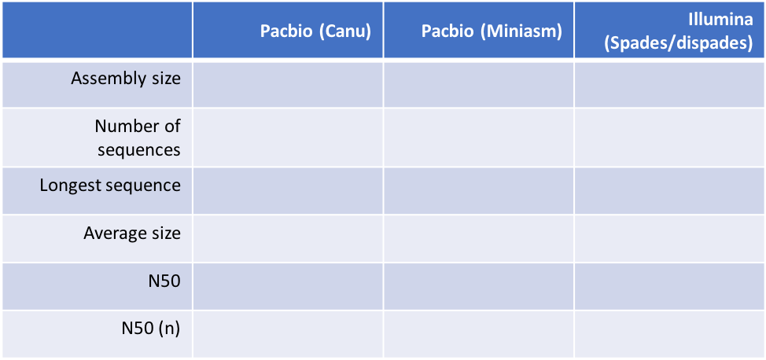


### Questions

1. how do my assemblies compare to the expected size of chomosome IV?
2. what is the impact of long reads versus short reads on assembly contiguity?
3. how did the uncorrected (Minimap/miniasm) assembly compare to the corrected Canu assembly?

---
[↥ **Back to top**](#top)


## Step 4: Comparison of your assemblies against the known reference sequence <a name="step4"></a>

Now that we have three independent genome assemblies, we would like to see how they compare to the reference chromosome IV sequence. This is only possible because we already have a reference sequence, however, if you have a closely related species with a more contiguous reference, it might be worth trying. If you do not have a good reference to compare against, you could simply compare different versions of the *de novo* assembly to see how they compare (we would like you to do this if you have time).
There are a number of ways to compare genomes. We will be using nucmer to do the DNA vs DNA sequence comparison, and the web application Assemblytics (http://assemblytics.com/) to visualise the comparison. Assemblytics is a nice way to visualise this comparison, as it not only allows a “zoomed” out view of how the genomes compare (via the Interactive dot plot), but it also provides base-level and small structural variant statistics. These can be informative particular when comparing different sequencing technologies, ie., Illumina versus Pacbio, and may reveal inherent biases in each.


### Tasks

1. Run nucmer of each of the three comparisons, ie. Ref vs PB, ref vs miniasm, ref vs illumina
2. Explore each of the interactive dotplots
3. Compare the base level statistics for each comparison (these are the colour plots)

```bash
# go to the working directory

cd /home/manager/Module_5_helminth_denovo_assembly/step_4  


# run nucmer to generate the comparison between the reference and each genome assembly. We have provided one example, but we would like you to modify the command to also run the SPADES assembly against the reference. Note that it might take a while longer to run.

nucmer -maxmatch -l 100 -c 500 SM_V7_chr4.fa ../step_3/PB_SM_V7_chr4.contigs.fasta -prefix chr4_v_PB

gzip chr4_v_PB.delta


# open the webpage: http://assemblytics.com/
# upload the OUT.delta.gz using the instructions provided
# note that that upload might take a minute or two to analyse # the raw data and provide the data output / plots
```

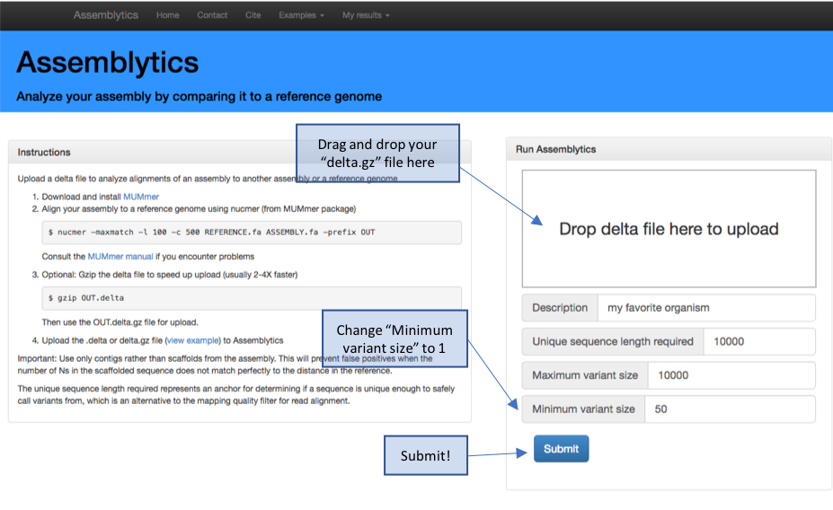

**Figure 6**. Assemblytics hompage and upload instructions

Note: once your analysis competed successfully on the website, it will generate a http link that you can use to visualise your data even after you have closed your browser down. This is nice, as it means you can easily share this analysis via email of the link. Make a note of each http link for each comparison so you can compere each comparison.

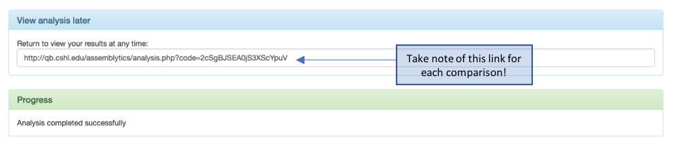

**Figure 7**. Assemblytics output – saving the http link for future reference


To help you visualise and interpret the interactive dot plot, we have provided some examples of pairwise DNA sequence comparisons that are commonly observed (Figure 7). Ideally, we are looking for a perfect match (a), however, there are many feature of a genome that either complicate, and often break, assemblies, including repeats (b), palindromes (c), and low complexity repeats such as microsatellites (e) to name a few. See what features are present in your assemblies, and if there are features associated with the ends of contigs that might be associated with breaking your assemblies.  


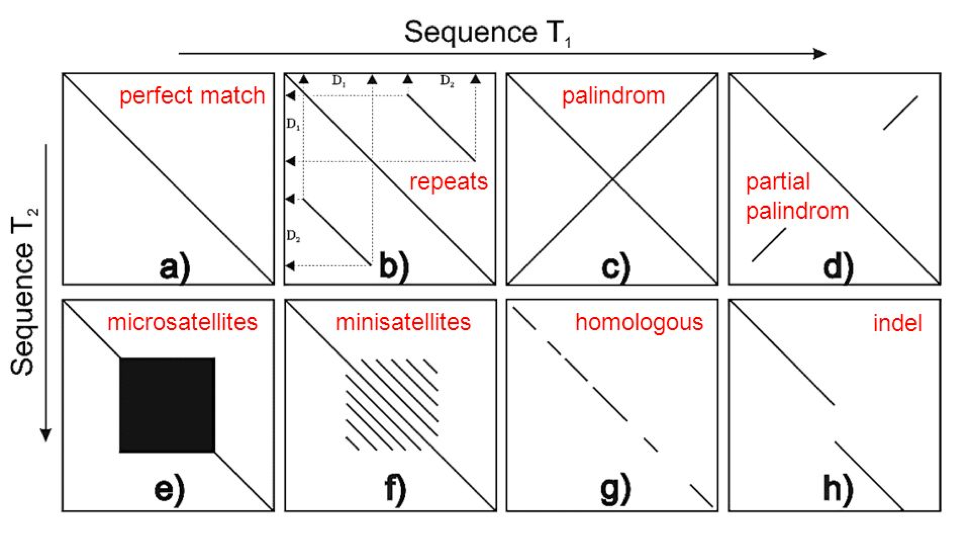

**Figure 8**. Schematic of dot plot examples. Originally from goo.gl/P4QTFd; adapted from http://slideplayer.com/slide/10357320/


### Questions

1. how does each assembly compare against the reference?
2. particularly in the ref vs PB dot plot comparison, what sequence features are found and sequence ends, and why might they be there?
3. are there base level characteristics found in one assembly but not the other? Is there anything specific to the Pacbio assembly but not Illumina assembly, and vice versa?
4. what sequence features define the uncorrected Miniasm in particular?

---
[↥ **Back to top**](#top)


## Step 5: Further exploration of your genome assemblies <a name="step5"></a>

Now that we have compared and contrasted our initial genome assemblies, we would now want to think about ways of improving them to make them more contiguous – each of our assemblies is still some way off being a single sequence, i.e., a single chromosome. One way would be to generate additional, complementary data that might be used to scaffold the existing contigs together to create much longer sequences. Approaches include generating mate-pair libraries, or alternate long range sequencing technologies such as Nanopore, optical mapping, or HiC to name a few. However, this is obviously outside the scope of this tutorial.
Our assemblies are currently represented in a FASTA file; each individual sequence is presented separate from each other, and there is no information that links each sequence to each other. However, in generating the assembly, the assembler catalogs overlaps between sequences with the aim of joining / extending existing sequences; if there is a single overlap, a join is made, however, if there are two or more overlaps between which the assembler cannot confidently make a decision, it will not make the join and report multiple sequences. These multiple paths between sequences might be due to genetic variants, haplotypes, repeats etc. Importantly, some assemblers record these multiple paths in a structure known as a genome graph. These genome graphs are composed of:
- nodes – these are the individual sequences presented in the FASTA
- edges – these link two nodes together
- paths – describes the linking of nodes via edges to form a longer sequence

We will use the tool Bandage (https://rrwick.github.io/Bandage/) to visualise the genome graphs produced by miniasm and spades assemblers, and demonstrate how to extract extended sequences from these graphs to extend your genome assemblies. We will compare your new sequence against the reference using the web tool, Genome Ribbon (http://genomeribbon.com/), which is similar to ACT, but is more suited for larger genomes.


### Tasks

1. visualise and compare the Pacbio miniasm and Illumina Spades genome graphs
2. using the Pacbio miniasm graph, construct a path through the graph, making a new sequence
3. compare your new sequence against the reference


```bash
# go to the working directory

cd /home/manager/Module_5_helminth_denovo_assembly/step_5  


# load Pacbio miniasm genome graph into Bandage. This file was made during the miniasm assembly

Bandage load SM_V7_chr4.miniasm.gfa


# use Bandage to explore the graph
```

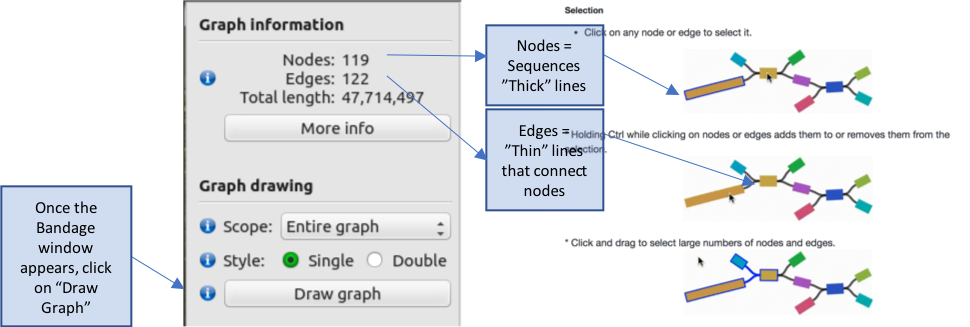

The genome graph is sorted by size, with the largest sequence(s) in the top left corner, which get progressively smaller down the page. The colours represent difference sequences in the genome, which are called “nodes” in the graph. These are joined in some cases by thin black lines called “edges”, which where possible, describe the relationship between sequences. Graphs therefore provide an additional level of detail over the genome sequence alone; each node is represented as an independent sequence in a fasta file, however, in a genome graph, alternate paths that connect nodes can be visualised. These alternate paths typically break assemblies, as the assembler cannot reliable choose a single path to extend the assembly.

Explore the genome graph, zooming into some of the groups of sequences. Some consist of a single node, i.e., a single contig sequence, with no relationships to other sequences, whereas other are more complex, in which larger nodes may be connected by two or more alternate nodes.

```bash
# Once finished, load the Illumina (SPADES) graph (made during the Illumina assembly) into Bandage, and compare.

Bandage load SM_V7_chr4.spades.gfa

# Note that this file will take longer to load than the previous one.
```

Once Bandage loads, we are going to limit the amount of data displayed to enable faster viewing.
1. Under the “Graph drawing” subheading, select “Depth Range” in the “Scope” drop-down.
2. Set the ”min” to 5 and “max” to 30
3. Click on “Draw Graph”
NOTE: if the graph has not appeared after 2-3 mins, click on “Cancel layout”, after which the graph should appear shortly.

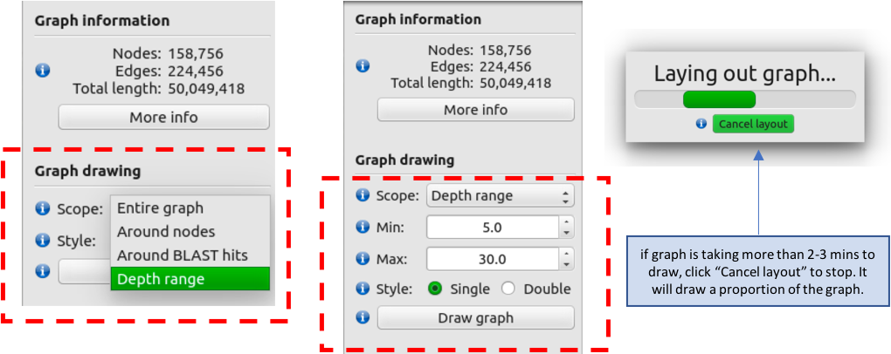

The Illumina genome graph will look *quite* different to the Pacbio miniasm graph.

Zoom out completely to give you a sense of the scale of the graph.
- If you recall from the “assembly-stats” output in step 3, the Illumina assembly was in many more pieces than the Pacbio assemblies. The graph reflects this by the large number of unique nodes present.

Move to the top left hand corner containing the largest collection of sequences, and take a closer look by zooming in.
- The graph also demonstrates the reason for the fragmentation in the Illumina assembly; the relationships between nodes is often much more complex with many more paths present, due to non-unique edges between sequences.
- You should also see in this this graph (if you look closely) that there are many paths that terminate suddenly. If you looker closer still at the direction of the edges connecting the nodes, some look to turn around, resulting in a duplication of the sequence. This might be due to repetitive or haplotypic sequences in the assembly.


Lets perform a basic improvement to our Pacbio miniasm assembly, by trying to use the graph information to string multiple nodes (sequences) together to produce a longer sequence.
- Reopen the Pacbio miniasm graph as you have done so previously.

```bash
# make sure you are still in the correct working directory

cd /home/manager/Module_5_helminth_denovo_assembly/step_5  

Bandage load SM_V7_chr4.miniasm.gfa
```
- Draw graph. Zoom in on the top left hand corner on the largest graph
- Select a node, and while continuing to hold the “ctrl” key, select multiple nodes in a linear path
     - You can move the nodes around if you need to to make it clearer / easier to see the path by clicking on one and dragging it to the side
     - Be careful not to double back on yourself – it will not save if it is not linear. For example:

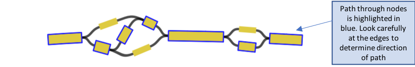

- To save your path, go to “Output”, and select “Save selected path sequence to FASTA”, and then save it as “path_sequence.fasta” and click on “save”

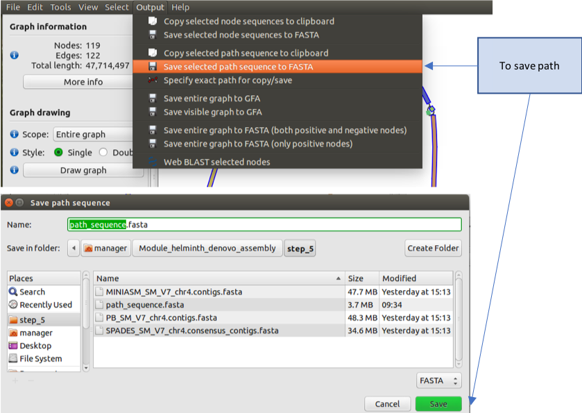


Lets now compare your new sequence back against the reference to see how you have done.
- Use nucmer to compare the reference sequence and your new path_sequence

```bash
# Compare your new sequence with the reference using nucmer and show-coords

nucmer -maxmatch SM_V7_chr4.fa path_sequence.fasta

show-coords -lTH -L10000 out.delta  > out.coords

# once completed, load Genome Ribbon (genomeribbon.com) in a web browser.
```
- Load your data into Genome Ribbon. Scroll down the page until you see the “Input alignments” window, select the tab “coordinates”, and then click “Browse”
- A finder window will appear – select your “out.coords” file and click “Open”

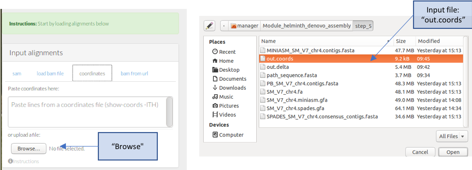

- The comparison between your sequence and the reference should now appear.

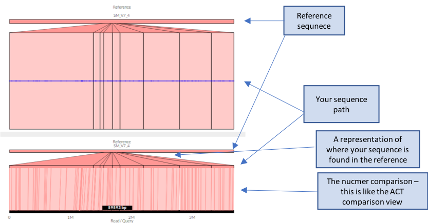


### Questions

1. what are the main differences between the Pacbio and Illumina genome graphs?
2. what is the length of your new sequence?
3. how did your new sequence compare to the reference? Was it syntenic?

---
[↥ **Back to top**](#top)


## Summary <a name="summary"></a>
This module aimed to introduce you to some of the concepts involved in eukaryotic genome assembly, from the QC of your raw data, through to assembly, validation and improvement.  In reality, eukaryotic genomic assembly is a challenging task, often requiring multiple datasets and tools, each with their own strengths and weaknesses. It is important to understand or at least be aware of these differences to maximise the completeness of the assembly. Hopefully it is clear from the examples that long read technologies such as Pacbio significantly improve the contiguity of assemblies over Illumina-only assemblies.

---
[↥ **Back to top**](#top)


## References / Links <a name="references"></a>
- Assemblytics
     - Web: http://assemblytics.com/
     - Paper: https://doi.org/10.1093/bioinformatics/btw369
- Bandage
     - Web: https://rrwick.github.io/Bandage/
     - Paper: https://academic.oup.com/bioinformatics/article/31/20/3350/196114
- Canu
     - Web: https://canu.readthedocs.io/en/latest/
     - Paper: https://genome.cshlp.org/content/27/5/722.full.pdf+html
- FastQC
     - Web: https://www.bioinformatics.babraham.ac.uk/projects/fastqc/
- Genome Ribbon
     - Web: http://genomeribbon.com/
     - Paper: https://www.biorxiv.org/content/early/2016/10/20/082123
- Genome Scope:
     - Github: https://github.com/schatzlab/genomescope
     - Paper: https://doi.org/10.1093/bioinformatics/btx153
- Illumina
     - Web: https://emea.illumina.com
- Jellyfish
     - Web: http://www.genome.umd.edu/jellyfish.html
     - Paper: https://doi.org/10.1093/bioinformatics/btr011
- Kraken
     - Web: https://ccb.jhu.edu/software/kraken/
     - Paper: https://doi.org/10.1186/gb-2014-15-3-r46
- Minimap2 / Miniasm
     - Github: https://github.com/lh3/minimap2
     - Paper: https://academic.oup.com/bioinformatics/article/32/14/2103/1742895
- MultiQC
     - Web: http://multiqc.info/
     - Paper: https://doi.org/10.1093/bioinformatics/btw354
- Nucmer
     - Web: http://mummer.sourceforge.net/
     - Paper: http://mummer.sourceforge.net/MUMmer3.pdf
- Pacbio
     - Web: https://www.pacb.com
- Spades / dispades
     - Web: http://cab.spbu.ru/software/spades/
     - Paper: https://dx.doi.org/10.1089%2Fcmb.2012.0021

---
[↥ **Back to top**](#top)


## License
<a rel="license" href="http://creativecommons.org/licenses/by/4.0/"></a><br />This work is licensed under a <a rel="license" href="http://creativecommons.org/licenses/by/4.0/">Creative Commons Attribution 4.0 International License</a>.
