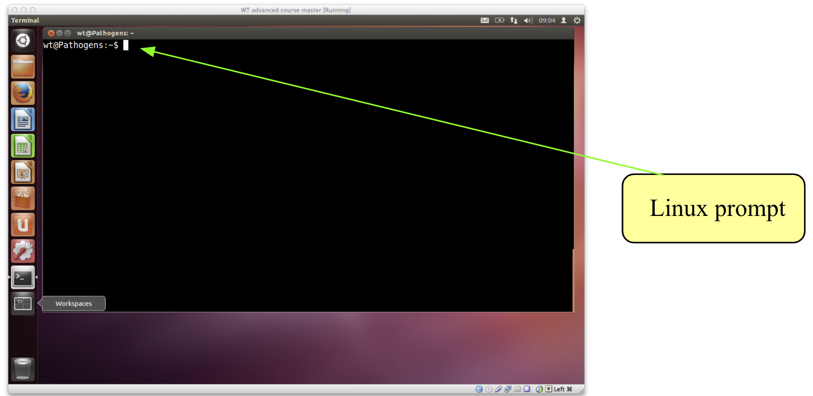
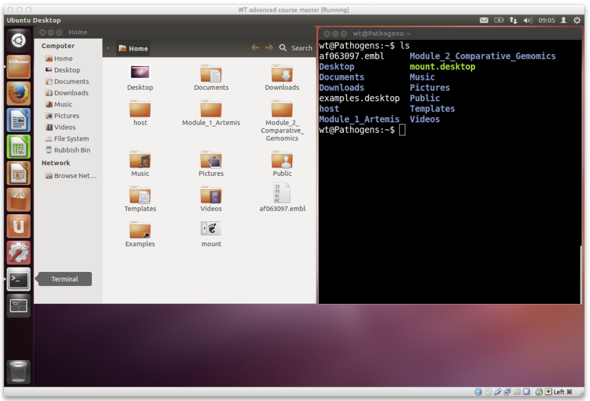
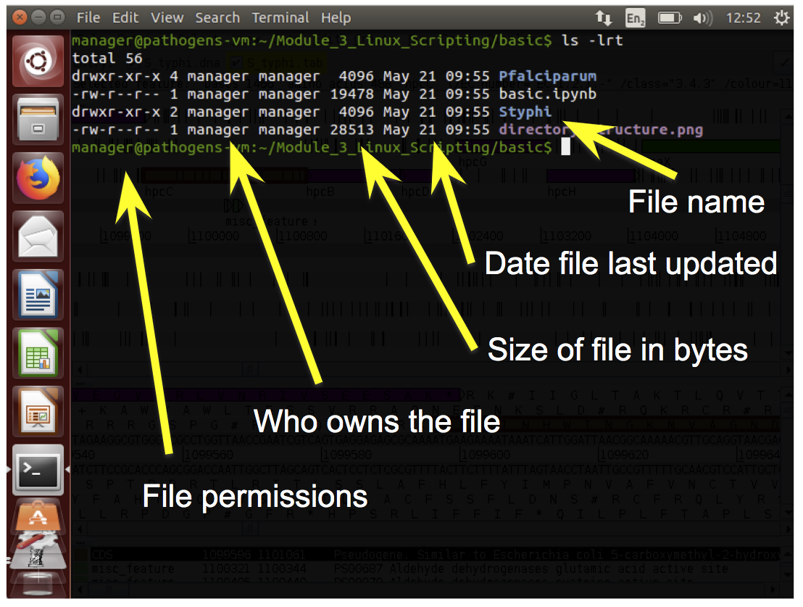
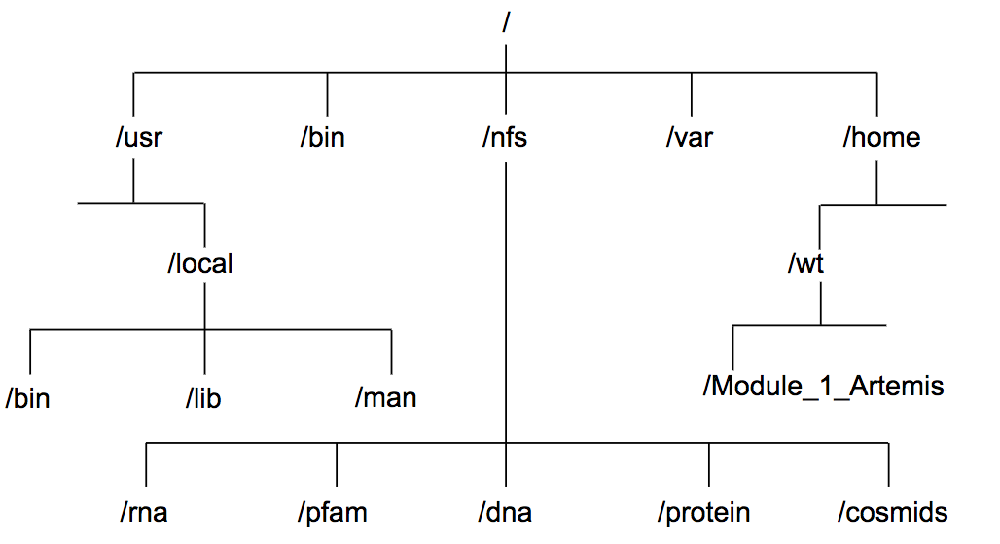
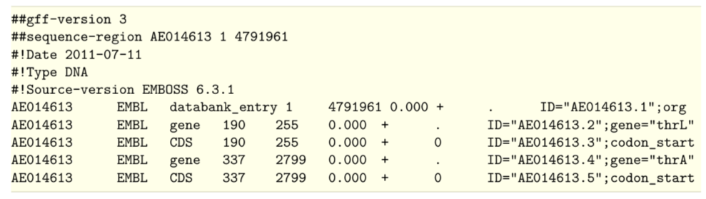
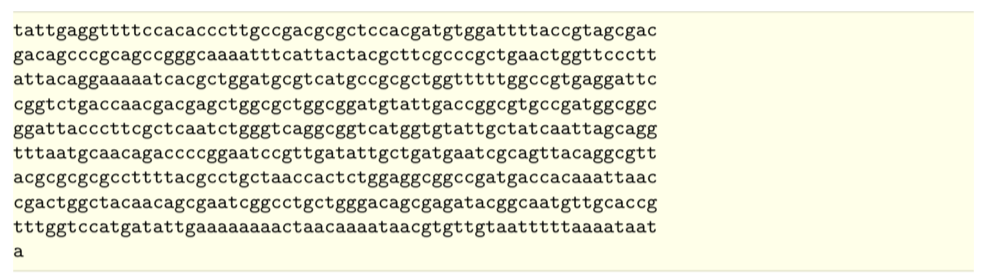

# Linux Scripting


## Table of Contents
1. [Introduction and aims](#intro)
2. [Getting started on the command line - Basic unix](#getting_started)
3. [Files and directories](#files_directories)
4. [Looking inside files](#inside_files)
5. [Searching the content of files using grep](#grep)
6. [Processing columns with awk](#awk)
7. [Loops](#loops)
8. [Bash scripts](#scripts)
9. [UNIX quick reference guide](#quick_ref)

---


## Introduction and Aims <a name="intro"></a>

### Introducing Linux
Unix is the standard operating system on most large computer systems in scientific research, in the same way that Microsoft Windows is the dominant operating system on desktop PCs.

Unix and MS Windows both perform the important job of managing the computer's hardware (screen, keyboard, mouse, hard disks, network connections, etc...) on your behalf. They also provide you with tools to manage your files and to run application software. They both offer a graphical user interface (desktop). These desktop interfaces look different between the operating systems, use different names for things (e.g. directory versus folder) and have different images but they mostly offer the same functionality.

Unix is a powerful, secure, robust and stable operating system which allows dozens
of people to run programs on the same computer at the same time. This is why it
is the preferred operating system for large-scale scientific computing. It runs
on all kinds of machines, from mobile phones (Android), desktop PCs... to supercomputers.


### Why Linux
Increasingly, the output of biological research exists as *in silico* data, usually
in the form of large text files. Unix is particularly suitable for working with
such files and has several powerful and flexible commands that can be used to
process and analyse this data. One advantage of learning Unix is that many of the
commands can be combined in an almost unlimited fashion. So if you can learn just
six Unix commands, you will be able to do a lot more than just six things.

Unix contains hundreds of commands, but to conduct your analysis you will probably
only need 10 or so to achieve most of what you want to do. In this course we will
introduce you to some basic Unix commands followed by some more advanced commands
and provide examples of how they can be used in bioinformatics analyses.


### General points to consider
- Linux is pretty straightforward, but there are some general points to remember that will make your life easier:
     - Linux is case sensitive - typing *"ls"* is not the same as typing *"LS"*.
     - You need to put a space between a command and its argument - for example, *"more myfile"* will show you the contents of the file called *myfile*; *"moremyfile"* will just give you an error!
     - Linux is not psychic! If you misspell the name of a command or the name of a file, it will not understand you.
     - Many of the commands are only a few letters long; this can be confusing until you start to think logically about why those letters were chosen
          - ls for list, rm for remove and so on.
     - Often when you have problems with Linux, it is due to a spelling mistake, or perhaps you have omitted a space.
- If you want to know more about Linux and its commands there are plenty of resources available that provide a more comprehensive guide, for example:
     - http://Linuxhelp.com
     - https://learn.datacamp.com/


### Some useful Linux commands

| Command   |    What it does   |
| ---  |    ---  |
| ls   | Lists the contents of the current directory  |
| mkdir | Makes a new directory    |
| mv   | moves or renames a file  |
| cp   | copies a file  |
| rm   | removes a file |
| cat | concatenates two or more files |
| less |    displays the contents of a file one page at a time     |
| head | displays the first ten lines of a file |
| tail |    displays the last ten lines of a file   |
| cd | change directory   |
| pwd | print the working directory |
| find | find files matching an expression     |
| grep | search for a pattern within a file    |
| wc | count the lines, words, characters or bytes in a file |
| kill | stop a process |
| jobs | list the processes that are running |


### Tips to get you started
- read the text! It contain lots of hints that should help you to answer some of the questions
- grey boxes contain instructions for running commands
     - lines that start with a hash, ie *"#"* are a comment line - do not type these out.
     - lines that start with the following symbols should be typed out. Different programming languages have different symbols,
          - '\$' : this is a shell prompt
               - everything performed in this module is using the shell prompt
          - '\>' : this is a R prompt
               - this may appear in other modules
               - note that you also see this on the shell prompt if you have not completed a command correctly   
          - '\>\>\>' : this is the python prompt  
               - you are not going to be using python here, but may choose to learn it in your own time as it is a very versatile programming language commonly used in bioinformatics
     - note that you don't actually type out the command prompt symbol, i.e. ignore the "$" at the start of the line, just type out the command after it.

---
[↥ **Back to top**](#top)


## Getting started on the command line - Basic unix <a name="getting_started"></a>

### Introduction to the terminal
- Lets get started with the command line
- In this workshop, we will be using Ubuntu, a version of Linux which was specially designed for PCs.

- We will use a terminal window to type in our Linux command line.
     - This is similar to the "Command Prompt" window on MS Windows systems, which allows the user to type DOS commands to manage files.


- You should see a window labelled "Terminal" which will be empty except for a ’$' character at the top left.      
     - The '$' character is the Linux prompt, similar to "C:\" in DOS. Note: the prompt will often be different on different Linux computers, for example it may be displayed as a ‘%’ character.

- All Linux programs may be run by typing commands at the Linux prompt $. The command line tells the computer what to do.
     - You can type commands directly into the terminal at the '$' prompt.



```bash
# your first command – move to the working directory to get started!

cd /home/manager/Module_2_Linux_Scripting

```

- A list of useful commands can be found on a previous page.   
     - Many of them are two- or three-letter abbreviations. The earliest Linux systems (circa 1970) only had slow Teletype terminals, so it was faster to type 'rm' to remove a file than 'delete' or 'erase'. This terseness is a feature of Linux which still survives.   

---


### Command line arguments
- You may subtly alter these commands by specifying certain options when typing in the command line.
- Typing any Linux command for example *ls*, *mv* or *cd* at the Linux prompt with the appropriate variables such as files names or directories will result in the tasks being performed on pressing the enter key.
- The ‘command’ is separated from the options and arguments by a space.  
- Additional options and/or arguments can be added to the commands to affect the way the command works.
- Options usually have one dash and a letter (e.g. -h) or two dashes and a word (--help) with no space between the dash and the letter/word.
- Arguments are usually filenames or directories.
- For example, to get a list of files in the terminal you can use the ls command with no other options. This tells the computer you want a list of all the files in the current directory.  The same information is also displayed in the file browser but with nice looking pictures.



- Lets try out some different examples of the "ls" command:   

```bash
# List the contents of a directory
$ ls

# List the contents of a directory with extra information about the files
$ ls –l

# List all contents including hidden files & directories
$ ls –al 	

# List the contents of the directory called basic with extra information
$ ls –l basic

# Suggested usage – this will be the most frequent command used as a bioinformatician!
$ ls –ltr

# where:
	–l gives the long format,
	-t sort the output by time,
	–r reverse sorts the output.

# this will therefore provide a detailed list, with the most recent files at the bottom. This is really useful if you have a lot of files in the same directory

```

- By using the *–l* (lowercase L for "long") option we can change the behaviour of the *ls* command. Instead of printing out a simple list, it will print out additional information about each file. There is a space between the command *ls* and the *–l* option. There is no space between the dash and the letter l.



---


### Permissions
- Every file has permissions which restrict what can be done with a file or directory.  

| Permission   |    What it does   |
| --- | --- |
| Read (r) |	permission to read from a file/directory |
| Write (w) | 	permission to modify a file/directory |
| Execute (x) | 	Tells the operating system that the file contains code for the computer to run, as opposed to a file of text which you open in a text editor. |

- The first set of permissions (characters 2,3,4) refer to what the owner of the file can do
- the second set of permissions (5,6,7) refers to what members of the Linux group can do
- the third set of permissions (8,9,10) refers to what everyone else can do.

---
[↥ **Back to top**](#top)


## Files and Directories <a name="file_directories"></a>
- Directories are the Linux equivalent of folders on a PC or Mac.
- They are organised in a hierarchy, so directories can have sub-directories and so on.
- Directories are very useful for organising your work and keeping your account tidy - for example, if you have more than one project, you can organise the files for each project into different directories to keep them separate. You can think of directories as rooms in a house. You can only be in one room (directory) at a time. When you are in a room you can see everything in that room easily. To see things in other rooms, you have to go to the appropriate door and crane your head around. Linux works in a similar manner, moving from directory to directory to access files.
- The location or directory that you are in is referred to as the current working directory.



- Therefore, if there is a file called *genome.seq* in the dna directory its location or full pathname can be expressed as */nfs/dna/genome.seq*.

---


### pwd - find where you are
- The command *pwd* stands for print working directory.
- A command (also known as a program) is something which tells the computer to do something. Commands are therefore often the first thing that you type into the terminal (although we'll show you some advanced exceptions to this rule later).
- As described above, directories are arranged in a hierarchical structure. To determine where you are in the hierarchy you can use the *pwd* command to display the name of the current working directory. The current working directory may be thought of as the directory you are in, i.e. your current position in the file-system tree.

```bash
# To find out where you are, type this into your terminal.
$ pwd

$ cd basic

$ pwd

```
- Remember that Unix is case sensitive, *PWD* is not the same as *pwd*.
- *pwd* will list each of the folders you would need to navigate through to get from the root of the file system to your current directory.
     - This is sometimes referred to as your 'absolute path' to distinguish that it gives a complete route rather than a 'relative path' which tells you how to get from one folder to another.
     - More on that shortly ...

---


### cd - change current working directory
- The command *cd* stands for change directory.
- The *cd* command will change the current working directory to another, in other words allow you to move up or down in the directory hierarchy.
- To move into the genome_1 directory , complete the following:
     - Note, you'll remember this more easily if you type this into the terminal rather copying and pasting.
     - Also remember that you can use tab completion to save typing all of it.

```bash
# Move into the genome_1 directory using the cd command
$ cd genome_1/

# Use the pwd command to check you are in the right place
$ pwd

# it is often useful to list the contents of your new location after moving
$ ls -lrt

```
- There are some short cuts for referring to directories:

| Command | What it means |
| ---     | ---     |
| . | Current directory (one full stop) |
| .. | Directory above (two full stops) |
| ~ | Home directory (tilda) |
| / | Root of the file system (like C: in Windows) |

- Try the following commands, what do they do?

```bash
# List contents of current directory
$ ls .

# List the contents of directory above your current location
$ ls ..

# list the contents of the home directory
$ ls ~

```
---


### Tab completion - *"make tab-it and hab-it"*
- Typing out file names is really boring and you're likely to make typos which will at best make your command fail with a strange error and at worst overwrite some of your carefully crafted analysis.
     - **Tab completion is a trick which normally reduces this risk significantly.**
- Instead of typing out *ls genome_2/*, try typing *ls g* and then press the tab character (instead of Enter).
     - Most of the rest of the folder name should just appear.
     - As you have two folders with similar names, you will need to give your terminal a bit of a hand to work out which one you want.
- Pressing the tab key twice will try and autocomplete what you’ve started typing or give you a list of all possible completions.
     - This saves a lot of typing and typos.

---


### cp - copy a file
- The command *cp* stands for copy.
- The *cp* command will copy a file from one location to another and you will end up with two copies of the file.

```bash
# To copy the file genome_1.gff to a new file called genome_1.withseq use:
$ cp genome_1.gff genome_1.withseq.gff

# Use ls to check the contents of the current directory for the copied file:
$ ls -lrt
```

---


### mv - move a file
- The *mv* command stand for move.
- The *mv* command will move a file from one location to another. This moves the file rather than copies it, therefore you end up with only one file rather than two.
- When using the command, the path or pathname is used to tell Unix where to find the file.
- You refer to files in other directories by using the list of hierarchical names separated by slashes.
     - For example, the file called bases in the directory genome has the path genome/bases.
     - If no path is specified, Unix assumes that the file is in the current working directory.

```bash
# To move the file genome_1.withseq.gff from the current directory to the directory above use:
$ mv genome_1.withseq.gff ..

# Use the ls command to check the contents of the current directory and the directory above to see
that genome_1.withseq.gff has been moved.
$ ls –lrt
$ ls –lrt ../

# you could also change directory to check the file moved
$ cd ../
$ ls -lrt
```
---


### rm - delete a file
- The command *rm* stands for remove.
- The *rm* command will delete a file permanently from your computer so take care!

```bash
# To remove the copy of the genome_1 gff file, called genome_1.withseq.gff use:
$ rm genome_1.withseq.gff

# Use ls to check the contents of the current directory for the copied file:
$ ls -lrt

```
- Linux as a general rule does exactly what you ask, and does not ask for confirmation.
- Unfortunately there is no "recycle bin" on the command line to recover the file from, so you have to be careful.

---


### Exercises
- Many people panic when they are confronted with a Unix prompt! Don't! All the commands you need to solve these exercises are provided above and don't be afraid to make a mistake.
- If you get lost ask a demonstrator. If you are a person skilled at Unix, be patient this is only a short exercise.
- To begin, open a terminal window and navigate to the basic directory in the Unix_course directory (remember use the Unix command cd) and then complete the exercise below.

1. Use the ls command to show the contents of the basic directory.
2. How many files are there in the genome_2 directory?
3. What is the largest file in the genome_2 directory?
4. Move into the genome_2 directory.
5. How many files are there in the fasta directory?
6. Copy the file genome_2.bed in the genome_2 directory into the annotation subdirectory.
7. Move all the fasta files in the directory genome_2 to the fasta subdirectory.
8. How many files are there in the fasta directory?

---
[↥ **Back to top**](#top)


## Looking inside files <a name="inside_files"></a>
- A common task is to look at the contents of a file. This can be achieved using several different Unix commands, less, head and tail. Let us consider some examples.


### less
- The *less* command displays the contents of a specified file one screen at a time.
- To test this command, open a terminal window on the computer, navigate to the directory files in the Unix_course directory and type the following command followed by the enter key:

```bash
# Use the less command to open a gff
$ less genome_1.gff
```
- The contents of the file genome_1.gff is displayed one screen at a time, to view the next screen press the spacebar.
- As genome_1.gff is a large file this will take a while, therefore you may want to escape or exit from this command.
     - To do this, press the q key, this kills the less command and returns you to the Unix prompt.
- less can also scroll backwards if you hit the b key.
- Another useful feature is the slash key, /, to search for an expression in the file.
     - Try it, search for the gene with locus tag t0038.
     - What is the start and end position of this gene?

---

### head and tail
- Sometimes you may just want to view the text at the beginning or the end of a file, without having to display all of the file.
     - The *head* and *tail* commands can be used to do this.
- The head command displays the first ten lines of a file.

```bash
# To look at the beginning of the file genome_1.gff file use:
$ head genome_1.gff
```

```bash
# To look at the end of genome_1.gff use:
$ tail genome_1.gff
```


- The amount of the file that is displayed can be increased by adding extra arguments.
     - To increase the number of lines viewed from 10 to 25 add *-n 25* to the command:

```bash
# To look at the last 25 lines of genome_1.gff use:
$ tail –n 25 genome_1.gff
```
- In this case you've given tail an argument in two parts.
     - the -n says that you want to specify the number of lines to show and the 25 bit tells it how many.
- Unlike earlier when we merged arguments like *ls -lha* together, it's not a good idea to merge multiple two part arguments together because otherwise it is ambiguous which value goes with which argument.
     - -n is such a common argument for tail and head that it even has a shorthand: -n 25 and -25 mean the same thing.

---


### Saving time
- Saving time while typing may not seem important, but the longer that you spend in front of a computer, the happier you will be if you can reduce the time you spend at the keyboard.
- pressing the up/down arrows will let you scroll through previous commands entered.
- If you highlight some text, middle clicking on the mouse will paste it on the command line.
- Tab completion doesn't just work on filenames, it also works on commands.
     - Try it by typing fin and pressing tab...
          - fin
- Although tab completion works on commands and file names, unfortunately it rarely works on options or other arguments.

---


### Getting help: man , -h , --help
- There are a number of different ways you can be help with a command. Not all of these work for each command you will encounter, however, they are worth knowing and using to learn about new tools, and troubleshoot using commands that may not initially work for you.
- For example, to get help using the *tail* command, we could use one of the following:

```bash
# I’m stuck – help!
$ man tail
Or
$ tail –h
Or
$ tail --help
```
- The prefix *man* will typically give extensive detail about the command and its options, whereas *–h* and *--help* tend to give an abbreviated version.
- IMPORTANTLY, each will give an example command, or usage statement.

- There are several other useful commands that can be used to manipulate and summarise information inside files and we will introduce some of these next, *cat, sort, wc* and *uniq*.

---


### Writing to files
- So far we've been running commands and outputting the results into the terminal. That's obviously useful but what if you want to save the results to another file?

```bash
# Extract the first line of genome_1.gff and output to a new file
$ head -1 genome_1.gff > first_genome_1_line.txt

```
- It's likely that nothing obvious will have happened….
- This is because the *">"* character has redirected the output of the head command. Instead of writing to the standard output (your terminal) it sent the output into the file *first_genome_1_line.txt*.
- Note that tab completion works for *genome_1.gff* because it exists but doesn't work for *first_genome_1_line.txt* because it doesn't exist yet.

---


### cat
- *cat* is another way of reading files, but unlike less it just throws the entire contents of the file onto your standard output. Try it on *first_genome_1_line.txt*.

```bash
# Read you new file using the cat command
$ cat first_genome_1_line.txt

# we don’t actually need this file, so lets remove it
rm first_genome_1_line.txt

```
- The command *cat* can be used to join two or more files into a single file. The order in which the files are joined is determined by the order in which they appear in the command line. You can use *cat* and the *">"* symbol to join files together.
- Having looked at the beginning and end of the *genome_1.gff* file you should notice that in the GFF file the annotation comes first, then the DNA sequence at the end.
- We can recreate this file by using cat to join two separate files, *genome_1.noseq.gff* and *genome_1.fa*, that contain the annotation and DNA sequence, respectively for genome_1. To join together these files use:

```bash
# Join the two files using the cat command
$ cat genome_1.noseq.gff genome_1.fa > genome_1.concatenated.gff

# lets check that the new file has been generated
$ ls -lrt

```

---


### wc - counting
- The command *wc* counts lines (-l), words (-w) or characters (-c).
- There are two ways you could use it:

```bash
# use the wc command on the file directly
$ wc -l genome_1.gff

# use cat to open the file, and “pipe” the result to the wc command
$ cat genome_1.gff | wc -l

```

- Did you get the same answer?
- In the first example, you tell *wc* the file that you want it to review (i.e. *genome_1.gff*) and pass the -l option to say that you're only interested in the number of lines.
- In the second example you use the \| symbol which is also known as the pipe symbol. This pipes the output of *cat genome_1.gff* into the input of *wc -l*.
     - This means that you can also use the same *wc* tool to count other things.

```bash
# For example to count the number of files that are listed by ls use:
$ ls | wc –l

# You can connect as many commands as you want. For example:
$ ls | grep ".gff" | wc -l

```

---


### sort - sorting values
- The *sort* command lets you sort the contents of the input.
- When you sort the input, lines with identical content end up next to each other in the output. This is useful as the output can then be fed to the *uniq* command (see below) to count the number of unique lines in the input.
- First, navigate your way to the "genome_2" directory.

```bash
# For example, to sort the contents of a BED file use:
$ sort genome_2.bed | head

# look at the other end of the file using tail
$ sort genome_2.bed | tail

# To sort the contents of a BED file on position, type the following command.
$ sort -k 2 -n genome_2.bed
```
- The *sort* command can sort by multiple columns e.g. 1st column and then 2nd column by specifying successive -k parameters in the command.
- Why not have a look at the manual for sort to see what these options do?
     - Remember that you can type / followed by a search phrase, n to find the next search hit, N to find the previous search hit and q to exit.

---


### uniq - finding unique values
- The *uniq* command extracts unique lines from the input.
- It is usually used in combination with *sort* to count unique values in the input.

```bash
# To get the list of chromosomes in the genome_2 bed file use:
$ awk '{ print $1 }' genome_2.bed | sort | uniq

```
- How many chromosomes are there?
     - You will learn more about the *awk* command later in this course.
- Warning: *uniq* is really stupid; it can only spot that two lines are the same if they are right next to one another. Your therefore almost always want to sort your input data before using *uniq*.

- Do you understand how this command is working? Why not try building it up piece by piece to see what it does?

```bash
# Lets see what happens when we build a command using pipes
$ awk '{ print $1 }' genome_2.bed | less
$ awk '{ print $1 }' genome_2.bed | sort | less
$ awk '{ print $1 }' genome_2.bed | sort | uniq | less
```
---


### Exercises
- Open up a new terminal window, navigate to the files directory in the Unix_course directory and complete the following exercise:
1. Use the head command to extract the first 500 lines of the file genome_1.gff and store the output in a new file called genome_1.500.gff.
2. Use the wc command to count the number of lines in the genome_2.bed file.
3. Use the sort command to sort the file genome_2.bed on chromosome and then gene position.
4. Use the uniq command to count the number of features per chromosome in the genome_2.bed file.
     - Hint: use the man command to look at the options for the uniq command. Or peruse the wc or grep manuals. There's more than one way to do it!

---
[↥ **Back to top**](#top)


## Searching the content of files using grep <a name="grep"></a>
- A common task is extraction of information from a large file or many large files.
- This is achieved using the Unix command *grep*. This stands for “Globally search for a Regular Expression and Print”.

```bash
# First we need to go to the correct directory
$ cd /home/manager/Module_2_Linux_Scripting/grep

```

### Simple pattern matching
- We will search a small example file in “BED” format.
- This is a tab delimited file format, which can contain 10 or more columns, although only the first three are required.
     - The file format is described in full at  http://genome.ucsc.edu/FAQ/FAQformat#format1
- We will use columns 1 to 5
     - Sequence name
     - Start position (starting from 0 not 1)
     - End position (starting from 0 not 1)
     - Feature name
      - Score (used to store gene expression level in our examples)

```bash
# Use cat to view the file contents
$ cat gene_expression.bed

```
- This is a short example but files of this format may contain hundreds to thousands of lines, making it impractical to read them manually.

```bash
# We are interested in chromosome 2 so wish to find all lines involving it using grep.
$ grep chr2 gene_expression.bed

```
- This has shown us all lines containing the text “chr2”.
- We may wish to refine our search further.

```bash
# We can search the output of the grep search using a pipe
$ grep chr2 gene_expression.bed | grep +

```
- As *grep* reports matches to a string anywhere on a line, such simple searches can have undesired consequences.

```bash
# We will modify our original search slightly to find all data on chromosome 1
$ grep chr1 gene_expression.bed

```
- You should notice that, in addition to lines from chromosome 1, *grep* reports lines from chromosome 10 also.
- Similarly, annotations can be inconsistent, leading to further problems with simple searches.

```bash
# Look at another bed file we have provides
$ cat gene_expression_sneaky.bed

```
- You will notice some inconsistency in column 4.

```bash
# See what happens when we grep for genes on chromosome 1, on the negative strand. (Note, we put the minus sign in quotes to stop Unix interpreting this as an option in grep
$ grep chr1 gene_expression_sneaky.bed | grep "-"

```
- You will notice that *grep* reports several lines form genes which aren’t on chromosome 1.  
     - This is because each of them contains the text “chr1” and the text “-” somewhere.
- We need a way to refine our searches further.

---


### Regular expressions
- Regular expressions provide a way of defining more specific patterns to match.
- We will concentrate on some of the most useful and commonly used regular expressions.
- Firstly, we can specify a match only to text at the start of a line using the *"^"* (carat) symbol.

```bash
# Repeat the first part of our search but including ^. Note, to be safe, we will put the search term in quotes.
$ grep '^chr1' gene_expression_sneaky.bed

```
- We can now refine our search further to avoid the remaining genes not on chromosome 1.

```bash
# This can be done by searching for a tab character following the chromosome name. Tab is represented by ‘\t’. For reasons beyond the scope of this course,we must start the search term with a dollar symbol to recognise tab.

$ grep $'^chr1\t' gene_expression_sneaky.bed

```
- As expected, there are now three genes left, all on chromosome 1.
- We will now include the second part of our original grep to search for genes only on the negative strand. However, we will modify this with a regular expression to only find characters at the end of the line.

```bash
# Searching for a string at the end of the line is done using a $ symbol at the end of the search term. In this case, we will backslash the - symbol for safety.
$ grep $'^chr1\t' gene_expression_sneaky.bed | grep '\-$'

```
- We now have only one gene reported and it is on chromosome 1 and on the negative strand.
- Further, more complex examples of regular expressions and their use may be found in the reference guide at the end of this chapter.

---


### Useful grep command line options
- A common requirement is to count the number of matches to a search term.
- This could be done by piping the output of *grep* into *wc -l*, but can be done more succinctly using *grep -c* (c = count) option.

```bash
# We will repeat a previous search but include the -c option to count matches rather than just returning them.
$ grep -c  $'^chr1\t' gene_expression_sneaky.bed

```
- Another common requirement is to make searches case insensitive. By default, *grep* is case sensitive so grepping for ‘acgt’ will not return hits to ‘ACGT’.

```bash
# Consider the fasta file sequences.fasta.
$ cat sequences.fasta
# A simple search for ACGT will not hit all relevant sequences.
$ grep ACGT sequences.fasta

```
- Therefore, we need to make the search case insensitive.

```bash
# The -i option does this
$ grep -i ACGT sequences.fasta

```
- Another commonly used requirement from *grep* is to find the reverse of a match, i.e. return all lines which *do not* match the search term.

```bash
# The -v option does this
$ grep -v $'^chr1\t' gene_expression_sneaky.bed

```

---


### Replacing matches to regular expressions
- In Unix, it is possible to replace every match to a character string or regular expression with something else using the command *sed*. This stands for “stream editor”.

```bash
# As an example, we wish to replace each incidence of the characters ‘chr’ at the beginning of the line in gene_expression.bed with ‘chromosome
$ sed 's/^chr/chromosome/' gene_expression.bed

```
- Note: this will output to the terminal window. The output can be redirected to a new file using the *">"* character.

```bash
# For example:
$ sed '/^chr/chromosome/' gene_expression.bed > gene_expression_new.bed

```

---
[↥ **Back to top**](#top)


## Processing columns with awk <a name="awk"></a>
- *awk* is a programming language named after its three inventors: Alfred Aho, Peter Weinberger and Brian Kernighan.
- *awk* is powerful at processing files, particularly column based files, which are commonplace in bioinformatics e.g. BED, GFF and SAM files.
- Although complex programs can be written in *awk*, we will use it directly on the command line.
- Before we begin we need to change directory to the correct location.

```bash
$ cd ~/Module_2_Linux_Scripting/awk/

```
- *awk* reads a file line by line, splitting each line into columns.
     - This makes it easy to extract a single column or multiple columns.
- We will use a GFF file for all of our examples.

```bash
# First we will view the GFF file to look at its structure.
$ cat genes.gff

```

- The columns in a GFF file are separated by tabs and having the following meanings
1. Sequence name
2. Source (the name of the program that made the feature)
3. Feature - the type of feature e.g. gene or CDS
4. Start position
5. Stop position
6. Score
7. Strand (+ or -)
8. Frame (0, 1 or 2)
9. Optional extra information in the form key1=value1; key2= value2; etc.

- The score, strand and frame may set to “.” if they are not relevant to the feature.
- The final column may or may not be present and can contain any number of key:value pairs.

```bash
# We can ask awk just to give us the first column of a file. awk calls the columns $1, $2 etc. with $0 representing the full line.
$ awk -F"\t" '{print $1}' genes.gff

```
- A little explanation is required:
     - The option *-F"\t"* is needed to tell *awk* that the columns are tab separated.
     - For each line of the file, awk simply does what is inside the curly brackets, in this case, simply print the first column.
- Try to modify the command to list each chromosome once only. (Hint: you’ll need to pipe your output into a Unix command we saw earlier.)

---


### Filtering input files
- Like *grep*, *awk* can be used to filter lines from a file.
- However, as *awk* is column based, it makes it easier to filter on the properties of the column of interest.

```bash
# The filtering criteria can be added before the braces. For example, this will extract just chromosome 1 data from the file.
$ awk -F"\t" '$1=="chr1" { print $0 }' genes.gff

```

- There are two important things to note here:
     - *$1=="chr1"* means that column 1 must exactly match “chr1”.
     - The *"(print $0}"* part only happens when the first column is equal to “chr1”
- In general, awk commands a made up of two parts:
     - a pattern (e.g. $1=="chr1")
     - an action (e.g. "print $0")
          - The pattern defines which line the action is applied to.
- Actually, in this example, the action could be omitted as awk assumes you want to print the whole line unless told otherwise.
- Similarly, if the pattern is omitted, *awk* assumes that the action should be applied to every line, as in the first awk command we used.

```bash
# In this example we will search for just the genes from chromosome 1.
$ awk -F"\t" '$1=="chr1" && $3=="gene"' genes.gff

```
- Similarly, "\|\|" is used in awk to mean "or".

```bash
# In this example we will search for features which are on chromosome 1 or are repeats
$ awk -F"\t" '$1=="chr1" || $3=="repeat"' genes.gff

```
- So far, we have only filtered using strings. Numbers can also be used.

```bash
# In this example we will search for genes on chromosome 1 which start before base position 1100
$ awk -F"\t" '$1=="chr1" && $3=="gene" && $4 < 1100' genes.gff

```
- If we do not specify a column, *awk* will match the entire line as it assumes it is searching $0.

```bash
# Note that -F"\t" can be omitted here. As we're searching the whole line, the column delimiter is not relevant.
$ awk '/repeat/' genes.gff

```
- Similarly to *grep*, via its -v option, *awk* can invert its match. In this case, we use the *"!~"* operator to represent “does not match”.

```bash
# Here we simply look for the inverse of the previous search.
$ awk ‘!/repeat/’ genes.gff
```

---


### Sanity checking files
- **Never ever trust** the content of a bioinformatics file, even if you generated it.
- With the *awk* we have learnt so far, we can do some basic sanity checks on a GFF file

```bash
# One thing we may want to do is check that each gene has been assigned a strand. To do this, we need to check whether column 7 contains either a + or - symbol.
$ awk -F"\t" '$3=="gene" && !($7 == "+" || $7 == "-")' genes.gff

```
- Likewise, we may want to check whether the coordinates of all features make sense.

```bash
# To do this, we simply need to check that the end coordinate of the feature is not less than the start coordinate.
$ awk -F"\t" '$5 < $4' genes.gff

```
- A final simple sanity check is that each feature has either 8 or 9 columns.

```bash
# We do this using a special variable in awk, “NF”, which is the number of columns in a line. Remember to distinguish this from “$NF”, which referes specifically to the final column. This search will give no output if all features pass.
$ awk -F"\t" 'NF<8 || NF>9' genes.gff

```

---


### Changing the output
- In addition to filtering files, awk can be used to change the output.
- Potentially, every value in a column can be changed to something else.

```bash
# As a simple example, we will change the value in the source column (column 2) to a new value for each line.
$ awk -F"\t" '{$2="new_source"; print $0}' genes.gff

```
- This is close to what is required but, if you look closely at the output, you will notice that it is no longer tab separated.
- To fix this, we need to use another special variable called *"OFS"* (output field separator).

```bash
# This is achieved by adding "BEGIN{OFS="\t"}" to the code, as below. Before awk reads any lines of the file, it reads the BEGIN block of code, in this case, changing OFS to a tab character.
$ awk -F"\t" 'BEGIN{OFS="\t"} {$2="new_source"; print $0}' genes.gff

```

---


### Exercises
1. Looking at the file grep/exercises.fasta, write a grep command to only output the sequence names.
     - How many sequences does this file contain?
     - How many sequences contain unknown bases (denoted by "n" or "N")?
     - Do any sequences have the same name? You don’t need to find the repeated names, just how many names are repeated.
          - Hint: You may need to look back at some earlier Unix commands.
2. Looking at the files awk/exercises.bed, find the names of the contigs in the file.
     - How many contigs are there?
     - How many features are on the positive strand?
     - And, how many on the negative strand?
     - How many genes are there?
     - How many genes have no strand assigned to them? (i.e. no final column)
     - How many genes have repeated names? You don’t need to find the names.

---
[↥ **Back to top**](#top)


## Loops <a name="loops"></a>
- It is common in bioinformatics to run the same analysis on many files.
- Suppose we have a script which runs an analysis we wish to run on 100 data files.
- It is both tedious and error type the same command 100 times so instead we use a loop.
- There are several types of loop used by Unix but we will concentrate on two, the *"for loop"* and the *"while loop"*.

```bash
# We will use a for loop to run wc on the files in the directory loop_files/
$ for filename in loop_files/*; do wc ${filename}; done
```
- Notice the syntax used.
     - The $ symbol denotes the variable used within the loop.
     - The semi-colon is used to separate the parts of the loop.
     - The * acts as a wildcard so all files are iterated over.

```bash
# Next we will use a while read a file line-by-line, and only print lines for chromosome 1 and on the sense strand
$ while read -r chr start end name strand; do \
		if [[ $chr == "1" && $strand == "1" ]]; then \
		echo $chr $start $end $name $strand; \
		fi; \
		done < loop_files/file.1
```
- let us break this while loop down:
     - *“while read -r chr start end name strand”* defines the columns that will be passed as variables to the next part of the command.
          - We could call these anything we like, but it make sense to given the names that relate to the data
     - *“< loop_files/file.1”* is the input file that will be read line-by-line, and is passed into the command using the *"<"*.
     - the while loop starts with the *"do"* and finishes with the *"done"*.
     - inside the while loop, there is the *“if”* command - if the conditions are TRUE, ie., the chr ==1 AND strand ==1, then we *“echo”* or print the data in the columns chr, start, end, name & strand. These were set as variables at the start of the while command
     - The *"if"* command starts with *"then"*, and finishes with *"fi"*.

---
[↥ **Back to top**](#top)


## BASH scripts <a name="scripts"></a>
- So far, we have run single commands in the terminal.
- However, it is often useful to run multiple commands to process data and produce output.
- These commands can be put into a script which can be run on input data.
- This allows for reproducibility meaning the same analysis can be run on multiple datasets in different locations.

### Your first script
- It is traditional when learning a new programming language (in this case BASH) to write a simple script which says “Hello world!”. We will do this here.

```bash
# In a terminal window, navigate to your home directory and create a directory called scripts
$ cd
$ mkdir scripts
$ cd scripts

# Open a text editor to create your script. Do not use a word processor. An example is gedit. If you don’t have a favourite text editor already run this.
$ gedit &

# In the editor window type ‘echo “Hello world!”’ and save the file with the name hello.sh.

```
- Congratulations! You have created your first script.
- We will now run the script.

```bash
# First check to see whether the file in place then run it.
$ ls hello.sh
$ bash hello.sh

```

---


### Setting up a generic directory for scripts
- It would be useful to be able to run scripts we’ve written from anywhere on the filesystem without telling Unix where the script is or that it is a BASH script.
- To tell Unix that a script is a BASH script, edit it so the first line reads:

```bash
#!/usr/bin/env bash

```
- Next we need to make the script executable. To do this, we use the Unix command *"chmod"*

```bash
# chmod changes the permissions of the file
$ chmod +x hello.sh

```
- The final thing we need to do is change our setup so Unix can find our scripts without explicitly being told where they are.
- When a command is typed, Unix searches a list of directories looking for it.
- This list is stored as an environmental variable known as the *PATH*.
- Some of the directories in the PATH are looked at for all users but others can be set explicitly for an individual user.

```bash
# First we want to check what our PATH currently is.
$ echo $PATH

```
- This has given us the list of directories currently used for commands.
- You will notice that it does not include your scripts directory.

```bash
# We can modify the PATH environment variable in the current terminal
$ export PATH=$PATH:~/scripts

```
- If you want this change to be permanent i.e. so Unix finds your scripts directory in a new terminal or after a fresh login, add the above line to a file called ~/.bashrc.
- Each user has a .bashrc file. It stores environment variables and aliases for the individual user account.
- On a Mac, the equivalent file is called ~/.bash_profile.
- This file is only usually looked at when logging in or opening a new terminal.

```bash
# To check the change has worked, open a new terminal and run your script with no location set.
$ hello.sh

```
- With this set up, to create a new script, you can copy and edit an existing script or create a new one

```bash
$ cd ~/scripts
$ touch myscript.sh
$ chmod +x myscript.sh

```
- myscript.sh can now be edited using a text editor.

---


### Getting command line options and adding output text
- Usually we want a script to read in options from the user, for example the name of an input file.
- Inside the script, these parameters are given the names $1, $2, $3 etc.
- We have provided a simple example in which the user provides a file name and a number.
- The script simply prints the file name on screen together with the top few lines of the file (the number given as the second command line option).

```bash
# We can view this example using the cat commend we’ve seen earlier
$ cd ~/Module_2_Linux_scripting/bash_scripts/scripts
$ cat options_example.sh

```
- Having looked at the script, run it to observe the output

```bash
$ ./options_example.sh test_file 2

```
- You will notice that, whilst the script works, is not very readable.
     - It is better to replace $1 and $2 with meaningful variable names.

```bash
# We have provided a second version of the script which is more readable
$ cat options_example2.sh

```
- We have set the variable filename to be $1 and the variable number_of_lines to be $2.
- This may seem unimportant with a simple script but, as you write more complex scripts or adapt them to particular datasets, you will realise that setting meaningful variable names saves a lot of time.

---


### Exercises
1. Write a script which takes a file name from the user, if the file exists, print a human readable message telling the user how many lines the file has.
2. Navigate to the base Module_2_Linux_scripting directory. Use a loop to run the script written in exercise 1 on the files in the loop_files subdirectory.
3. Write a script that takes a GFF filename as input. Make the script produce a summary of various properties of the file.
     - An example input file is provided called bash_scripts/exercise_3.gff.
     - Use your imagination as to what you want to summarise.
     - You may want to look back at the awk section of the manual for inspiration.

---
[↥ **Back to top**](#top)


## UNIX quick reference guide <a name="quick_ref"></a>

**1. Looking at files and moving them around**

| command | what is it doing |
| --- | --- |
| pwd | Tell me which directory I'm in |
| ls | What else is in this directory |
| ls .. | What is in the directory above me |
| ls foo/bar/ | What is inside the bar directory which is inside the foo/ directory |
| ls -lah foo/ | Give the the details (-l) of all files and folders (-a) using human readable file sizes (-h) |
| cd ../.. | Move up two directories |
| cd ../foo/bar | Move up one directory and down into the foo/bar/ subdirectories |
| cp -r foo/ baz/ | Copy the foo/ directory into the baz/ directory |
| mv baz/foo .. | Move the foo directory into the parent directory |
| rm -r ../foo | remove the directory called foo/ from the parent directory |
| find foo/ -name "*.gff" | find all the files with a gff extension in the directory foo/ |

---

**2. Looking in files**

| command | what is it doing |
| --- | --- |
| less bar.bed | scroll through bar.bed |
| grep chrom bar.bed \| less -S | Only look at lines in bar.bed which have 'chrom' and don't wrap lines (-S) |
| head -20 bar.bed | show me the first 20 lines of bar.bed |
| tail -20 bar.bed | show me the last 20 lines |
| cat bar.bed | show me all of the lines (bad for big files) |
| wc -l bar.bed | how many lines are there |
| sort -k 2 -n bar.bed | sort by the second column in numerical order |
| awk '{print $1}' bar.bed \| sort \| uniq | show the unique entries in the first column |

---

**3. Grep**

| command | what is it doing |
| --- | --- |
| grep foo bar.bed | show me the lines in bar.bed with 'foo' in them |
| grep foo baz/* | show me all examples of foo in the files immediately within baz/ |
| grep -r foo baz/ | show me all examples of foo in baz/ and every subdirectory within it |
| grep '^foo' bar.bed | show me all of the lines begining with foo |
| grep 'foo$' bar.bed | show me all of the lines ending in foo |
| grep -i '^[acgt]$' bar.bed | show me all of the lines which only have the characters a,c,g and t (ignoring their case) |
| grep -v foo bar.bed | don't show me any files with foo in them |

---

**4. awk**

| command | what is it doing |
| --- | --- |
| awk '{print $1}' bar.bed | just the first column |
| awk '$4 ~ /^foo/' bar.bed | just rows where the 4th column starts with foo |
| awk '$4 == "foo" {print $1}' bar.bed | the first column of rows where the 4th column is foo |
| awk -F"\t" '{print $NF}' bar.bed | ignore spaces and print the last column |
| awk -F"\t" '{print $(NF-1)}' bar.bed | print the penultimate column |
| awk '{sum+=$2} END {print sum}' bar.bed | print the sum of the second column |
| awk '/^foo/ {sum+=$2; count+=1} END {print sum/count}' bar.bed | print the average of the second value of lines starting with foo |

---

**5. Piping, redirection and more advanced queries**
```bash

grep -hv '^#' bar/*.gff | awk -F"\t" '{print $1}' | sort -u
# grep => -h: don't print file names
# -v: don't give me matching files
# '^#': get rid of the header rows
# 'bar/*.gff': only look in the gff files in bar/
# awk => print the first column
# sort => -u: give me unique values


awk 'NR%10 == 0' bar.bed | head -20
# awk => NR: is the row number
# NR%10: is the modulo (remander) of dividing by 10
# awk is therefore giving you every 10th line
# head => only show the first 20


awk '{l=($3-$2+1)}; (l<300 && $2>200000 && $3<250000)' exercises.bed
# Gives:
# contig-2 201156 201359 gene-67 24.7 -
# contig-4 245705 245932 gene-163 24.8 +
# Finds all of the lines with features less than 300 bases long which start
# after base 200,000 and end before base 250,000
# Note that this appears to have the action before the pattern. This is
# because we need to calculate the length of each feature before we use it
# for filtering. If they were the other way around, you'd get the line
# immediatly after the one you want:


awk '(l<300 && $2>200000 && $3<250000) {l=($3-$2+1); print $0}' exercises.bed
# Gives:
# contig-2 201156 201359 gene-67 24.7 -
# contig-2 242625 243449 gene-68 46.5 +

```

---

**6. A script**
```bash
#!/usr/bin/env bash
set -e # stop running the script if there are errors
set -u # stop running the script if it uses an unknown variable
set -x # print every line before you run it (useful for debugging but annoying)

if [ $# -ne 2 ]
then
echo "You must provide two files"
exit 1 # exit the programme (and number > 0 reports that this is a failure)
fi

file_one=$1
file_two=$2

if [ ! -f $file_one ]
then
echo "The first file couldn't be found"
exit 2
fi

if [ ! -f $file_two ]
then
echo "The second file couldn't be found"
exit 2
fi

# Get the lines which aren't headers,
# take the first column and return the unique values
number_of_contigs_in_one=$(awk '$1 !~ /^#/ {print $1}' $file_one | sort -u | wc -l)
number_of_contigs_in_two=$(awk '/^[^#]/ {print $1}' $file_two | sort -u | wc -l)

if [ $number_of_contigs_in_one -gt $number_of_contigs_in_two ]
then
echo "The first file had more unique contigs than the second"
exit
elif [ $number_of_contigs_in_one -lt $number_of_contigs_in_two ]
then
echo "The second file had more unique contigs"
exit
else
echo "The two files had the same number of contigs"
exit
fi
```

---


**7. Pro tips**   
- Always have a quick look at files with *less* or *head* to double check their format.
- Watch out for data in headers and make sure you don't accidentally include it in your output.
- Watch out for spaces, especially if you're using *awk* - if in doubt, use *-F"\t"*.
- Build regular expressions slowly, bit by bit.
- If you did something smart but can't remember what it was, try typing history.
- **man the_name_of_a_command** often gives you help.
- **Google is an excellent resource.** Particularly prioritise results from stackoverflow.com, seqanswers.com and biostars.org.

---


**8. Build your commands slowly**   
- If you wanted me to calculate the sum of all of the scores for genes on contig-1 in a bed file, it’s best to run each of the following commands before moving onto the next:

```bash
# check which column is which and if there are any headers
head -20 bar.bed

# have a look at the scores
head -20 bar.bed | awk '{print $5}'

# check the contigs don't look wierd
awk '{print $1}' bar.bed | sort -u | less

# check the genes don't look wierd
awk '{print $4}' bar.bed | sort -u | less

# check that I can spot genes
awk '$4 ~ /gene-/' bar.bed | head -20

# check I can find genes on contig-1
awk '($1 == "contig-1" && $4 ~ /gene-/)' bar.bed | head -20

# check my algorithm works on a subset of the data
head -20 bar.bed | awk '($1 == "contig-1" && $4 ~ /gene-/) {sum+=$5}; END {print sum}'

# apply the algorithm to all of the data
awk '($1 == "contig-1" && $4 ~ /gene-/) {sum+=$5}; END {print sum}' bar.bed

```

---


**9. Which tool should I use?**
- You should probably use **awk** if:
     - your data has columns.
     - you need to do simple maths.

- You should probably use **grep** if:
     - you're looking for files which contain some specific text (e.g. grep -r foo bar/: look in all the files in bar/ for any with the word 'foo').

- You should probably use **find** if:
     - you know something about a file (like it's name or creation date) but not where it is.
     - you want a list of all the files in a subdirectory and its subdirectories etc.

- You should write a **script** if:
     - your code doesn’t fit easily on a single line.
     - you are doing something you will want to repeat at a later date.
     - you are doing something another person may wish to do.
     - you are doing something sensitive (e.g. deleting a lot of files).
     - you are doing some repeatedly.

---
[↥ **Back to top**](#top)


******
## License
<a rel="license" href="http://creativecommons.org/licenses/by/4.0/"></a><br />This work is licensed under a <a rel="license" href="http://creativecommons.org/licenses/by/4.0/">Creative Commons Attribution 4.0 International License</a>.
