# Phylogenetics

## Table of contents
1. [Introduction & Aims](#introduction)
2. [Exercise 1: *ompA* phylogeny from gene sequences](#exercise1)
3. [Exercise 2: MLST gene phylogeny using Artemis](#exercise2)
4. [Exercise 3: Phylogeny from whole genome SNPs](#exercise3)
5. [Additional Information](#additional_info)

## 1. Introduction & Aims <a name="introduction"></a>

Phylogeny has important applications in many fields of genome biology. For example, when
annotating a gene in a new genome it is useful for identifying previously-annotated genes in
other genomes that share a common ancestry. It is also becoming increasingly common to use
phylogeny to trace the evolution and spread of bacterial diseases, and even as an
epidemiological tool to help identify disease outbreaks in a clinical setting. Further analysis of
genome sequences to examine recombination, molecular adaptation and the evolution of gene
function, all benefit from phylogeny.  

Phylogenetics is essentially about similarity, and looking at patterns of similarity between taxa
to infer their relationships. Although the methods may initially appear quite daunting, the basic
ideas behind phylogenetics are quite simple. We want to identify the tree that best fits our data
assuming that the data evolve under a simple model. When the data are DNA, we can use our
knowledge of biology to improve our chances of finding the correct tree by defining
evolutionary models that make biological sense. For example, we know that transition
mutations occur more frequently than transversions, so we can make our model favour trees in
which this is the case with our data.  

In this module we will use phylogenetics to explore the strengths and weaknesses of techniques
that may be used for typing *Chlamydia trachomatis*.

The exercise will begin by using assembled sequences. Historically this is the type of data
that would have been available for molecular phylogenetic analyses. We will look at the
*ompA* gene, the most commonly used Chlamydia typing locus.

In the second part of the exercise, we will see how Artemis can be used to create sequence
alignments from the *C. trachomatis* bcf files used in the mapping module. We will extract
the sequences of genes used in a Chlamydia multilocus-typing scheme and compare the
results with those from the *ompA* analysis.

Finally we will create a tree based on whole-genome SNP data and see which of the other
two typing schemes it supports.

By the end of this module you should have some understanding of:
1. Multiple sequence alignment using ClustalX and/or muscle.
2. Maximum likelihood phylogenetic estimation using a nucleotide model.
3. Evaluation of support for relationships in a tree using non-parametric bootstrap replicates.
4. Interpretation of phylogenetic trees.  

---
[↥ **Back to top**](#top)


## Exercise 1: *ompA* phylogeny from gene sequences <a name="exercise1"></a>
For our first phylogeny we will make a tree using the sequences of the *ompA* gene from 16
strains of *C. trachomatis*. These sequences are provided for you in a single file called
ompA_assembled.mfa in the Module 4 directory.  

Historically, the most commonly used tool for typing *C. trachomatis* isolates was
serotyping using the MOMP (major outer membrane protein), which is encoded by the
*ompA* gene. There are two biovars of *C. trachomatis*:
1. the trachoma biovar includes ocular and urogenital strains, which cause the majority of trachoma and STIs, and are
characterised by localised infections of the epithelial surface of the conjunctiva or genital
mucosa;
2. the lymphogranuloma venereum (LGV) biovar includes strains which are
distinguished by their ability to spread systemically thorough the lymphatic system,
causing genital ulceration and bubonic disease.

Based on MOMP serotyping, *C.trachomatis* has been subdivided into between 15 and 19 serotypes: the trachoma biovar includes ocular serotypes A to C and urogenital serotypes D to K, while the LGV biovar
includes serotypes L1, L2 (including L2a, b and c) and L3.

### Viewing the alignment in Seaview
To view and edit alignments and produce phylogenies we will use a program called
Seaview. Seaview is a graphical user interface (GUI) that combines a number of the most
popular alignment and phylogeny programs. We have chosen to use Seaview in this
module as it is freely-available for all platforms, simple to use, and contains all of the tools
necessary for automatic and manual multiple sequence alignment and producing
phylogenies. However, the primary aim of this module is to demonstrate the principles of
alignment and phylogenetic reconstruction that apply to any of the wide range of programs
that you may encounter.

First you should navigate to Module 4 directory.

```bash
# change to the working directory
cd Module_4_Phylogenetics

# start Seaview
seaview

# load the alignment file ompA_assembled.mfa by selecting ‘Open’ from the ‘File’ menu.
```
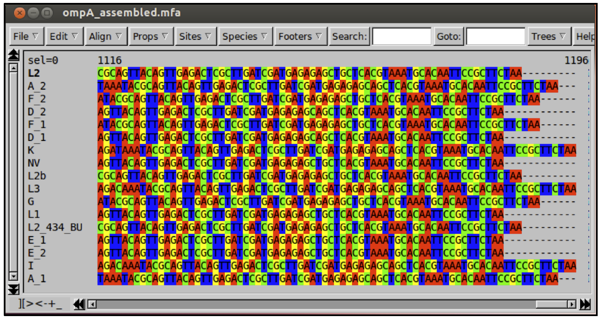

If you have time, have a look at the mapping of the *ompA* gene in some of your samples. The diverse nature of the *ompA* region, with high SNP density and a number of indels, makes mapping of the region difficult and variant-calling from mapped data prone to errors. It is for this reason that we have provided assembled versions of the gene for this part of the module. The methods used to produce these assemblies were exactly as you will see in the assembly module later in the course.


### Multiple sequence alignment
Before any phylogenetic analysis, we must make sure that the columns in our data represent homologous bases.  With gene or protein sequence data, this usually means aligning the nucleotide or amino acid sequences using a multiple alignment program. In this part of the exercise you will align the *ompA* sequences.  Length differences complicate multiple sequence alignment because these require the insertion of gaps into an alignment to ensure that homologous sites remain aligned.  Alignment should be checked by eye wherever possible, because no program is perfect; but for large numbers of sequences and sites, de novo manual alignment is impractical and we must rely on the algorithms of sequence alignment tools.

Seaview allows alignment using two programs, clustal and muscle. Generally muscle is faster, and the protein alignments are of similar quality to clustal. In both cases, sequences are aligned by assigning costs to particular base changes and gap insertions and then minimising the overall cost of the alignment. The parameters can be altered to optimise the process, but in practice the default options will usually suffice.
It is usually better to align genes after translating them into amino acids, so we will do that here.


On the **‘Props’** menu choose **‘View as proteins’.**

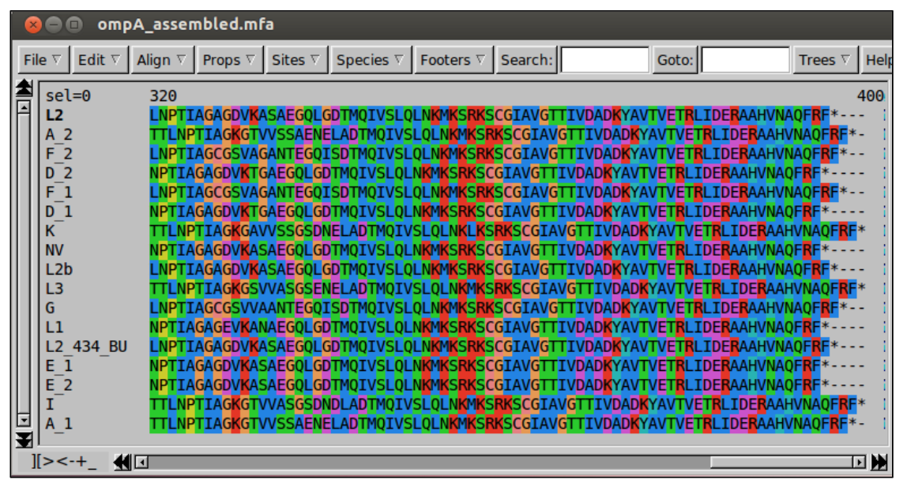

To start the alignment, select **‘Align’** then **‘Align all’.**

When the alignment process is complete, Seaview will have inserted gaps into the sequences so that homologous sites (or at least homologous according to the alignment program) are lined up in columns.  

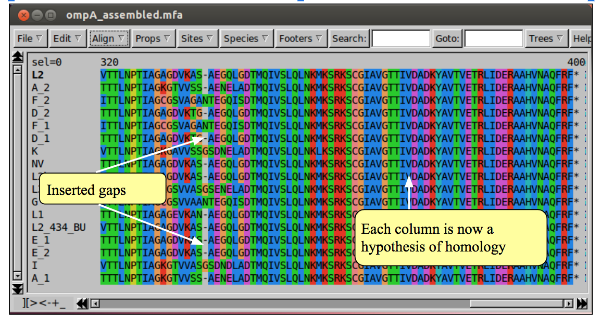

If you inspect the alignment, it should be clearer how the sequences differ from one another. Can you see which sequences are most closely related?

If an alignment has been problematic, requiring many gaps, it is advisable to inspect the it by eye and edit where necessary. In Seaview you can add gaps with the space bar, and remove them with the backspace (for more detailed instructions see the Seaview ‘Help’). If you are not convinced by any region of the alignment it is probably better to remove it, as erroneous alignment provides misleading information for phylogeny reconstruction.

If you turn off protein view you can see that the nucleotides are also now aligned.

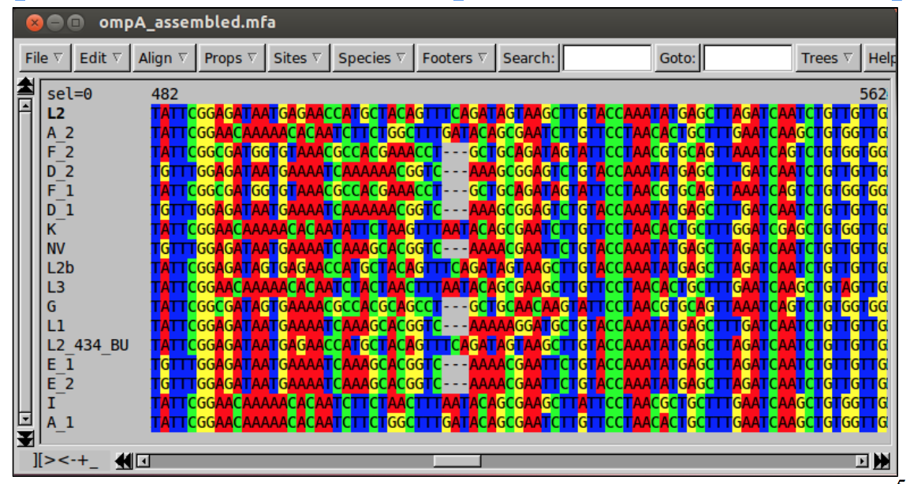


### Phylogeny estimation using PhyML
To estimate the phylogeny, we will use a program called PhyML, which is included in Seaview. PhyML uses maximum likelihood (ML) to estimate the tree.  We will use ML because it is more accurate than simpler methods as it specifies an explicit evolutionary model to account for sources of homoplasy, but at the same time it is relatively fast.  Furthermore, it uses an optimality criterion (likelihood), which means it is possible to compare different trees directly.

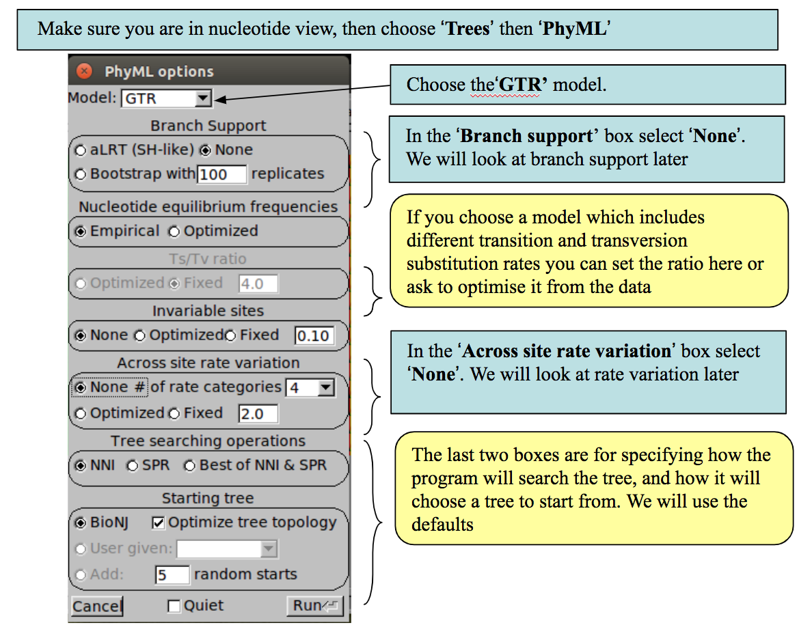

PhyML includes a number of nucleotide substitution models.  The strength of using a Maximum Likelihood method is that an explicit model of nucleotide substitution is applied, which can be more biologically realistic than some other methods.  Various models are available from the very simple (and unrealistic) to the quite complex:

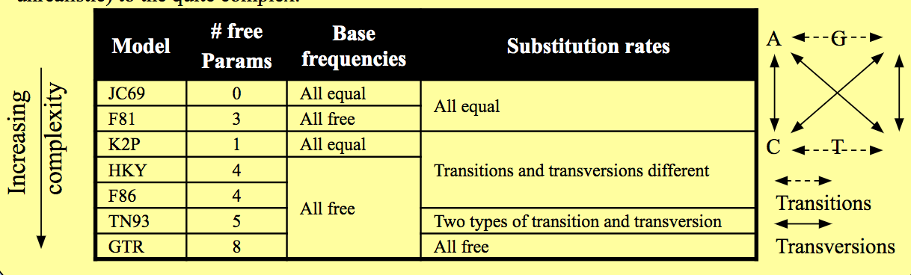


### Interpretation of phylogeny
Once the run has finished, click ‘OK’. The tree created by PhyML not only includes the topology of tree (i.e., the relationships between sequences) but also the branch lengths (i.e., the amount of change occurring in each lineage).  Therefore, the tree is drawn as a phylogram, in which the length of branches is proportional to the amount of evolutionary change (shown below).

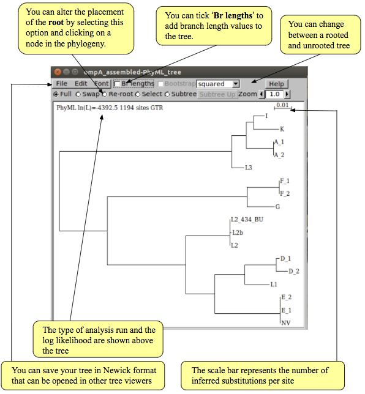

If you are running behind at this point, skip now to part ii of the exercise. You can come back to this part when you have time. Otherwise, note down the likelihood of the tree. We will use it later.


### Phylogeny estimation with across site rate heterogeneity

Almost all nucleotide sequences in nature display across site rate heterogeneity.  This means that not all sites within the sequence evolve at the same rate; rather some parts of a gene evolve faster than others, an active site of an enzyme for example, generally changes more slowly because it is functionally important.  When comparing several sequences to estimate a phylogeny, we should account for rate heterogeneity to avoid errors, i.e., fast evolving, but otherwise unrelated, sequences clustering together.  

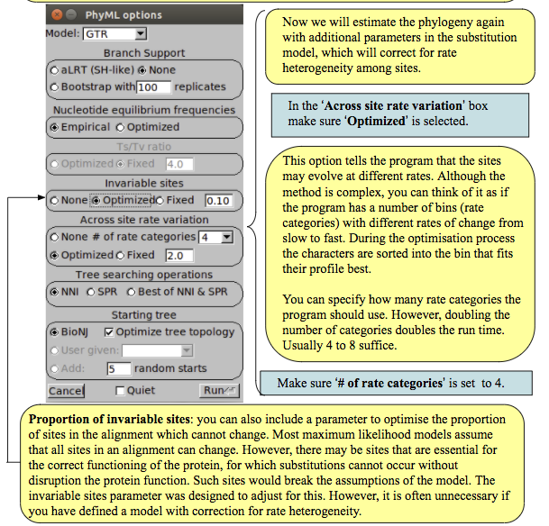

Select **‘Optimized’** from the **‘Invariable sites’** box to allow the proportion of invariant sites to change. After selecting these parameters, ensure that you have selected the same choice of substitution model as you did in the previous analysis.  Now press ‘Run’ to begin the estimation process as before. Examine the tree; have the additional parameters had any effect? Again note down the likelihood of the tree. We will use it in the next section.


### Comparing models with the likelihood ratio test
The **likelihood ratio test (LRT)** can be used to statistically test the difference in fit of two nested evolutionary models to the data.

‘Nested’ means that the more complex model must include all of the parameters of the simpler model. For comparison of non-nested models, more complex methods are available - see the notes on model selection at the end of this module.
Increasing model parameters can only improve the fit of the data to the trees, so more complex models will always produce higher likelihood values ( = smaller negative log likelihood values). However, to justify the addition of these additional parameters we want to know if they have provided a significant improvement to the fit to the data.

To perform a LRT we must first calculate the likelihood ratio (LR) of our two models:
LR = 2x(neglogL1 - neglogL2)
Where: neglogL1 is the  negative log likelihood of the simpler model, and neglogL2 is the negative log likelihood of the more complex model.

The LRT statistic approximately follows a chi-square distribution, so we can evaluate the significance of our LR using chi-square significance tables (or calculate p-values using statistical calculators)

However, as with any chi-square significance test, we need to know the degrees of freedom (df). In a LRT the df are the difference in number of free parameters between the two models.

The number of free parameters for the models in Seaview are listed in the table of models on page 6 of this module. e.g. the GTR model has 8 free parameters. Both the gamma parameter of among site rate variation and the parameter for estimating the proportion of invariant sites add a single free parameter each.

To help you perform your LRT, we have provided a pre-formatted spreadsheet for calculating significance from your negative log likelihoods and the number of free parameters of the models you used.


Start LibreOffice Calc using the icon on the left of the screen and open LR_test.xls from the phylogeny directory of Module 5. Type the negative log likelihood values you recorded for your two trees into the appropriate boxes. Type the number of free parameters for your two models into the appropriate boxes. It should look something like the image below.

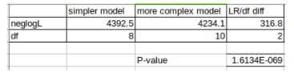

Question:
- Do the additions of the gamma and invariant sites parameters significantly improve the fit of the model to the data?


### Phylogeny estimation with bootstrapping
**Bootstrapping** is a statistical technique for adding confidence intervals around an estimate, in this case, a tree topology.  Non-parametric bootstrapping involves repeated analysis of the data set through **“resampling with replacement”.**  

Imagine putting each site into a bag. Replicate data sets are created by randomly drawing sites from the bag until a new dataset the same size as the original has been created. Importantly, after a site has been drawn, it is replaced back into the bag. This means some sites may be present more than once in the resampled dataset whilst others may not be present at all.

Trees are then built for each replicate data set.  Robust relationships, i.e. those that are repeatable, will occur in a large proportion of randomised data sets.

Estimate a bootstrapped phylogeny for the *ompA* data set by creating a new phylogeny as before, with the addition of 10 bootstrap replicates.  Click on ‘Bootstrap’ in the ‘Branch Support’ box, and enter ‘10’ in the replicates box. Processing of the 10 replicates may take a few minutes, so you could move on while this is running. In practice you would want to run more replicates (100 or 1000), but we are only using 10 for speed.

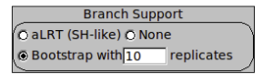

**WARNING!**: bootstrap proportions are measures of robustness, or repeatability.  A high bootstrap value indicates that a given node tends to occur in every analysis.  **This does not guarantee that the node is correct.**  For example, if the substitution model is inaccurate, it could produce the wrong answer in every estimation.

You will notice that PhyML includes another branch support method called aLRT. aLRT assesses whether each branch on the tree provides a significant likelihood improvement over the same tree with that branch collapsed. We will not use this method here or discuss it further. It is not equivalent to bootstrap, but is much faster and may be useful for assessing branch support on large phylogenies.

Once the search is complete, you can show the bootstrap values on the tree by ticking this box.
Each node in the tree now has an associated value out of 100, its bootstrap.  Can you identify any nodes that are not robust?  Unfortunately there is no generally accepted threshold for significant bootstrap robustness, so you must use your judgement.

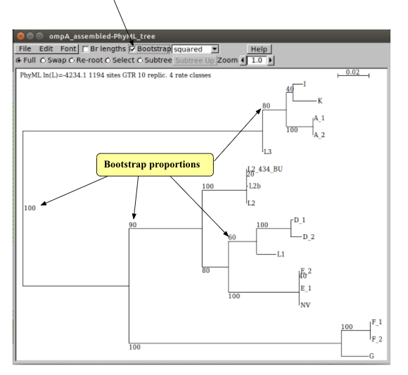

Questions:
- From the trees that you have produced, which MOMP type would you suggest the new variant (NV) strain belongs to?
- Do the *ompA* trees agree with the separation of *C. trachomatis* into trachoma (serotypes A to K) and LGV (L serotypes) biovars?

---
[↥ **Back to top**](#top)


## Exercise 2: MLST gene phylogeny using Artemis <a name="exercise2"></a>
A second typing method used for many bacterial species is multilocus sequence typing (MLST). MLST involves the sequencing of fragments of a number (usually 6 or 7) of housekeeping genes spread around the genome. In true MLST, each different allele for each locus is assigned a number. Each unique allelic profile defines a sequence type (ST).

A number of MLST schemes have been devised for *C. trachomatis*, but we will use the scheme of Dean et al. (Emerg Infect Dis. 2009 Sep;15(9):1385-94.), which comprises the following seven loci.

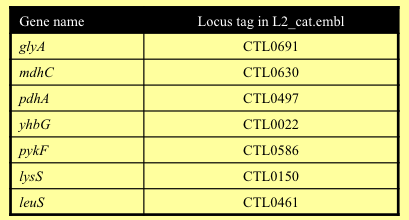

If **Artemis** is not open, start it now and open the L2_cat.fasta reference. Read in the annotation (L2_cat.embl) by **’Read Entry Into’**. Open the NV.vcf.gz file by selecting **‘Read BAM / VCF’** from the **‘File’** menu.

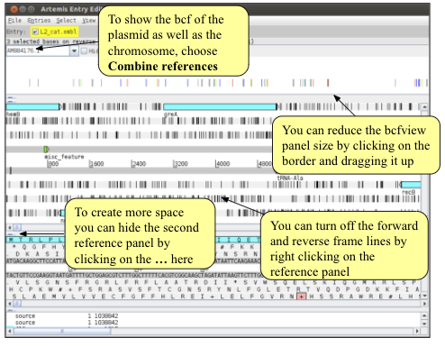

As you saw in the mapping module, bcf files contain support values for each variant. Before writing out the alignment of the MLST genes it is crucial to filter the variants so that only strongly supported variants are included in the alignment.
Right click on the bcfview panel and select the Filter option. You can choose your own filters, but we would suggest something similar to the following:

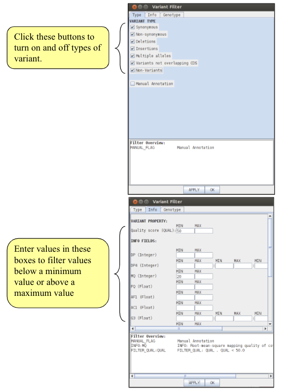

Importantly, note that we have also selected the **‘non-variants’** tick box. This option tells Artemis to also show sites which match the reference, rather than just variant sites, provided, of course, that they pass the filters. This information is necessary when saving an alignment, as it allows differentiation between regions that show no variation because they are the same as the reference from those that show no variation due to a lack of mapping. To apply the filters click on the ‘Apply’ button. Note what happens to the bcfview in the MLST gene regions. Once you are happy with your filters, close the Variant filter box.


If you have time, have a look at some of the MLST genes in Artemis.
Question:
- How does their diversity within the *C. trachomatis* strains compare to that of ompA?
- Can you think of a possible reason that the diversity may be different?

Rather than use fragments of these loci in a true MLST typing scheme, we will extract the sequences of the seven genes and run a phylogenetic analysis on the concatenated sequence.

There are many ways in which you could identify and select the seven MLST genes in Artemis, but one convenient method is using the ‘Feature Selector’ in the ‘Select’ menu. We want to search for CDSs with the locus tags in the MLST scheme, so in the ‘Key’ dropdown box select CDS, and in the ‘Qualifier’ box select or type locus_tag. You then now type the locus tags of the seven loci into the ‘Containing this text’ box, and make sure to tick the ‘Match Any Word’.

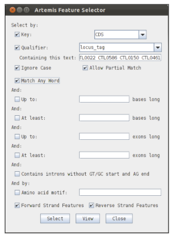

To find the genes click on the select button. To check the results of your search, click on the view button. This will list the features that have been selected by your search.

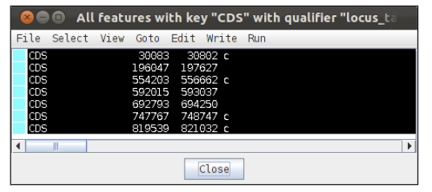

Check that you have selected the correct seven genes. Next we will write out their sequences into a fasta file.

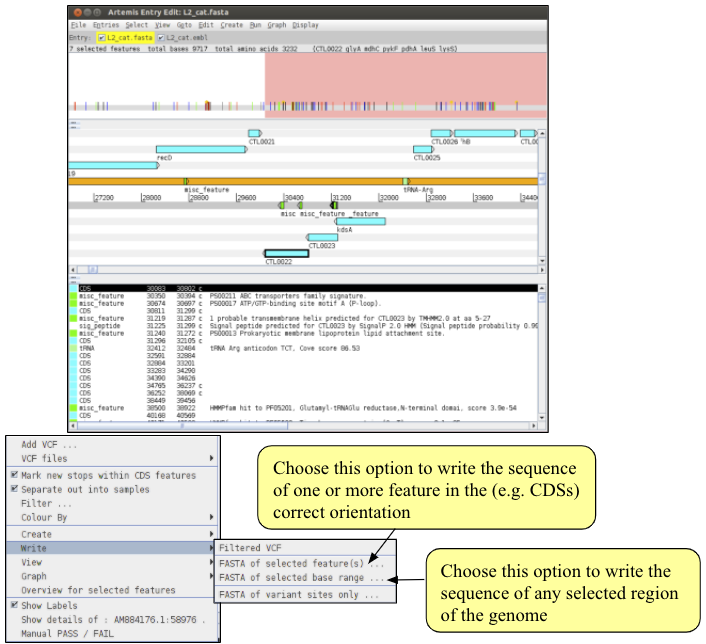

We are now ready to write out the alignment of the NV MLST genes. To do this, make sure the correct genes are selected in the embl file and right click on the bcfview panel. From the menu choose **‘Write’ -> ‘Fasta of selected features’**. You will be asked for a filename for the alignment file. Call it NV_MLST.fasta. Note the three options on the right hand side of the save dialogue box.

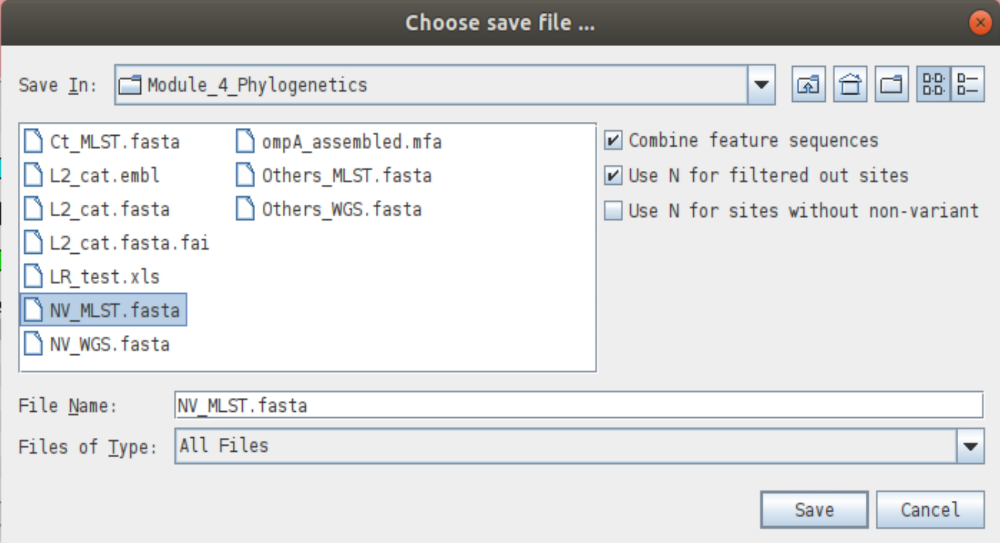

- The **‘Combine feature sequences’** option is useful if you have selected more than one feature in the reference when choosing to write the bcf sequences. With this option selected, the sequences of each feature will be concatenated together in one file. If you deselect this option you will save one fasta per feature selected. We need to make sure this option is selected.
- The **‘Use N for filtered out sites’** tells Artemis that when a site fails the chosen filters, that base should be written as an N (unknown) in the alignment. If you deselect this box any site that fails any of the filters will be saved in the alignment as the reference base. Why might it be a bad idea?
- The **‘Use N for sites without non-variant’** option is useful when there are non-variant sites confirming the reference sequence as this will then write out ‘N’ for each of the non-confirmed sites.
If you have multiple bcf files open, a fourth option will appear.
- The **‘Single fasta’** option tells Artemis to save the sequences of multiple bcf files into a single fasta file. If you deselect this option, one fasta file will be saved for each individual bcf. This does not apply here.


We have only output the MLST gene sequences for one Chlamydia isolate. If we had opened more than one bcf file in Artemis, we could have output the sequences for all of those isolates in one go to create an alignment of MLST gene sequences. However, running Artemis with many bcf files open can be slow, especially on the USB stick. An alternative is to output the sequence for each strain into a separate file in exactly the same way as we have for NV. You can then concatenate the separate files into one alignment file using the ‘cat’ command. Remember, though that the reference will be included in each file created in Artemis.

For speed we have provided you with an alignment of the MLST genes from the 15 other *C. trachomatis* isolates you included in the *ompA* tree. These were produced in exactly the same way as the NV_MLST.fasta file you just created. We will use cat to add the reference and NV sequences and make a file containing all 17 isolates by typing:

```bash
cat Others_MLST.fasta NV_MLST.fasta > Ct_MLST.fasta

# once completed, open "Ct_MLST.fasta" in Seaview
```
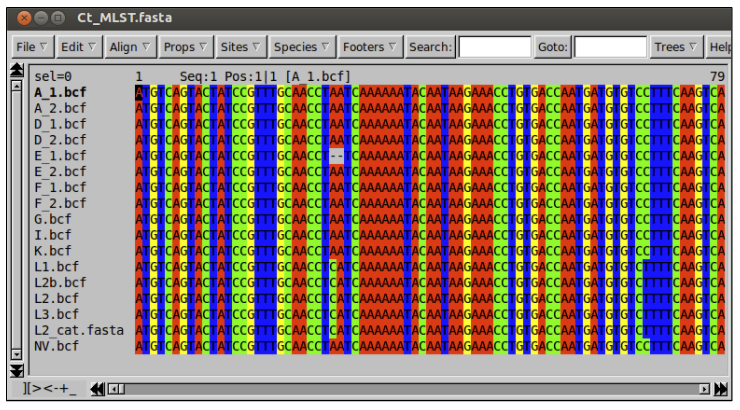

Notice that there is only one sequence for each strain. This is because Artemis has concatenated the sequences of the seven loci into one long sequence.

To check all seven genes are in the alignment you can use Seaview to translate the nucleotides into their corresponding amino acids. To do this, select **‘Props’** and then **‘View as proteins’.**

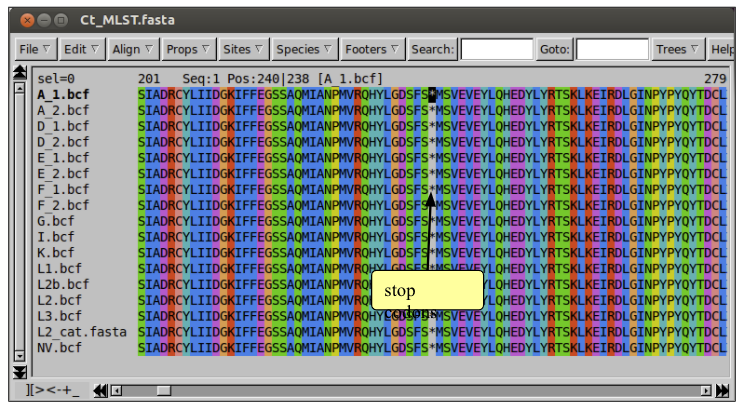

To check you have seven genes in your alignment you can count the number of stop codons, which are represented as asterisks (∗) in the protein view. To do this you can either scroll along the sequence or use the search box.

Construct a maximum likelihood tree of the MLST alignment as nucleotides.

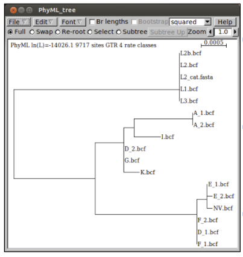

Questions:
- How does the tree compare with the *ompA* tree you made earlier?
- Does the MLST gene tree support the splitting of *C. trachomatis* into trachoma and LGV biovars?
- Do the strains cluster by serotype in the MLST tree?
- What biological processes could account for these discrepancies?
- Do you think *ompA* is a good gene for typing *C. trachomatis* isolates?


---
[↥ **Back to top**](#top)

### Exercise 3: Phylogeny from whole genome SNPs <a name="exercise3"></a>
In the past few years, with whole genome data being produced for large numbers of bacterial isolates, it has become possible to use variation from whole genomes for phylogenetic reconstruction.

Although it is possible to extract whole genome variation from Artemis in the same way as we did for the MLST genes, this is not what Artemis was designed to do, making the process slow. However, there are ways we can extract SNPs from bcf variation files at the command line. Here we will use the **“bcftools consensus”** to make a new consensus sequence that contains your SNPs.

```bash
# At the prompt type the following command:
samtools faidx L2_cat.fasta 'AM884176.1' | bcftools consensus ../Module_3_Mapping/NV.bcf > NV_WGS.fasta

# Note: you are using the variants contained in the bcf that you generated in Module_4
```

Although this command line looks complex, it is just things you’ve seen before put together.
The command is in two parts separated by a pipe ‘|’, which simply tells the command line to take the output from the first command and use it as the input for the second command.

The first command uses **samtools faidx** to extract a single reference sequence from a multi-sequence fasta file. In this case, we only want the genome sequence, and not the plasmid sequence that is in this file.

The second part of the command uses **bcftools consensus** to take the SNP calls you generated yesterday in Module 3 and together with the reference sequnece (obtained from faidx), to make a new fasta sequence that now contains your SNP calls.

Finally the result is redirected into a file called **NV_WGS.fastq**.


The sequence produced is not the complete genome of the NV isolate, as mapping only allows variants to be called in regions present in the reference genome, as where the amount of variation is not too great. Instead, the sequence produced is a pseudosequence of the bases mapped against each base of the reference genome.
We have created pseudosequences for the other 15 isolates, and included these, along with the reference chromosome sequence in a file called Others_WGS.fasta


Using cat, concatenate the Others_WGS.fasta and NV_WGS.fasta files into a single alignment called Ct_WGS.fasta

Try to open the alignment in Seaview. You will find it is much larger than the other datasets you have used.

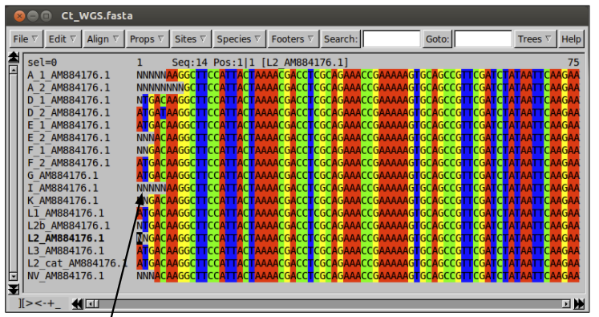

The Ns in the alignment represent bases that cannot be called from the mapping. This may be because there is no mapping in a region due to a true deletion, or because the mapping of that base fails to meet one of the filters imposed.

Although it is possible to run a tree on such a large dataset because phylogenetic methods reduce the complexity by only analysing identical site patterns once, this may still be very slow. Instead, we will extract only those sites which contain variation and run a tree on those using a C script called **snp_sites**.

```bash
# At the command line, run this command:
snp-sites -o Ct_WGS_SNPs.fasta Ct_WGS.fasta

```

Open the SNP alignment in Seaview and make a tree as before. Do not include the invariant sites parameter, as this would not makes sense – we have just removed all invariant sites from the dataset.

Questions:
- How does the tree of whole genome SNPs compare to the other trees you have made?
- What could cause analyses of different parts of the genome to produce different phylogenies?
- What does this tell you about *ompA*, MLST and whole genome SNPs for typing and surveillance of *C. trachomatis*?


---
[↥ **Back to top**](#top)

## Additional Information <a name="additional_info"></a>
### Other useful Seaview features
- File Menu:
     - **Save as…** allows you to save your alignment in many formats, including fasta, phylip (used by many phylogenetics programs), nexus (used by PAUP* and MrBayes), and many more.
     - **Save selection**. Allows you to save a region of your alignment masked with a set or an alignment of only the selected taxa.
     - **Concatenate**. Allows you to join multiple alignments together either based on the names of the taxa or the order of the taxa in the alignment
- Edit Menu:
     - In this menu there are options to delete, add, edit, reverse and reverse complement sequences in your alignment
     - You can view a dot plot of any selected pair of sequences
- Props Menu:
      - This menu contains options about how the sequences are shown. If you select the Allow seq. edition option, you can manually add or delete bases from the sequences
- Sites Menu:
     - This menu allows you to create a mask (set) under the alignment, which you can use to select a set of sites.
     - When sites (also taxa) are selected, any tree run will only include the selected sites and taxa.
     - You can save your selection using the save selection option in the file menu
- Search and Goto:
     - Search allows you to find a sequence of nucleotides or amino acids in a sequence.
     - Goto allows you to specify a base or amino acid number to move to in the alignment


### FigTree: a more versatile tree viewer
Also included on your disk is a tree viewing program called **FigTree**. FigTree can open Newick format trees, as output by Seaview (see page 8). FigTree is more versatile than the tree viewer in Seaview, allowing you to colour branches and taxa, redraw the tree in a number of ways, collapse branches and output the results in a large number of  graphics formats including eps and pdf. It is particularly useful for preparing figures for manuscripts. If you have time you may find it useful to try opening and editing your tree in FigTree.

FigTree can be opened by typing **‘figtree’** into the terminal.

### Protein models

In this exercise you have become familiar with phylogenetic analysis of nucleotide data. Analysing sequences on the protein level is very similar, but there are some differences in the substitution models used.

When analysing nucleotide sequences our models optimise substitution rates from the data. For a JC69 model this means optimising a single rate for all changes, while for a GTR 6 substitution rates need to be optimised.
The 6 nucleotide substitutions:

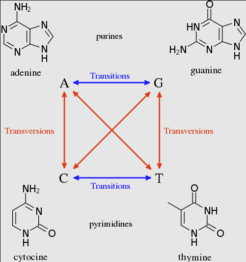

When analysing amino acid data we have 20 “standard” amino acids, which would require 190 substitution rates to be estimated. In most circumstances our data does not contain enough information to estimate all of these parameters, and even if it did, the calculation time would become prohibitive.

Instead we usually use a pre-made matrix of substitution rates calculated from large collections of alignments of proteins of known function. PhyML provides a range of options:

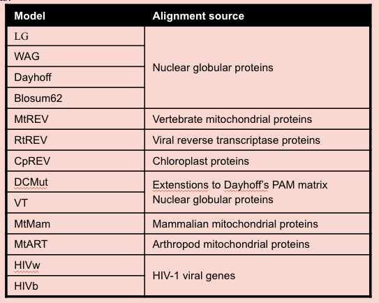

The most commonly used model over the last few years has been the WAG, as it is generally applicable and in most cases gave the best results. However, the new LG model seems to be a further improvement.
The gamma correction for among site rate variation, and invariant sites correction is exactly the same as with nucleotide data


### Model selection
One of the most difficult and important decisions in phylogenetic analyses is which model to choose. Overly simple models are not biologically realistic, and have been shown to produce wrong trees in certain circumstances. For example, it is well known that parsimony and overly simple ML models often place long, unrelated branches together because they underestimate the number of multiple substitutions at sites. This phenomenon, known as long branch attraction, is one of the major causes of error in phylogeny.

Given the problems associated with overly simple models, it tempting to always use the most complex models available, which estimate more parameters from the data. Often you will find these are the best models for you to use.

AN INCREASE IN THE NUMBER OF MODEL PARAMETERS CAN ONLY INCREASE THE FIT OF THE MODEL TO THE DATA AND THEREFORE CAN ONLY IMPROVE THE LIKELIHOOD.

However, increasing the number of parameters reduces the amount of data we have to estimate the correct value for these parameters.

One way to approach choosing a model is to run a mini analysis with a range of models and compare the results. There are a number of tests that allow us to compare the likelihoods of models with different numbers of parameters. These include the likelihood ratio test, which you have used in this module, and the AIC.

You can run these tests using the programs jMODELTEST for nucleotides (a reduced version called Findmodel is available online) and PROTTEST for proteins:

- jMODELTEST: http://darwin.uvigo.es/software/jMODELTEST.html
- Findmodel: http://www.hiv.lanl.gov/content/sequence/findmodel/findmodel.html
- Prottest: http://darwin.uvigo.es/software/prottest.html

A final warning note: never select a model with one of these methods without thinking about the biology. If you’re working on Plasmodium, would it be sensible to use a protein model produced from HIV sequences?


### Alignment: some things to remember
- It is worth spending time to make a good alignment. If your alignment is wrong, your phylogeny is also likely to be wrong
- Progressive alignment is a mathematical process that is completely independent of biological reality
- Can be a very good estimate
- Can be an impossibly poor estimate
- Requires user input and skill
- Treat cautiously
- Can (usually) be improved by eye
- Often helps to have colour-coding
- Depending on the use, the you should be able to make a judgement on those regions that are reliable or not
- For phylogeny reconstruction, only use those positions whose hypothesis of positional homology is strong

FINALLY… IT IS NOT USUALLY SENSIBLE TO ALIGN PROTEINS AT THE NUCLEOTIDE LEVEL:
- The result might be highly-implausible and might not reflect what is known about biological processes.
- It is much more sensible to translate the sequences to their corresponding amino acid sequences, align these protein sequences and then put the gaps in the DNA sequences according to where they are found in the amino acid alignment.

---
[↥ **Back to top**](#top)

******
## License
<a rel="license" href="http://creativecommons.org/licenses/by/4.0/"></a><br />This work is licensed under a <a rel="license" href="http://creativecommons.org/licenses/by/4.0/">Creative Commons Attribution 4.0 International License</a>.
