# Mapping Short Reads


## Table of contents
1. [Introduction & Aims](#introduction)
2. [Background](#background)
3. [Short Read Alignment](#short_read_alignment)
4. [Artemis - Viewing Mapped Reads](#artemis_reads)
5. [Artemis - Viewing SNPs](#artemis_snps2)
6. [Chlamydia example](#chlamydia_example)
7. [Looking at SNPs in more detail](#snps)


## 1. Introduction & Aims <a name="introduction"></a>

The re-sequencing of a genome typically aims to capture information on Single Nucleotide Polymorphisms (SNPs), INsertions and DELetions (INDELs) and Copy Number Variants (CNVs) between representatives of the same species. A reference genome must already exist (at least for a very closely related species). Whether one is dealing with different bacterial isolates, with different strains of single-celled parasites, or indeed with genomes of different human individuals, the principles are essentially the same. Instead of assembling the newly generated sequence reads de novo to produce a new genome sequence, it is easier and much faster to align or map the new sequence data to the reference genome (please note that we will use the terms “aligning” and “mapping” interchangeably). One can then readily identify SNPs, INDELs, and CNVs that distinguish closely related populations or individual organisms and may thus learn about genetic differences that may cause drug resistance or increased virulence in pathogens, or changed susceptibility to disease in humans. One important prerequisite for the mapping of sequence data to work is that the reference and the re-sequenced subject have the same genome architecture. Once you are familiar with viewing short read mapping data you may also find it helpful for quality checking your sequencing data and your de novo assemblies.

The computer programme Artemis allows the user to view genomic sequences and EMBL/GenBank (NCBI) annotation entries in a highly interactive graphical format. Artemis also allows the user to view mapped sequencing reads from e.g. Illumina, or PacBio sequencers. See http://www.sanger.ac.uk/resources/software/artemis/ngs/.
 
The aims of this module are to:

- To introduce mapping software, BWA, SAMtools, SAM/BAM and FASTQ file format.
- To show how Next Generation Sequencing data can be viewed in Artemis alongside your chosen reference using Chlamydia as an example: navigation, read filtering, read coverage, views.
- To show how sequence variation data such as SNPs, INDELs, CNVs can be viewed in single and multiple BAM files, and BCF variant filtering.

[↥ **Back to top**](#top)

******
## 2. Background <a name="background"></a>

### *Chlamydia trachomatis*

To learn about sequence read mapping and the use of Artemis in conjunction with NGS data we will work with real data from the bacterial pathogen Chlamydia.

*Chlamydia trachomatis* is one of the most prevalent human pathogens in the world, causing a variety of infections. It is the leading cause of sexually transmitted infections (STIs), with an estimated 131 million new cases each year. Additionally, it is also the leading cause of preventable infectious blindness with tens of millions of people thought to have active disease. The STI strains of Chlamydia can be further subdivided into those that are restricted to the genital tract and the more invasive type know as the lymphogranuloma venereum or LGV biovar. Despite the large differences in the site of infection and the disease severity and outcome there are few whole-gene differences that distinguish any of the different types of *C. trachomatis*. As you will see most of the variation lies at the level of SNPs.

In this part of the course we will align the Illumina reads from a generated from the New Variant Swedish *C. trachomatis* strain (known as NV) against a reference sequence (L2). The NV strain caused a European health alert in 2006. During this time it became the dominant strain circulating in some European countries and began to spread world wide. The reason for this was that it evaded detection by the widely used PCR-based diagnostic test. During the course of this exercise you will identify the reason why this isolate confounded the standard assay.


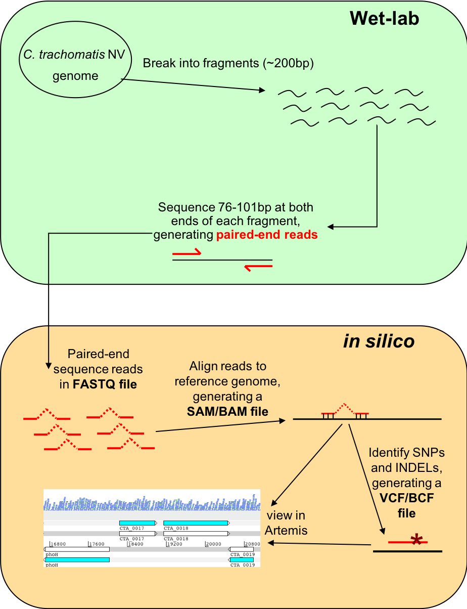

**Figure**. Workflow of re-sequencing, alignment, and *in silico* analysis

[↥ **Back to top**](#top)

******
## 3. Short Read Alignment <a name="short_read_alignment"></a>

There are multiple short-read alignment programs, each with its own strengths, weaknesses, and caveats. Wikipedia has a good list and description of each. Search for “short-read sequence alignment” if you are interested. We are going to use Burrows-Wheeler Aligner or BWA.

We quote from http://bio-bwa.sourceforge.net/ the following:

*“BWA is a software package for mapping low-divergent sequences against a large reference genome, such as the human genome. It consists of three algorithms: BWA-backtrack, BWA-SW and BWA-MEM. The first algorithm is designed for Illumina sequence reads up to 100bp, while the rest two for longer sequences ranged from 70 bp to 1 Mbp. BWA-MEM and BWA-SW share similar features such as long-read support and split alignment, but BWA-MEM, which is the latest, is generally recommended for high-quality queries as it is faster and more accurate. BWA-MEM also has better performance than BWA-backtrack for 70-100bp Illumina reads.”*

Although BWA does not call Single Nucleotide Polymorphisms (SNPs) like some short-read alignment programs, e.g. MAQ, it is thought to be more accurate in what it does do and it outputs alignments in the SAM format which is supported by several generic SNP callers such as SAMtools and GATK.

BWA has a manual that has much more detail on the commands we will use.
This can be found here: http://bio-bwa.sourceforge.net/bwa.shtml

Li H. and Durbin R. (2009) Fast and accurate short read alignment with
Burrows-Wheeler Transform. Bioinformatics, 25:1754-60. [PMID: 19451168]


The first thing we are going to do in this module is to map raw sequence read data that is in a standard short-read format (FASTQ) against a reference genome. This will allow us to determine the differences between our sequenced strain and the reference sequence without having to assemble our new sequence data de novo.

The FASTQ sequence format is shown below.


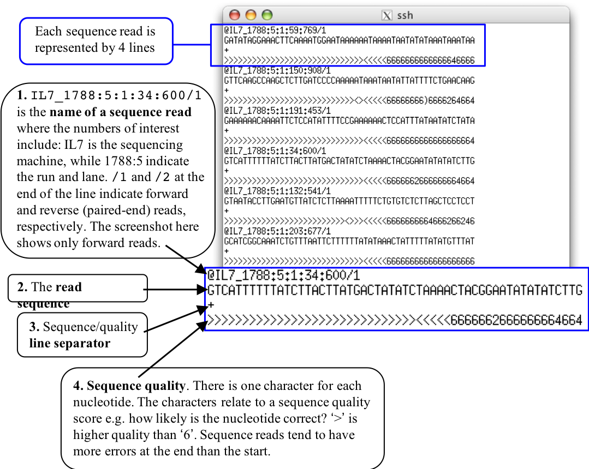

**Figure**. FASTQ sequence file format


To begin the exercise we need to open up a terminal window. We will then need to move into the ‘Module_2_Mapping’ directory using the UNIX command ‘cd’ .

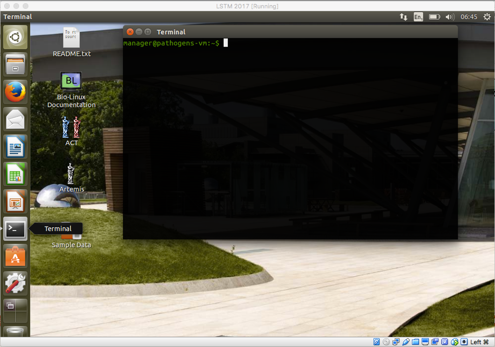

**Figure**. Terminal window

```shell
# type (or copy and paste) the following into the terminal

cd Module_3_Mapping
```


To map the reads using BWA follow the following series of commands which you will type on the command line when you have opened up your terminal and navigated into the correct directory. Do a quick check to see if you are in the correct directory: when you type the UNIX command ‘ls’ you should see the following folders (in blue) and files (in white) in the resulting list.

```shell
# type (or copy and paste) the following into the terminal

ls -lrt
```


**Step 1**  
Our reference sequence for this exercise is a *C. trachomatis* LGV strain called L2. The sequence file against which you will align your reads is called L2_cat.fasta. This file contains a concatenated sequence in FASTA format consisting of the genome and a plasmid. To have a quick look at the first 10 lines of this file, type:

```shell
# type (or copy and paste) the following into the terminal

head L2_cat.fasta
```

Most alignment programs need to index the reference sequence against which you will align your reads before you begin. To do this for BWA type:    
```shell
# type (or copy and paste) the following into the terminal

bwa index L2_cat.fasta
```
The command and expected output are shown below. Be patient and wait for the command prompt (~/Module_2_Mapping$) to return before proceeding to Stage 2.

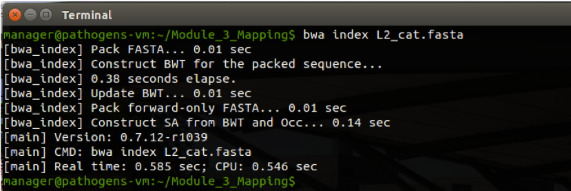

**Step 2**  
We will now align both the forward and the reverse reads against our now indexed reference sequence. The forward and reserve reads are contained in files NV_1.fastq.gz and NV_2.fastq.gz, and the output will be saved in SAM format.  

Perform the alignment with the following command and wait for it to finish running (it may take a few minutes):
```shell
# type (or copy and paste) the following into the terminal

bwa mem L2_cat.fasta NV_1.fastq.gz NV_2.fastq.gz > mapping.sam
```
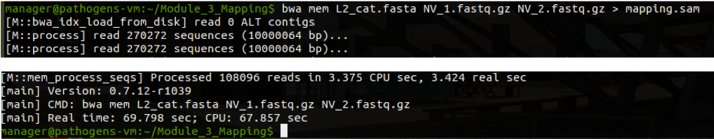


***Please note***
- The fastq input files provided have been gzipped to compress the large fastq files, many types of software like BWA will accept gzipped files as input.

- The last part of the command line > mapping.sam determines the name of the
output file that will be created in SAM format.

- SAM (Sequence Alignment/Map) format is a generic format for storing large
nucleotide sequence alignments that is illustrated on the next page. Creating our output in SAM format allows us to use a complementary software package called SAMtools.

- SAMtools is a collection of utilities for manipulating alignments in SAM format.
See http://samtools.sourceforge.net/ for more information. There are numerous options that control the way the SAMtools utilities run, a few of which are explained below. To get brief explanations of the various utilities and the different options or flags that control each utility, type samtools or samtools followed by one particular utility on the command line like e.g.:

```shell
# type (or copy and paste) the following into the terminal

samtools

samtools view

```


To have a quick look at the first lines of the SAM file you just generated, type:
```shell
# type (or copy and paste) the following into the terminal

head mapping.sam

```

The SAM/BAM file format is very powerful. It is unlikely that you will need to work with the contents of a SAM/BAM file directly, but it is very informative to visualise it in a viewer and it is a great format to do further analysis with. The format specifications are at http://samtools.sourceforge.net/SAM1.pdf. Below is a brief overview of the information contained in these files.

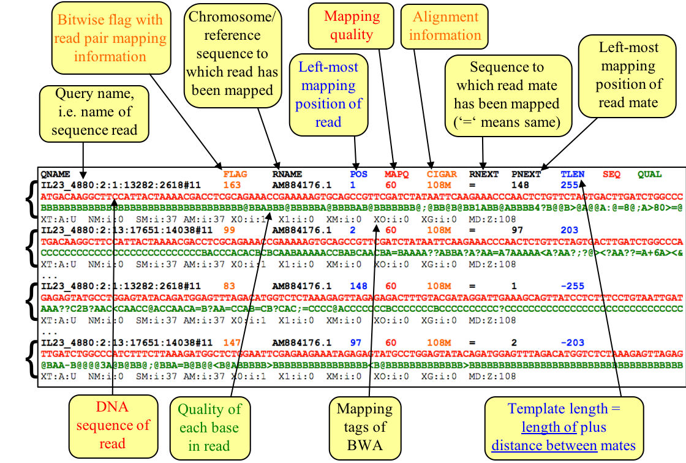

**Figure**. Example of the SAM file format

Next we want to change the file format from SAM to BAM. While files in SAM format store their information as plain text, the BAM format is a binary representation of that same information. One reason to keep the alignment files in BAM rather than in SAM format is that the binary files are a lot smaller than the plain text files, i.e. the BAM format saves expensive storage space (sequence data are generated at an ever increasing rate!) and reduces the time the computer has to wait for slow disk access to read or write data.

Many visualisation tools can read BAM files. But first a BAM file has to be sorted (by chromosome/reference sequence and position) and indexed, which enables fast working with the alignments.


**Step 3**
To convert our SAM format alignment into BAM format run the following command:
```shell
# type (or copy and paste) the following into the terminal

samtools view -q 15 -b -o mapping.bam mapping.sam

# -q 15 = discard sequence reads that are below a quality score of 15. Poor quality reads will therefore be discarded.
# -b = output in bam format
# -o mapping.bam = output file name

```

**Step 4**
Next we need to sort the mapped read sequences in the BAM file by typing this command:
```shell
# type (or copy and paste) the following into the terminal

samtools sort mapping.bam –o NV.bam
```
This will take a little time to run. By default the sorting is done by chromosomal/reference sequence and position.


**Step 5**
Finally we need to index the BAM file to make it ready for viewing in Artemis:

```shell
# type (or copy and paste) the following into the terminal

samtools index NV.bam
```

**Step 6**
We are now ready to open up Artemis and view our newly mapped sequence data.

[↥ **Back to top**](#top)


******
## 4. Artemis - Viewing Mapped Reads <a name="artemis_reads"></a>

Time to load Artemis. Double click on the Artemis Icon or type ‘art &’ on the command line of your terminal window and press return. We will read the reference sequence into Artemis that we have been using as a reference up until now.

```shell
# type (or copy and paste) the following into the terminal

art &

# "&" allows a program or task to run in the background, allowing you to still use the command line if needed.
```

Once you see the initial Artemis window, open the file L2_cat.fasta via File – Open. Just to remind you, this file contains a concatenated sequence consisting of the *C. trachomatis* LGV strain ‘L2’ chromosome sequence along with its plasmid.

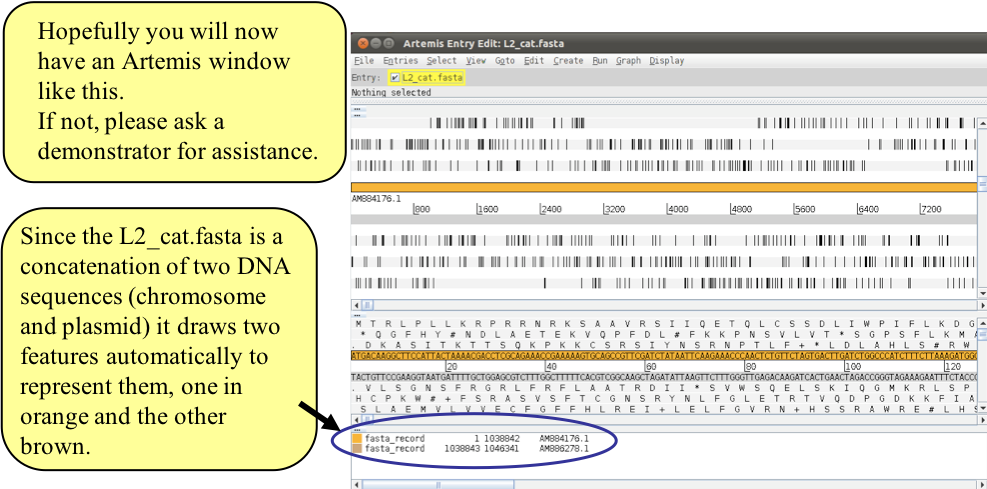

**Figure**. Loading fasta file into Artemis.

Now load up the annotation file for the *C. trachomatis* LGV strain L2 chromosome.

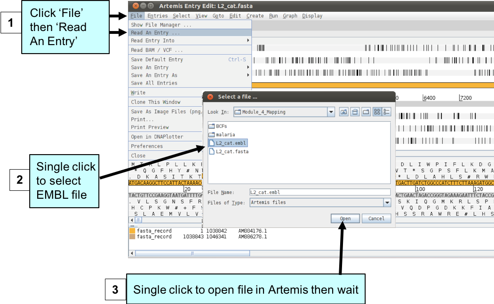

**Figure**. Loading genome annotation into Artemis.

To examine the read mapping we have just performed we are going to read our BAM file containing the mapped reads into Artemis as described below.Please make sure you do not go to a zoomed-out view of Artemis, but stay at this level, as display of BAM files does take time to load!

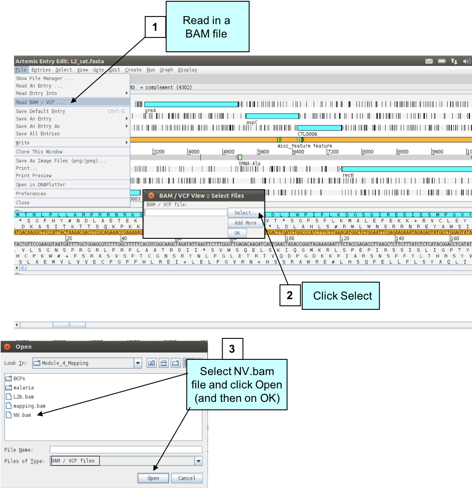

**Figure**. Loading a BAM file into Artemis.

You should see the BAM window appear as in the screen shot below. Remember these reads are of the Swedish NV strain mapped against the LGV strain L2 reference genome. In the top panel of the window each little horizontal line represents a sequencing read. Notice that some reads are blue which indicates that these are unique reads, whereas green reads represent “duplicated” reads that have been mapped to exactly the same position on the reference sequence. To save space, if there are duplicated reads only one is shown, which means that there could be a large number of duplicated reads at a given position but the software only depicts one.

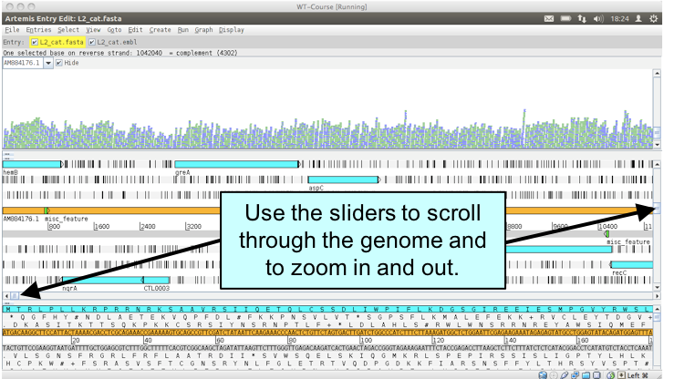

**Figure**. Moving around in Artemis

If you click a read (1 & 2) its mate pair will also be selected. Also note that if the cursor hovers over a read for long enough details of that read will appear in a small box (3). If you want to know more then right-click and select ‘Show details of: READ NAME’ from the  menu (4). A window will appear (5) detailing the mapping quality (see over page), coordinates, whether it’s a duplicated read etc. If this read(s) covers a region of interest, being able to access this information easily can be really helpful.

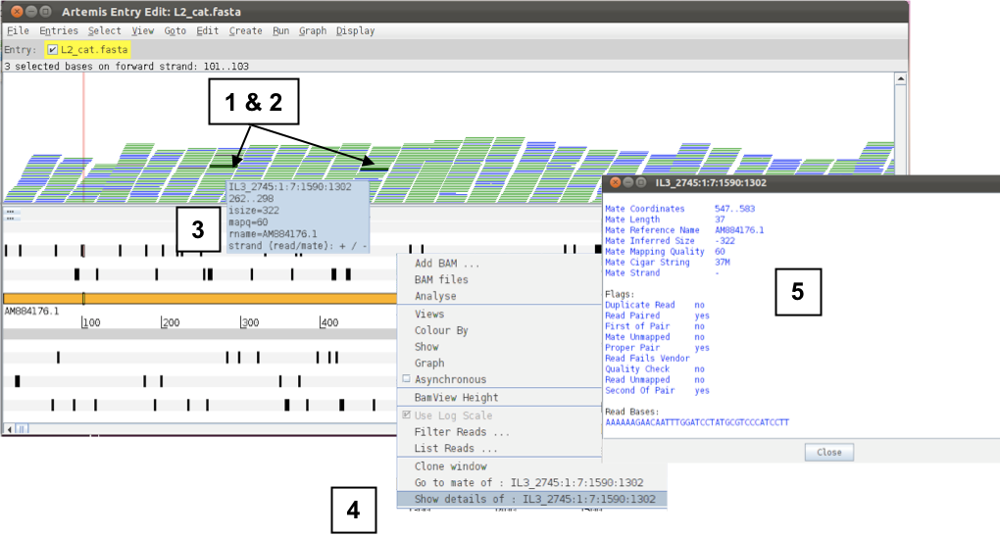

**Figure**. Inspecting reads in Artemis

“Mapping quality”- The mapping quality depends on the number of mismatches between the read and the reference sequence as well as the repetitiveness of the reference sequence. The maximum quality value is 99, whereas a value of 0 means that the read mapped equally well to at least one other location and is therefore not reliably mapped.

You can actually use several details relating to the mapping of a read to filter the reads from the BAM file that are shown in the window. To do this, right-click again over the stack plot window showing the reads and select “Filter Reads…”.  A window will appear with many options for filtering, as shown below.

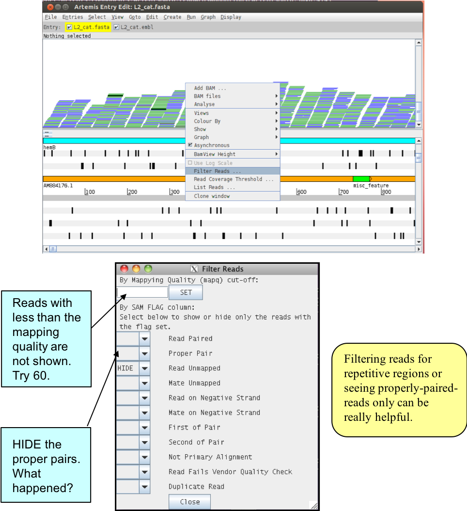

**Figure**. Filtering reads in Artemis

As mentioned before, to save space if there are duplicated reads only one is represented. But often one may want to know the actual read coverage on a particular region or see a graph of this coverage. You can do this by adding additional graphs as detailed below.

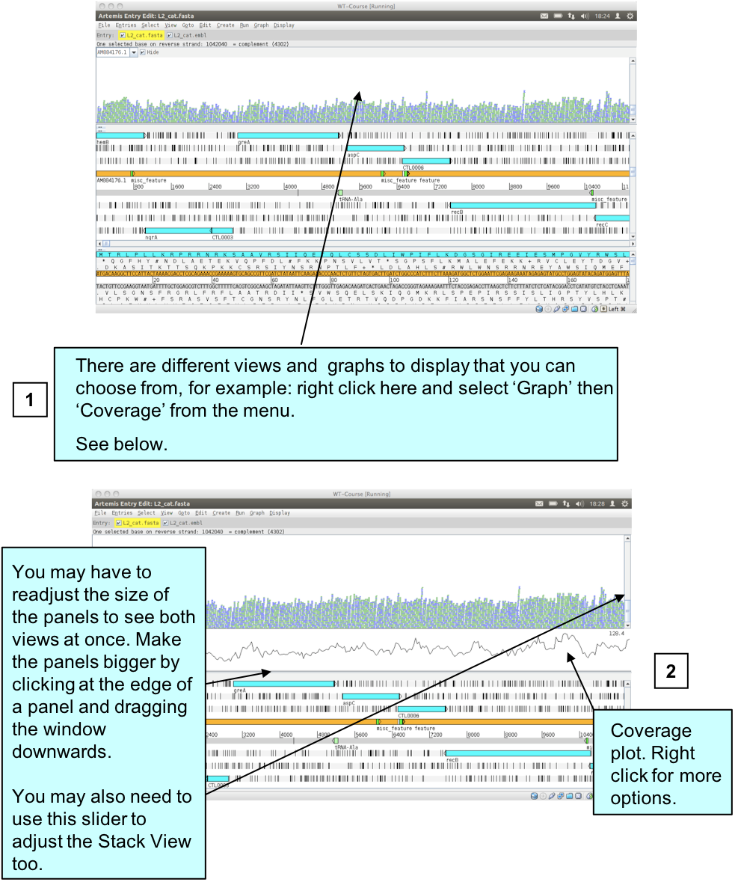

**Figure**. Graph of BAM coverage

There are several other ways to view your aligned read information. Each one may only be subtly different but they are very useful for specific tasks as hopefully you will see. To explore the alternative read views right-click in the BAM panel (1 below) and select the ‘Views’ menu option (2 below):

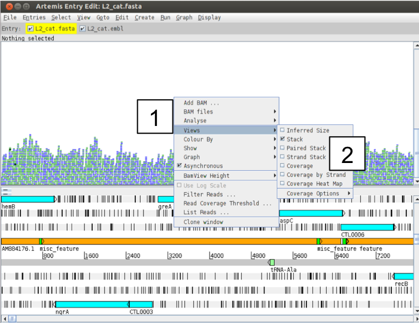

**Figure**. Exploring read views

We have already looked at ‘Stack’ view.
The Coverage view: just like adding the coverage plot above you can also convert the Stack view to a coverage view. This can be useful when multiple BAM files are loaded as a separate plot is shown for each. You can also look at the coverage for each strand individually by using the Coverage by Strand option. You can now also view the coverage as a Heat Map, with darker colours displaying higher coverage.
The ‘Strand Stack’ view (shown below), with the forward and reverse strand reads above and below the scale respectively. Useful for strand specific applications or for checking for strand-specific artifacts in your data. See picture below.

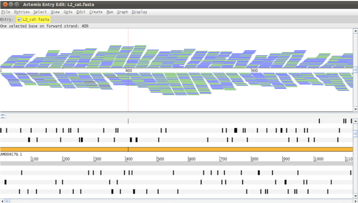

**Figure**. Read coverage by strand.

Alternative views continued:
d) The ‘Paired Stack’ view (inverted reads are red) joins paired reads. This can be useful to look for rearrangements and to confirm that regions are close together in the reference and the genome from which the aligned reads originate.

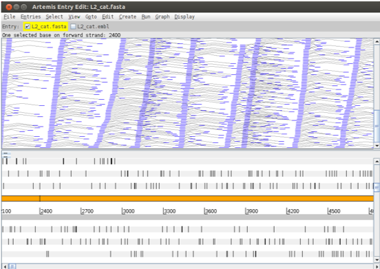

**Figure**. Paired stack highlighting paired-end reads


e) The ‘Inferred Size’ is similar to the ‘Paired Stack” view, but it orders the read pairs along the y-axis by their inferred insert size which is calculated from the aligned positions of the mates on the reference sequence (1). Optionally you can display the inferred insert sizes on a log scale (2). Note that Illumina libraries are usually made from size fractionated DNA fragments of about 250bp-500bp.
So this is not the actual library fragment size, although you would expect it to correlate closely, and be relatively constant, if your reference was highly conserved with the sequenced strain. The utility of this can seem a little obscure but its not and can be used to look for insertions and deletions as will be shown later in this Module.

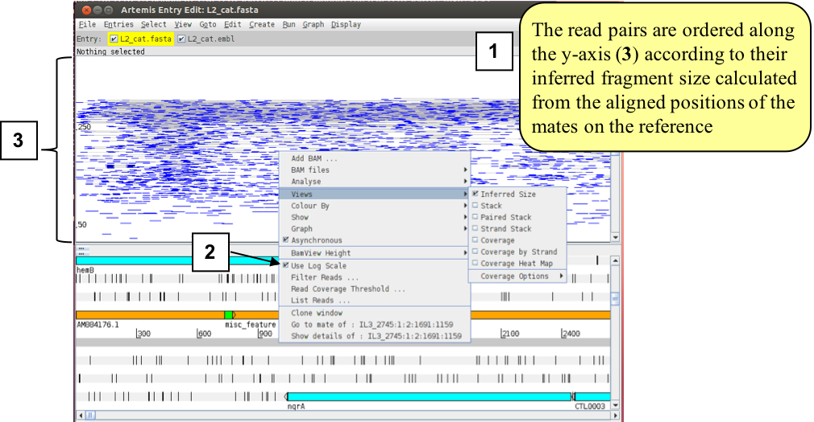

**Figure**. Paired stack highlighting inferred distance between paired reads.

[↥ **Back to top**](#top)


******
## 5. Artemis - Viewing SNPs <a name="artemis_snps"></a>
Start by returning your view back to ‘Stack’ view

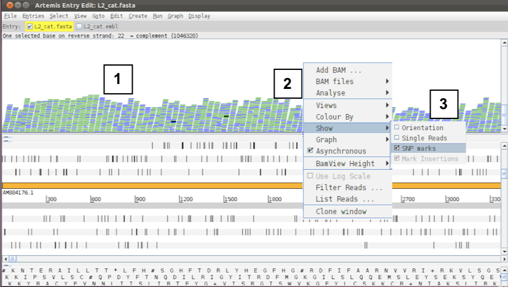

**Figure**. Showing SNP marks on raw reads (1)

To view SNPs use your right mouse button to click in the BAM view window (the panel showing the coloured sequence reads; 1 see above). Then in the popup menu click on  2 ‘Show’ and 3 and check the ‘SNP marks’ box. Single nucleotide differences between the read data and the reference sequence are shown as red marks on the individual reads as shown below.

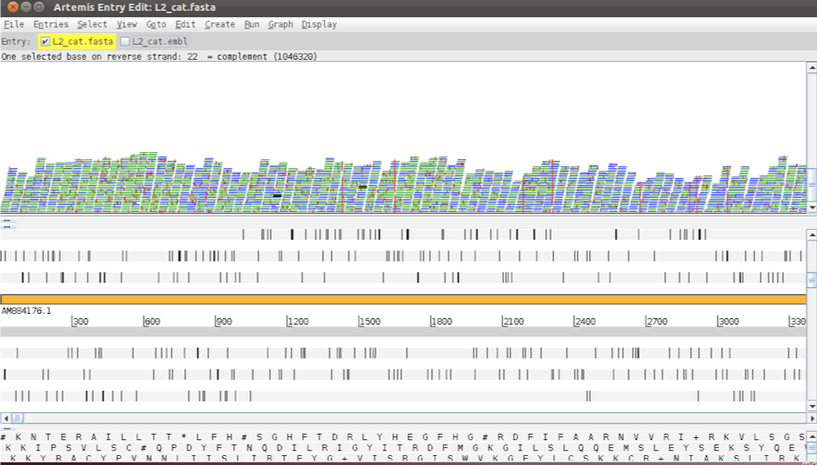

**Figure**. Showing SNP marks on raw reads (2)

In other words, the red marks appear on the stacked reads highlighting every base in a read that does not match the reference. When you zoom in you can see some differences that are present in all reads and appear as vertical red lines, whereas others are more sporadically distributed. The former are more likely to be true SNPs whereas the latter may be sequencing errors, although this would not always be true.

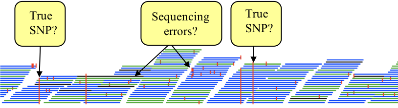

**Figure**. Sorting "true" SNPs from sequencing errors

If you zoom in further, the sequence of the individual sequence reads and the actual SNPs become visible, with the reference sequence highlighted in grey at the top. If you click on amino acids or bases in the sequence view (1), they will be highlighted in the sequence reads (2).


**Figure**. Zooming in on SNPs

Many SNP examples are quite clear, however this is not always the case. What if the read depth is very low? If there are only two reads mapping, the reference is T and both reads are C is this enough evidence to say that the genomes are different? What if there are many reads mapping and out of e.g. 100 base calls at a particular position 50 are called as G and 50 are called as T. This could be due to a mixed infection/population that was sequenced, or this would be typical for a heterozygous locus in a diploid genome…

[↥ **Back to top**](#top)


******
## 6. Chlamydia example <a name="chlamydia_example"></a>

We want to give you a biological example of how resequencing data can be really informative and valuable. Now do the following: using either the sliders, the GoTo menu or the ‘Navigator’, go to the end of the sequence or to base position 1043000. Adjust your view so you are in “Stack view” and have the depth of coverage graph showing. You might also need to adjust the Artemis window as well as the different panels.

You many need to clone the window to view the coverage plt. You can do this by righ clicking on the BAM view window. IN teh new cloned windo, right click > Views > Coverage.

If you adjust the zoom using the side sliders you should get a view similar to the one below. Notice two things: 1) the depth of coverage steps up at the beginning of the brown DNA line feature and 2) the coverage falls to zero within a region of this feature.

- What could this mean?

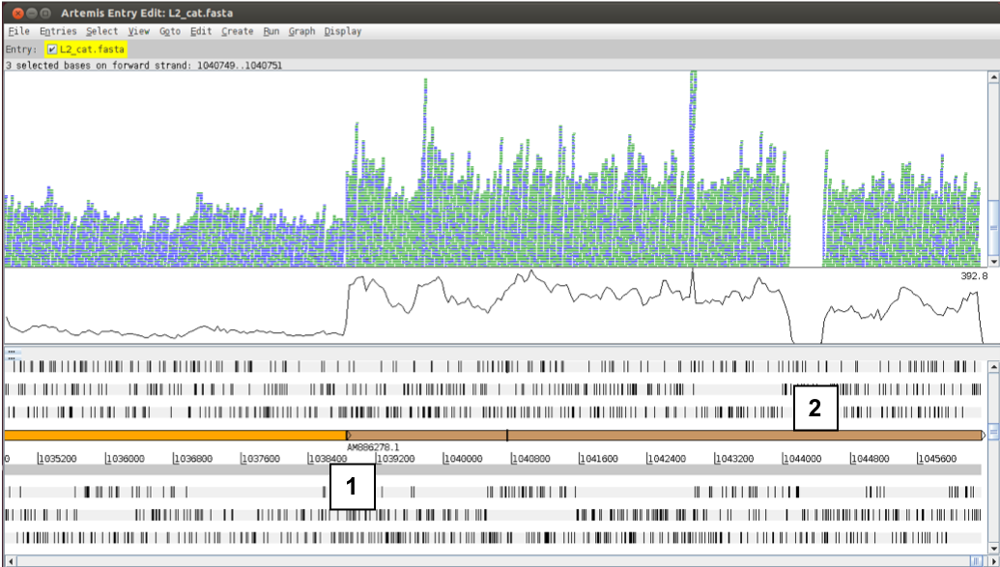

**Figure**. Comparison of differential coverage in the genome


Note that the display changes when you switch on the display of SNPs (right click – Show SNP marks). This is due to a difference in display of duplicate reads. Reads having the same start and end position after mapping are considered duplicates and are displayed in green in the bam view. However, apart from the true SNPs, these duplicate reads are likely to differ in the sequencing errors, thus have to be displayed individually when the SNPs are displayed (1).

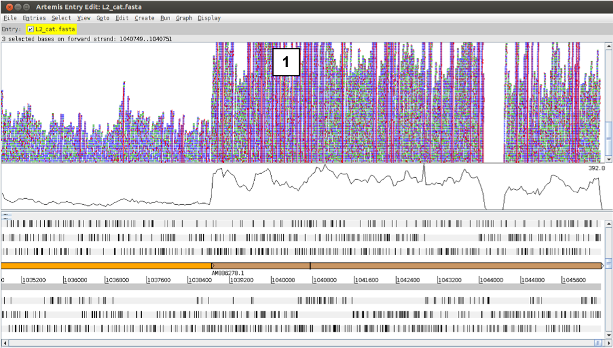

**Figure**. Comparison of differential coverage in the genome and SNPs

Coming back to the increase in coverage, the answer is that since part of the sequence you have been viewing is a plasmid (brown DNA feature) it is present in multiple copies per cell, whereas the chromosome is only present in one copy per cell (orange DNA feature). Therefore each part of the plasmid is sequenced more often than the rest of the genome leading to a higher read coverage in this area of the plot.

- What about the region in the plasmid where no reads map? Check out this paper: Ripa & Nilsson (2007), PUBMED: 17483723.


This is where the ‘Inferred Size’ view for the reads is useful. If you change the view as before to ‘Inferred Size’ and use the log scale you will see an image similar to the one below. You may have to adjust the view (1) to actually see the subset of reads that are shown above almost all other reads in this plot (2). The inferred insert size calculated from the alignment for this subset of reads is far bigger than the normal size range of other read pairs in this region (2) and there are no grey lines linking paired reads within the normal size range crossing this region (3). Together, this is indicative of a deletion in the DNA of the sequenced strain compared to the reference!

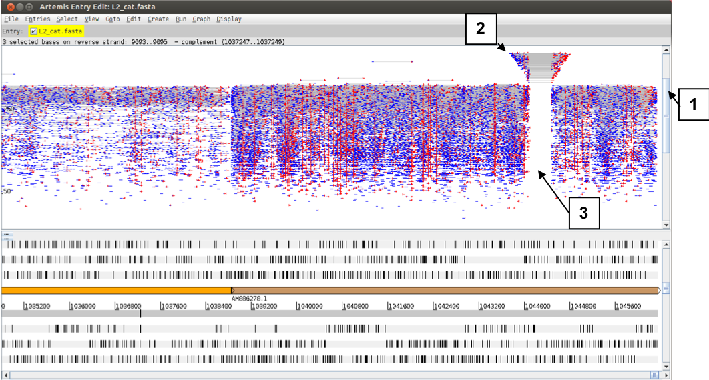

**Figure**. Comparison of insert length distribution between paired reads

You can also view multiple BAM files at the same time. Remember that a BAM file is a processed set of aligned reads from (in this case) one bacterium aligned against a reference sequence. So in principle we can view multiple different bacterial isolates mapped against the same reference concurrently. The *C. trachomatis* isolate you are going to read in is *C. trachomatis* strain L2b. It is more closely related to the reference sequence that we have been using, hence the similar name.

We are not going to redo the mapping for a new organism, instead we have pre-processed the relevant FASTQ data for you. The file you will need is called L2b.bam. Follow the instructions below. Start by going back to a normal stacked read view and zooming in more detail.

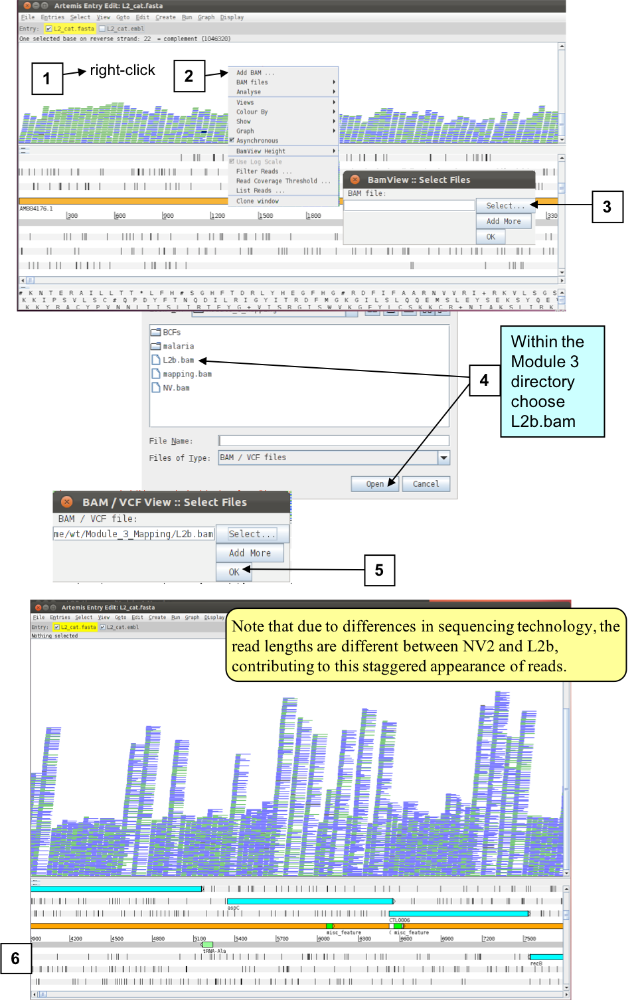

**Figure**. Loading L2b data

In the first instance Artemis reads all the new reads into the same window. This is useful if you have multiple sequencing runs for the same sample. But in this instance we want to split the reads into separate windows so that we can view them independently. This is done as described below.


First, clone the BAM view window.
Right-click over the BAM window and select ‘Clone window’.


If you right-click over the top BAM window and select BAM files you can individually select the files as desired. This means you can display each BAM file in its own window by de-selecting one or the other file.

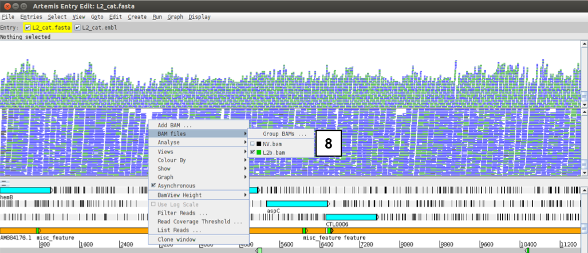

Now go back to the plasmid region at the end of the genome sequence and have a look at the previously un-mapped region located around base position 1044200. You can see that the newly added BAM file (for L2b) shows no such deletion with reads covering this region (as shown below). Have a look at the inferred read sizes, too.

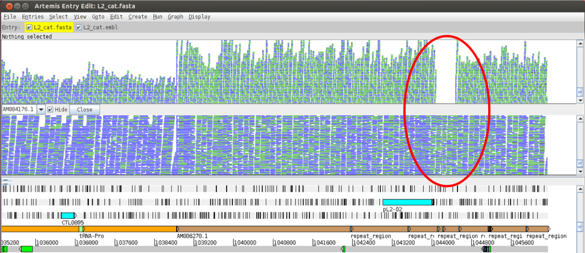

**Figure**. Comparison of mapped reads between the two strains  

[↥ **Back to top**](#top)


******
## 7. Looking at SNPs in more detail <a name="snps"></a>
So far we have looked at SNP variation rather superficially. In reality you would need more information to understand the effect that the sequence change might have on, for example, coding capacity. For this we can view a different data type called Variant Call Format (VCF). In analogy to the SAM/BAM file formats, VCF files are essentially plain text files while BCF files represent the binary, usually compressed versions of VCF files. VCF format was developed to represent variation data from the 1000 human genome project and is well accepted as a standard format for this type of data.


**Step 1**
We will now take our NV.bam file and generate a BCF file from it which we will view in Artemis. To do so go back to the terminal window and type on the command line be patient and wait for it to finish and return to the command prompt before continuing:
```shell
# type (or copy and paste) the following into the terminal

bcftools mpileup -Ou -f L2_cat.fasta NV.bam | bcftools call -v -c --ploidy 1 -Ob --skip-variants indels > NV.bcf

bcftools index NV.bcf

```

**Step 2**
There are two more steps required before we can view out SNPs in Artemis. First, do the actual SNP calling:
```shell
# type (or copy and paste) the following into the terminal

bcftools view -H NV.bcf -Oz > NV.vcf.gz
```
Second, we have to index the file before viewing in in Artemis:
```shell
# type (or copy and paste) the following into the terminal

tabix NV.vcf.gz
```

**Step 3**
Now let’s do a bit of house keeping because many of the files we have created are large and are no longer needed, before we view our SNP calls in the Artemis session that’s still open. So please delete the following files:
```shell
# type (or copy and paste) the following into the terminal

rm mapping.sam mapping.bam L2_cat.fasta.amb L2_cat.fasta.ann L2_cat.fasta.bwt L2_cat.fasta.pac L2_cat.fasta.sa L2_cat.fasta.fai

# make sure to check to see that the files have been deleted

ls -lrt

```


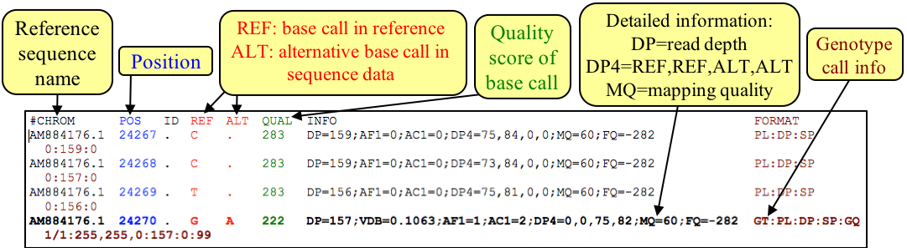

**Figure**. Example of VCF / BCF file format

To look at a region with some interesting sequence variation, go again to the end of the sequence or to base position 1043000 using either the sliders, the GoTo menu or the ‘Navigator’.
Next read the BCF file that you have just created into Artemis by selecting menus and options as shown below.

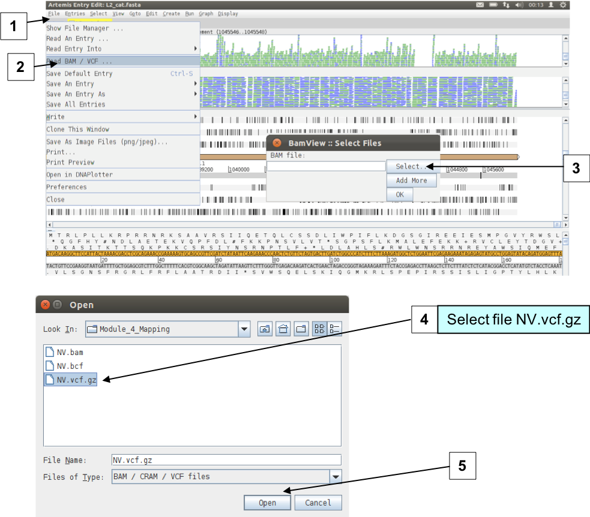


**Figure**. Loading BAM and VCF files


Below are the details of the three possible colour schemes for the variants in the BCF window panel (change the colour scheme via Right-click and Colour By). Note that this includes both SNPs and INDELs. Scroll along the sequence and see how many different kinds of variants you can find.


**Table**. Artemis colour coding of different types of variants
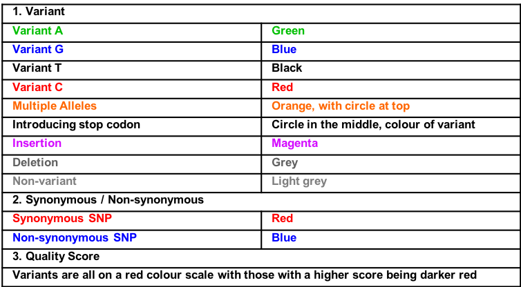

You can read in multiple BCF files from different related bacterial isolates. To do this right-click over the BCF window and select ‘Add VCF’ (remember BCF and VCF are essentially the same thing).

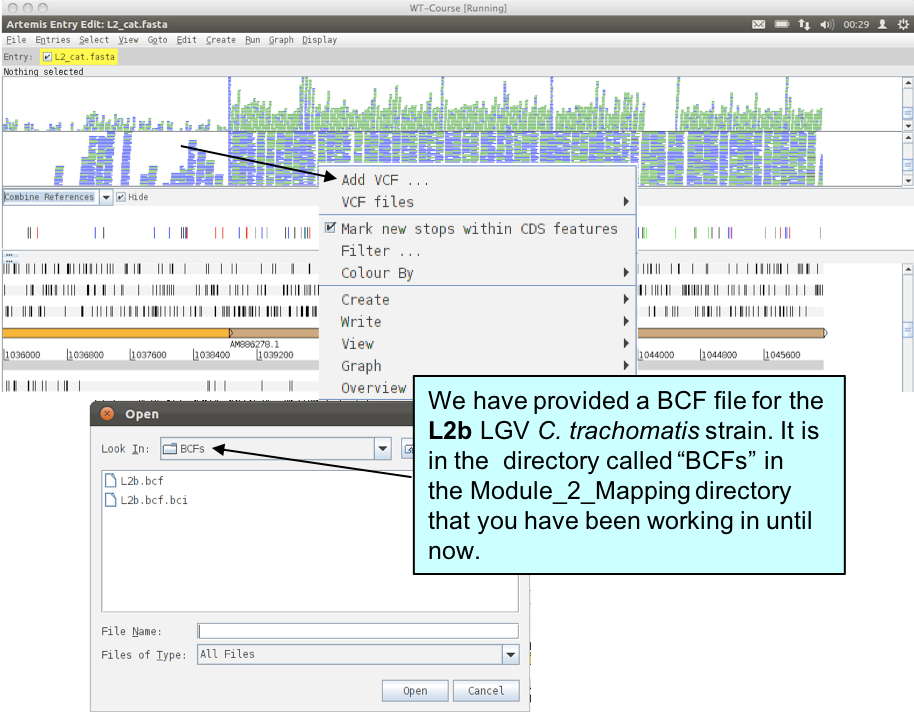

Once you have read the additional BCF file into Artemis right-click in the BCF window and check the ‘Show Labels’ box to make it easier to see which BCF file is which.

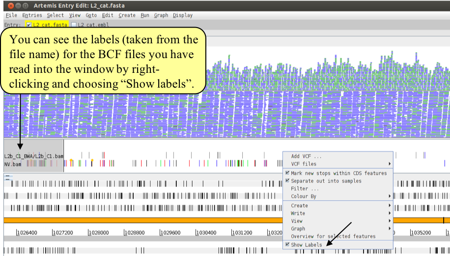

What you should notice is that L2b has far fewer SNPs and INDELs than NV compared to the reference. This is because L2b is an LGV strain of Chlamydia and NV is an STI strain. We will come back to these relationships later in the next Module.


As you may expect by now, Artemis also allows you to filter your VCF file.

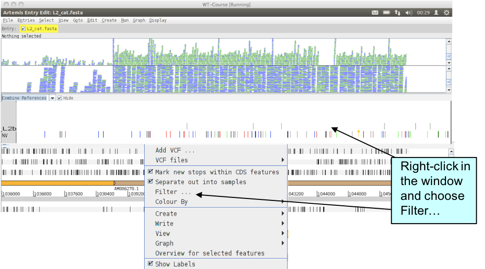

Have a look through the variant filter window that pops up. You can select or unselect different SNP types or variants to modify your view. Non-variant sites are important because they differentiate sites where the data confirm that the sequence is the same as the reference from regions that appear not to contain SNPs simply because no reads map to them.

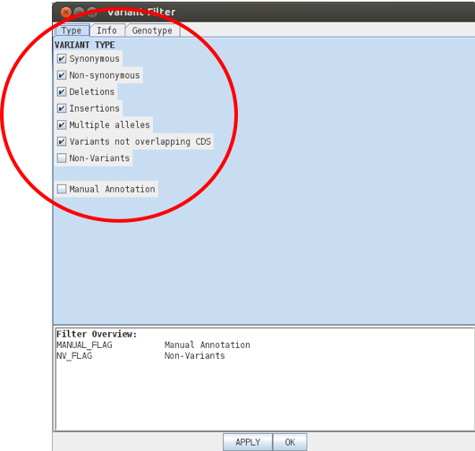

Like the BAM views you can also remove or include SNPs etc based on for example mapping score, depth of coverage or sequencing quality in the PROPERTY section listed under the INFO tab.

Useful cutoff values are e.g. DP of at least 10 and Qual of at least 30.

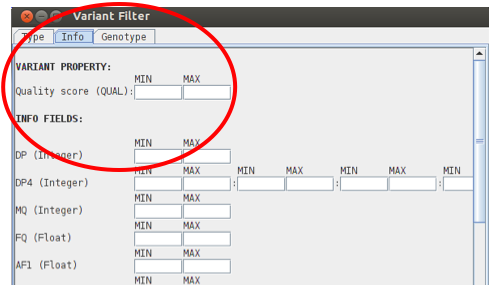

[↥ **Back to top**](#top)


******
## License
<a rel="license" href="http://creativecommons.org/licenses/by/4.0/"></a><br />This work is licensed under a <a rel="license" href="http://creativecommons.org/licenses/by/4.0/">Creative Commons Attribution 4.0 International License</a>.
