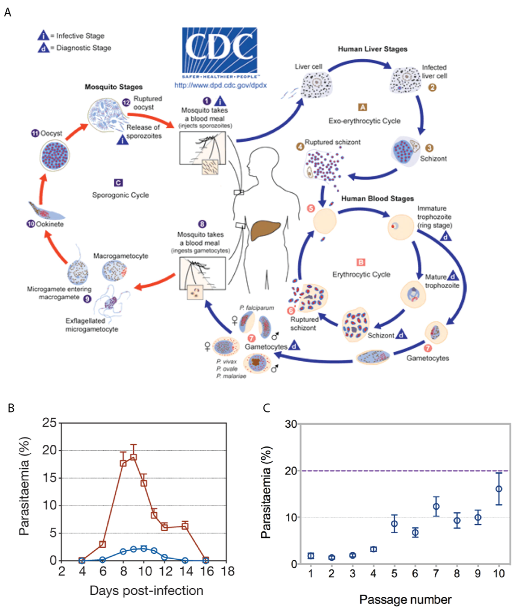
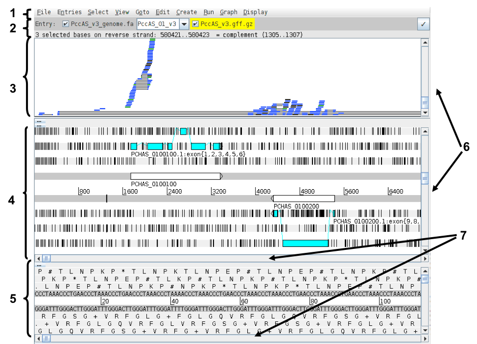
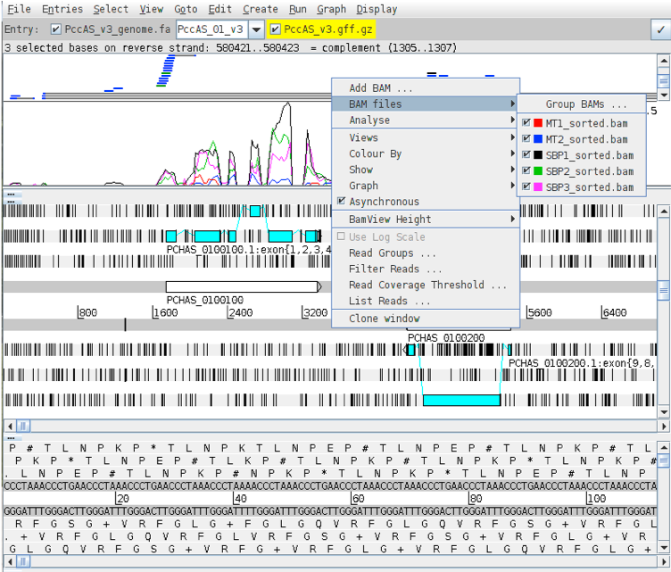
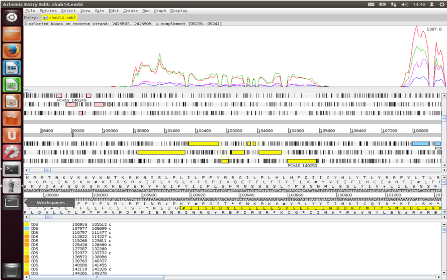
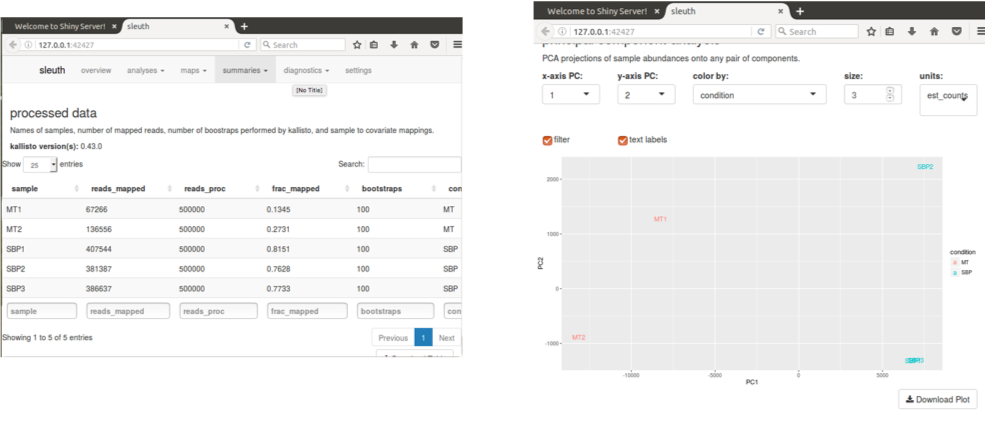

# Transcriptomics


## Table of contents
1. [Introduction & Aims](#introduction)
2. [Exercise 1 - Mapping RNA-seq reads to the genome using HISAT2](#exercise1)
3. [Exercise 2 - Using Artemis to visualise transcription](#exercise2)
4. [Exercise 3 - Using Kallisto and Sleuth to identify differentially expressed genes](#exercise3)
5. [Exercise 4 - Using Sleuth to check the quality of the data](#exercise4)
6. [Exercise 5 - Interpreting the results](#exercise5)
7. [Extended reading](#reading)


## 1. Introduction <a name="introduction"></a>

Understanding the genome is not simply about understanding which genes are there. Understanding when each gene is used helps us to find out how organisms develop and which genes are used in response to particular external stimuli. The first layer in understanding how the genome is used is the transcriptome. This is also the most accessible because like the genome the transcriptome is made of nucleic acids and can (directly or indirectly) be sequenced using the same technology. Arguably the proteome is of greater relevance to understanding cellular biology however it is chemically heterogeneous making it much more difficult to assay. 

Over the past decade or two microarray technology has been extensively applied to addressing the question of which genes are expressed when. Despite its success this technology is limited in that it requires prior knowledge of the gene sequences for an organism and has a limited dynamic range in detecting the level of expression. RNA sequencing technology, using for instance Illumina TruSeq library preparation and HiSeq sequencing machines, can sequence essentially all the genes which are transcribed and the results have a more linear relationship to the real number of transcripts generated in the cell.

The aim of differential expression analysis is to determine which genes are more or less expressed in different situations. We could ask, for instance, whether a bacterium uses its genome differently when exposed to stress, such as excessive heat or a drug. Alternatively we could ask which genes make human livers different from human kidneys. 

In this module we will address the effect of vector transmission on gene expression of the malaria parasite. Figure 1A shows the malaria life cycle, the red part highlighting the mosquito stage. Figure 1B shows the difference in virulence, measured by blood parasitemia, between mosquito-transmitted and serially blood passaged parasites. Is the transcriptome of a mosquito-transmitted parasite different from one which has not passed through a mosquito? The key reason for asking this question is that parasites which are transmitted by mosquito are less virulent in mice than those which are serially blood passaged in the laboratory. While mosquito transmitted and serially blood passaged parasites have exactly the same set of genes, perhaps they are using those genes differently. The data in this exercise, as well as figures 1B and 1C are taken from [Spence et al. (2013).](https://www.ncbi.nlm.nih.gov/pubmed/23719378), published by Springer Nature [https://www.nature.com/articles/nature12231]



**Figure 1. Serial blood passage increases virulence of malaria parasites.** (A) The lifecycle of plasmodium parasites involves mammalian and mosquito stages. Experiments in the lab often exclude the mosquito stage (red) and instead remove parasites from the blood of a mouse to infect another mouse (serial blood passage). (Source https://www.cdc.gov/) (B) Serially blood passaged parasites (red) are more virulent than mosquito-transmitted parasites (blue) as shown by their higher parasitemia over the course of infection. (C) As mosquito transmitted parasites are serially blood passaged an increasing number of times, they return to a higher level of parasitemia .

Figure 1C shows that increasing numbers of blood passages after mosquito transmission result in increasing virulence, back to around 20% parasitemia. Subsequent mosquito transmission of high virulence parasites renders them low virulence again. We hypothesise that parasites which have been through the mosquito are somehow better able to control the mosquito immune system than those which have not. This control of the immune system would result in lower parasitemia because this is advantageous for the parasite. Too high a parasitemia is bad for the mouse and therefore bad for the parasite. Are there any differences between the transcriptomes of serially blood passaged parasites and mosquito-transmitted parasites which might explain how they are able to do this? 

 [↥ **Back to top**](#top)

 ******
## Exercise 1 - Mapping RNA-seq reads to the genome using HISAT2 <a name="exercise1"></a>

We have two conditions: serially blood-passaged parasites (SBP) and mosquito transmitted parasites (MT). One with three biological replicates (SBP), one with two (MT). Therefore we have five RNA samples, each which has been sequenced on an Illumina HiSeq sequencing machine. For this exercise we have reduced the number of reads in each sample to around 2.5m to reduce the mapping time. However this will be sufficient to detect most differentially expressed genes.

Firstly, make a HISAT2 index for the P. chabaudi genome reference sequence.

```shell
# got to the working directory

cd /home/manager/Module_6_Transcriptomics/

# type the following into the terminal

hisat2-build PccAS_v3_genome.fa PccAS_v3_hisat2idx
```

Map the reads for the MT1 sample using HISAT2. Each of the following steps will take a couple of minutes. 

```shell
# type the following into the terminal (hisat2 may throw a syntax error - it is distressing but you can ignore it)
hisat2 --max-intronlen 10000 -x PccAS_v3_hisat2idx -1 MT1_1.fastq.gz -2 MT1_2.fastq.gz -S MT1.sam
```

Convert the SAM file to a BAM.

```shell
# type the following into the terminal
samtools view -b -o MT1.bam MT1.sam
```

Sort the BAM file (otherwise the indexing won’t work)

```shell
# type the following into the terminal
samtools sort -o MT1_sorted.bam MT1.bam
```

Index the BAM file so that it can be read efficiently by Artemis

```shell
# type the following into the terminal
samtools index MT1_sorted.bam
```

Now map, convert SAM to BAM, sort and index with the reads from the MT2 sample.

Note the BAM files and .bai index files provided for the SBP samples:

```shell
# type the following into the terminal
ls -lrt *bam*
```

 [↥ **Back to top**](#top)

 ******
## Exercise 2 - Using Artemis to visualise transcription <a name="exercise2"></a>

Index the fasta file so Artemis can view each chromosome separately

```shell
# type the following into the terminal
samtools faidx PccAS_v3_genome.fa
```

Load the genome sequence and annotation into Artemis from the command line, displaying the mapped reads from each sample:

```shell
# type the following into the terminal
art -Dbam="MT1_sorted.bam,MT2_sorted.bam,SBP1_sorted.bam,SBP2_sorted.bam,SBP3_sorted.bam" PccAS_v3_genome.fa +PccAS_v3.gff.gz &
```

Select ”Use index” so Artemis will show individual chromosomes.



The Artemis and BAM view windows:

1.	Drop-down menus
2. Entry (top line): shows which entries are currently loaded with the default entry highlighted in yellow You can select different chromosomes to view here.
3.	BAM view: Displays reads mapped to the genome sequence. Each little horizontal line represents a sequencing read. Some reads are blue indicating that they are unique reads. Green reads represent multiple reads mapped to exactly the same position on the reference sequence. Grey lines in the middle of reads mean that the read has been split and this usually means it maps over an intron. If you click a read its mate pair will also be selected. If you want to know more about a read right-click and select ‘Show details of: READ NAME’.
4. Sequence view panel. The central two grey lines represent the forward (top) and reverse (bottom) DNA strands. Above and below these are the three forward and three reverse reading frames (theoretical translations of the genome). Stop codons are marked as black vertical bars. Genes and other annotated features are displayed as coloured boxes. We often refer to predicted genes as coding sequences or CDSs.
5. This panel has a similar layout to the main panel but is zoomed in to show nucleotides and amino acids. 
6.	Sliders for zooming view panels.
7.	Sliders for scrolling along the DNA.

Right click on the BAM view, select *Graph*, then *Coverage*.

Right click on the BAM window showing the reads and hover over BAM files. This will show you which colours in the coverage plot relate to which samples. Scroll through the chromosome and see if you can identify genes which might be differentially expressed between SBP and MT parasites. Is looking at the coverage plots alone a reliable way to assess differential expression? Hint: what is the difference between read count and RPKM? Are the libraries all the same size?



Select chromosome *PccAS_14_v3* from the drop down box on the *Entry line*.

Press *ctrl-g* and use *Goto Feature With Gene Name* to navigate to the gene *PCHAS_1402500*. 

Investigate the coverage for this gene. Does the RNA-seq mapping agree with the gene model in blue?

You can determine read counts and RPKMs for individual genes within Artemis.

Click on the blue gene model, right click on the BAMview window, select Analyse, then RPKM value of selected features. 

Artemis asks whether you want to include introns in the calculations. We are only interested in reads mapping to the spliced transcript, so you should exclude these.  Select Use reads mapped to all reference sequences. Is this important?

After the analysis is done a window will appear behind Artemis.



This gene looks to be up-regulated in serially blood passaged parasites; SBP samples have RPKMs several times greater than the MT samples. Is it statistically significant? In the next section we will find out.


 [↥ **Back to top**](#top)

 ******
## Exercise 3 - Using Kalliso and Sleuth to identify differentially expressed genes <a name="exercise3"></a>

*Kallisto* is a read mapper, but instead of mapping against the genome it is designed to map against the transcriptome, i.e. the spliced gene sequences inferred from the genome annotation. Rather than tell you where the reads map it’s aim is in quantifying the expression level of each transcript. It is very fast because it uses pseudoalignment rather than true read alignment. 

Kallisto needs an index of the transcript sequences.

```shell
# type the following into the terminal
kallisto index -i PccAS_v3_kallisto PccAS_v3_transcripts.fa
```

Quantify the expression levels of your transcripts for the MT1 sample.

```shell
# type the following into the terminal
kallisto quant -i PccAS_v3_kallisto -o MT1 -b 100 MT1_1.fastq.gz MT1_2.fastq.gz
```

The results are contained in the file *MT1/abundance.tsv*

Use the kallisto quant command four more times, for the MT2 sample and the three SBP samples. **Don't forget this step!!!**

*Sleuth* uses the output from Kallisto to determine differentially expressed genes. It is written in the R statistical programming language, as is almost all RNA-seq analysis software. Helpfully however it produces a web page that allows interactive graphical analysis of the data. However, I would recommend learning R for anyone doing a significant amount of RNA-seq analysis.  It is nowhere near as hard to get started with as full-blown programming languages such as Perl or Python!

We have provided a series of R commands which will get Sleuth running. These are in the file sleuth.R. Open the file and have a look. It is not as hard as it seems, I copied most of this from the manual! To run this R script, you will have to open R:

```shell
# type the following into the terminal
R
```

And then copy and paste all the commands from the file sleuth.R

 [↥ **Back to top**](#top)

 ******
## Exercise 4 - Using Sleuth to check the quality of the data <a name="exercise4"></a>

*Sleuth* provides several tabs which we can use to determine whether the data is of good quality and whether we should trust the results we get.

In the web page which has been launched click on Summaries->processed data.

Even though we have used the same number of reads for each sample, there are large differences in the number of reads mapping for each one. Why might this be? Is it a problem?



Select *map -> PCA* from the menus.

The Principal Components Analysis plot shows the relationship between the samples in two dimensions (PC1 and PC2). In this case almost all the variation between the samples is captured by just Principal Component 1. The MT samples are well separated from the SBP samples, meaning that the replicates are more similar to each other than they are to samples from the different condition. This is good.

In some cases we identify outliers, e.g. samples which do not agree with other replicates and these can be excluded. If we don’t have many replicates, it is hard to detect outliers and our power to detect differentially expressed genes is reduced.

 [↥ **Back to top**](#top)

 ******
## Exercise 5 - Interpreting the results <a name="exercise5"></a>

In the R script we printed out a file of results describing the differentially expressed genes in our dataset. This is called “kallisto.results”.

The file contains several columns, of which the most important are:

Column 1: target_id (gene id)

Column 2: pval (p value)

Column 3: qval (p value corrected for multiple hypothesis testing)

Column 4: b (fold change)

Column 12: description (some more useful descriptionof the gene than its id) 

With a little Linux magic we can get the list of differentially expressed genes with only the columns of interest as above. The following command will get those genes which have an adjusted p value less than 0.01 and a positive fold change. These genes are more highly expressed in SBP samples.

```shell
# type the following into the terminal
cut -f1,2,4,5 kallisto.results | awk -F '\t' '$3 < 0.01 && $4 > 0'
```

These genes are more highly expressed in MT samples:

```shell
# type the following into the terminal
cut -f1,2,4,5 kallisto.results | awk -F '\t' '$3 < 0.01 && $4 < 0'
```

How many genes are more highly expressed in each condition?

Do you notice any particular genes that come up in the analysis?

The most highly up-regulated genes in MT samples are from the cir family. This is a large, malaria-specific gene family which had previously been proposed to be involved in immune evasion (Lawton et al., 2012). Here however we see many of these genes up-regulated in a form of the parasite which seems to cause the immune system to better control the parasite. This suggests that these genes interact with the immune system in a more subtle way, preventing the immune system from damaging the host. 

Remember PCHAS_1402500? Of course you do. It was the gene we looked at in Artemis that seemed absolutely definitely differentially expressed.

What does Sleuth think about it?

```shell
# type the following into the terminal
grep PCHAS_1402500 kallisto.results | cut –f1,2,4,5
```

Although this gene looked like it was differentially expressed from the plots in Artemis our test did not show it to be so. This might be because some samples tended to have more reads, so based on raw read counts, genes generally look up-regulated in the SBP samples. Alternatively the reliability of only two biological replicates and the strength of the difference between the conditions was not sufficient to be statistically convincing. In the second case increasing the number of biological replicates would give us more confidence about whether there really was a difference. 

In this case, the lower number of reads mapping to MT samples mislead us in the Artemis view. Luckily careful normalisation and appropriate use of statistics saved the day!

If you want to read more about the work related to this data it is published: [Spence et al. (2013)](https://www.ncbi.nlm.nih.gov/pubmed/23719378).


 [↥ **Back to top**](#top)

 ******
## Extended reading <a name="reading"></a>

Key aspects of differential expression analysis

### Replicates and power
In order to accurately ascertain which genes are differentially expressed and by how much it is necessary to use replicated data. As with all biological experiments doing it once is simply not enough. There is no simple way to decide how many replicates to do, it is usually a compromise of statistical power and cost. By determining how much variability there is in the sample preparation and sequencing reactions we can better assess how highly genes are really expressed and more accurately determine any differences. The key to this is performing biological rather than technical replicates. This means, for instance, growing up three batches of parasites, treating them all identically, extracting RNA from each and sequencing the three samples separately. Technical replicates, whereby the same sample is sequenced three times do not account for the variability that really exists in biological systems or the experimental error between batches of parasites and RNA extractions.

n.b. more replicates will help improve power for genes that are already detected at high levels, while deeper sequencing will improve power to detect differential expression for genes which are expressed at low levels.

### P-values vs. q-values
When asking whether a gene is differentially expressed we use statistical tests to assign a p-value. If a gene has a p-value of 0.05 we say that there is only a 5% chance that it is not really differentially expressed. However, if we are asking this question for every gene in the genome (~5500 genes for Plasmodium), then we would expect to see p-values less than 0.05 for many genes even though they are not really differentially expressed. Due to this statistical problem we must correct the p-values so that we are not tricked into accepting a large number of erroneous results. Q-values are p-values which have been corrected for what is known as multiple hypothesis testing. Therefore it is a q-value of less than 0.05 that we should be looking for when asking whether a gene is differentially expressed.

### Alternative software
If you have a good quality genome and genome annotation such as for model organisms e.g. human, mouse, Plasmodium, I would recommend mapping to the transcriptome for determining transcript abundance. This is even more relevant if you have variant transcripts per gene as you need a tool which will do its best to determine which transcript is really expressed. As well as Kallisto ([Bray et al., 2016](https://www.ncbi.nlm.nih.gov/pubmed/27043002)), there is eXpress ([Roberts & Pachter, 2012](https://www.ncbi.nlm.nih.gov/pubmed/23160280)) which will do this.

Alternatively you can map to the genome and then call abundance of genes, essentially ignoring variant transcripts. This is more appropriate where you are less confident about the genome annotation and/or you don’t have variant transcripts because your organism rarely makes them or they are simply not annotated. HISAT2 ([Pertea et al., 2016](https://www.ncbi.nlm.nih.gov/pubmed/27560171)) STAR ([Dobin et al., 2013](https://www.ncbi.nlm.nih.gov/pubmed/23104886)) and GSNAP ([Wu & Nacu, 2010](https://www.ncbi.nlm.nih.gov/pubmed/20147302)) are all splice-aware RNA-seq read mappers appropriate for this task. You then need to use a tool which counts the reads overlapping each gene model. HTSeq ([Anders et al., 2015](https://www.ncbi.nlm.nih.gov/pubmed/25260700)) is a popular tool for this purpose. Cufflinks ([Trapnell et al. 2012](https://www.ncbi.nlm.nih.gov/pubmed/22383036)) will count reads and determine differentially expressed genes.

There are a variety of programs for detecting differentially expressed genes from tables of RNA-seq read counts. DESeq2 ([Love et al., 2014](https://www.ncbi.nlm.nih.gov/pubmed/25516281)) and EdgeR ([Robinson et al., 2010](https://www.ncbi.nlm.nih.gov/pubmed/19910308)) are good examples.

### What do I do with a gene list?
Differential expression analysis results is a list of genes which show differences between two conditions. It can be daunting trying to determine what the results mean. On one hand you may find that that there are no real differences in your experiment. Is this due to biological reality or noisy data? On the other hand you may find several thousands of genes are differentially expressed. What can you say about that?

Other than looking for genes you expect to be different or unchanged, one of the first things to do is look at Gene Ontology (GO) term enrichment. There are many different algorithms for this, but you could annotate your genes with functional terms from GO using for instance Blast2GO ([Conesa et al., 2005](https://www.ncbi.nlm.nih.gov/pubmed/16081474)) and then use TopGO ([Alexa et al., 2005](https://www.ncbi.nlm.nih.gov/pubmed/16606683)) to determine whether any particular sorts of genes occur more than expected in your differentially expressed genes.


 [↥ **Back to top**](#top)

******
## License
<a rel="license" href="http://creativecommons.org/licenses/by/4.0/"></a><br />This work is licensed under a <a rel="license" href="http://creativecommons.org/licenses/by/4.0/">Creative Commons Attribution 4.0 International License</a>.

